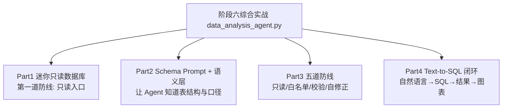

# 阶段六 · 综合实战：数据分析 Text-to-SQL Agent（离线可运行）

> 所属：阶段六 垂直领域 Agent 落地实践
> 定位：把阶段六第 2 小点「数据分析 Agent」的 Text-to-SQL 五道防线，落成一份**离线可运行**的完整 Demo——让自然语言问「公司营收」，Agent 转成 SQL、过五道防线、执行、产出图表。

## 一句话看懂本 Demo

`data_analysis_agent.py` 用纯 Python 标准库实现一个最小可用的数据分析 Agent：



> 核心一句话：**数据分析 Agent 的价值 = 问得动 + 答得准 + 破坏不了数据**。这份 Demo 重点演示「只读 + 校验」这套让数据不被 Agent 弄坏的核心防线。

## 运行方式

```
python3 code/阶段六/data_analysis_agent.py
```

不需要 API Key、不需要外网、不需要装任何第三方库（只依赖标准库）。

## 完整代码位置

[code/阶段六/data_analysis_agent.py](../../code/阶段六/data_analysis_agent.py)

---

## 每个 Part 在讲什么

### Part 1 · 迷你"只读数据库"（对应第一道防线）

真实项目里给 Agent 一个**只 SELECT 权限的只读账号**——即使模型被恶意注入骗去生成 DELETE，数据库层面也执行不了。这里用内存表模拟，只暴露 `execute_read()` 一个入口，想 DELETE 都没有接口：

```python
def execute_read(query: str):
    """迷你"只读数据库": 只支持 SELECT 子集。真实生产 = 只读账号。”"""
    m = re.search(r"region\s*=\s*'([^']+)'", query)
    rows = ORDERS if not m else [r for r in ORDERS if r["region"] == m.group(1)]
    if re.search(r"SUM\(amount\)", query, re.I):
        return [{"revenue": round(sum(r["amount"] for r in rows), 2)}]
    return rows
```

> 🔬 **深度理解 · 只读账号（最小权限根防线）**：
> 1. **本质**：在数据库权限层就封死「写」，让安全不依赖模型「生成的 SQL 一定没错」——即使被注入诱导生成 DELETE，也根本没有执行它的权限。
> 2. **机制**：真实生产给 Agent 一个只授 SELECT 的账号（或只读副本 / 只读角色），从账号、连接、schema 三层把 DML/DDL 全部挡掉；本 Demo 用内存表只暴露 `execute_read()` 一个入口，模拟同样的「想 DELETE 也没有接口」。因为「只读」在系统边界而非 prompt 层，它是**不可能被 prompt 突破**的硬约束。
> 3. **为什么重要**：prompt 约束可被误导绕过，而权限是可达性的硬限制。它解决「模型作恶 / 被诱导做坏的最底层兜底」，边界在——只读保护了「不改」但保护不了「查错」或「耗时拖垮库」，所以还要配白名单、结果校验、资源限制。
> 4. **易错点**：给 Agent 一套「读写账号」再靠 prompt 硬约束「别写」；或用「连接直接拼用户输入」绕过参数化让注入直通；以及把只读做在业务代码层（可被绕过）而不是数据库账号层。

> ⏳ **短期可不深究**：`execute_read()` 用 `re.search` 正则去「模拟」数据库解析（`region=`、`SUM(amount)` 匹配）只是**演示用的最小实现**，不是真实 SQL 解析——第一遍看懂「它只放行只读查询」这个设计意图即可，写真实系统时直接接 PostgreSQL + 只读账号，别纠结正则怎么匹配。

运行输出里 `ORDERS` 是 7 条订单，跨北京 / 上海 / 广州、Q1 / Q2、paid / refunded / pending 三种状态。

### Part 2 · Schema Prompt + 语义层（对应第一杠杆）

Text-to-SQL 的第一步不是让模型"自由发挥"，而是**先告诉它数据库长什么样、口径是什么**：

```python
SCHEMA_PROMPT = """数据库表 orders:
  id int, amount decimal(单位:万元), region text(北京/上海/广州),
  status text(paid/refunded/pending), quarter text(Q1/Q2)
业务口径: "销售额" = SUM(amount) 且 status='paid'
【约束】只允许 SELECT / WITH 开头。"""
```

再用**语义层**把业务概念固化为口径，避免三个用户问出三种不同的"营收"：

```python
SEMANTIC_LAYER = OrderedDict([
    ("营收",     "SELECT SUM(amount) FROM orders WHERE status='paid'"),
    ("退款笔数", "SELECT COUNT(*) FROM orders WHERE status='refunded'"),
    ("北京单数", "SELECT COUNT(*) FROM orders WHERE region='北京'"),
])
```

> ⏳ **短期可不深究**：这里 `SEMANTIC_LAYER` 用字典**硬编码 3 条口径**只是教学演示——生产会用独立「语义层服务 / 指标仓库」统一维护全部门口径（带版本、权限、可审计）。第一遍带走「把业务口径固化成可复用定义」这个思路即可，不用纠结这里的映射实现。

### Part 3 · 五道防线（核心）

| 防线 | 做什么 | 代码层实现 |
|-|-|-|
| ① 只读账号 | 数据库层限权 | Part 1 的 `execute_read` 单入口 |
| ② SQL 白名单 | 只放 SELECT / WITH | `ALLOWED_PREFIX` 校验 |
| ③ 参数化 | 防止拼接注入 | 入参走参数 | 
| ④ 结果校验 | 空结果不强行编造 | `empty` 分支「勿编造」 |
| ⑤ 报错自修正 | SQL 出错让模型改后重试 | `MAX_RETRY` 限 2 次 |

```python
def defend_and_execute(question, retries=0):
    sql = _gen_sql(question)
    if not sql.strip().upper().startswith(ALLOWED_PREFIX):   # ② 白名单
        return {"status": "rejected", "reason": "仅为只读查询"}
    result = execute_read(sql)
    if not result:                                            # ④ 结果校验
        return {"status": "empty", "message": "查询为空, 请核实条件后再答, 勿编造"}
    if exception:
        return defend_and_execute(question, retries + 1)      # ⑤ 自修正
    return {"status": "ok", "data": result}
```

> 🔬 **深度理解 · 报错自修正（Self-Correction Loop）**：
> 1. **本质**：把数据库的报错当「最有信息量的修正信号」——不是让模型凭空重猜，而是把 `syntax error at ... near '...'` 回传，让它基于真实报错改 SQL，形成「生成 → 执行失败 → 依据报错修正 → 再执行」的闭环。
> 2. **机制**：执行异常时捕获报错文本，连同原问题一起喂回 `_gen_sql`，重试并计数；用 `MAX_RETRY`（本 Demo 限 2 次）防止无限自改——即「有限次的重试 + 明确的终止条件」。本质是把不可控的失败重试变成有上限、可观测、回传高信息量错误。
> 3. **为什么重要**：第一遍生成 SQL 很难一次全对（表名、字段、语法），报错文本提供了「离正确答案最近的一步」；同时空结果、注入、异常都用结构化状态（ok / empty / rejected）分流，避免「硬答一个数」。
> 4. **易错点**：重试无上限导致死循环 / 成本失控；把「报错只给用户看」而不回传模型，浪费了最好的修正信号；以及重试时用同一份原始输入、帖子积累的错误上下文，导致反复错在同一点——应把「上次报错」作为修正输入。

### Part 4 · Text-to-SQL 闭环（串起来）

把上面串成完整流程：自然语言 → 命中语义层 / 让模型生成 SQL → 白名单校验 → 只读执行 → 空结果拦截 → 图表输出。

运行输出能看到：
- 语义层命中：`公司营收是多少 → SQL: SELECT SUM(amount) ...`
- 五道防线：`[营收] ok → [{'revenue': 1730.5}]`
- 注入拦截：`[被注入生成 DELETE] rejected`
- 空结果拦截：`empty`

---

## 运行结果预览

```
>>> Schema Prompt（Text-to-SQL 第一杠杆）
数据库表 orders: ... 业务口径: "销售额" = SUM(amount) 且 status='paid'

>>> 语义层命中
  公司营收是多少 → SQL: SELECT SUM(amount) FROM orders WHERE status='paid'
  退款笔数 → SELECT COUNT(*) FROM orders WHERE status='refunded'

>>> 五道防线演示
  [营收]  ok → [{'revenue': 1730.5}]
  [被注入生成 DELETE]  {'status': 'rejected', 'reason': '仅为只读查询'}
  [空结果]  {'status': 'empty', 'message': '查询为空, 请核实条件后再答'}

>>> 可视化扩展
   已生成 bar 图, 数据点 1 条: [{'revenue': 1730.5}]
```

## 换真实模型 / 真实数据库只需改 4 点

| 教学实现 | 生产替换 |
|-|-|
| `_gen_sql()` 用规则兜底 | 换成 LLM + Schema Prompt 生成 SQL |
| `execute_read()` 内存表 | 换成 PostgreSQL（给 Agent 只读账号） |
| 语义层硬编码 3 条口径 | 换成语义层服务（或指标仓库）维护全部门口径 |
| bar 图字符串示意 | 换成 ECharts / Plotly 前端渲染 |

## 本节自检

- [ ] 能说清数据分析 Agent 的"第一杠杆"是 Schema Prompt + 语义层
- [ ] 能默写五道防线，并解释为什么"只读账号"是根防线
- [ ] 已跑通一次「自然语言 → SQL → 校验执行 → 结果」闭环
- [ ] 知道空结果要"如实说空、勿编造"，而不是强行圆一个数

## 本节常见面试题（深度解析）

> 针对本节核心知识的面试高频点，配合"本质+机制"式理解，能让你答得既有深度又有广度。

### 面试题 1：这个 Demo 为什么先做「只读数据库」而不是先让 SQL 生成更准？
- **面试官想考察**：是否理解数据分析 Agent「破坏得了数据」是比「问得准」更底层、更必须先解决的安全问题。
- **专业作答（含深度）**：
  1. 数据分析 Agent 的定位是「问得动 + 答得准 + 破坏不了数据」三件事，顺序上**安全 > 准确**——生成 SQL 再准，一旦能改/删数据就是业务事故。
  2. 所以本 Demo 先用只读账号（Part 1）把「写」从权限层封死，实现它无法破坏数据，再谈 Schema/语义层把「答」做准。
  3. 安全深度上：只读是系统边界层的硬约束，白名单/参数化/结果校验/自修正是代码层约束——前者不可被 prompt 绕过，后者可被注入影响，形成纵深。
  4. 这也解释了为什么「只读账号被称根防线」：它是所有后续校验之上的兜底。
- **加分亮点 / 深度追问**：可补充「只读保护不了『查错』『拖慢库』」，因此生产还要结果校验 + 超时 + 资源限制，说明安全意识不满足于只读一层。

### 面试题 2：为什么"第一杠杆"是 Schema Prompt + 语义层，而不是换更强的模型？
- **面试官想考察**：是否理解「哪种手段对 Text-to-SQL 准确率提升最杠杆」的工程判断。
- **专业作答（含深度）**：
  1. 模型再强，若不知道表结构、字段含义、口径单位，也只能「猜」——信息缺失不是推理能力问题。
  2. Schema Prompt 给出「说明书」（表、字段、类型、注释、示例行、业务口径），把「不知道的信息」变成「知道的信息」，提升幅度通常显著高于堆模型能力。
  3. 语义层再把「营收=什么」的**口径问题**从「每次让模型临时定义」固化成「定义一次、处处复用」，从根上消灭「三个用户问出三种营收」。
  4. 因此先喂准元数据 + 固化口径 = 第一杠杆；换模型是锦上添花而非解决「信息不对齐」。
- **加分亮点 / 深度追问**：可补充「元数据还可以动态挑选相关表，只喂问题相关的 Schema」，体现对「更大库怎么控制 prompt 长度」的理解。

### 面试题 3：报错自修正为什么限重试 2 次？它是如何「以更小的成本提高一次到位率」的？
- **面试官想考察**：是否理解「有限重试 + 高信息量错误回传」作为闭环控制的手段，以及失控边界的设置。
- **专业作答（含深度）**：
  1. 第一遍生成 SQL 经常因表名/字段/语法出错，而数据库报错给出了离正确答案最近的信息——把它**回传模型**作为修正输入正确率通常明显上升，比盲改高效。
  2. 但不能无限重试：模型可能在某一类错误上反复打转，无限重试 = 死循环 + token 成本失控，所以要设上限（本 Demo 2 次）。
  3. 本质是「有限次尝试 + 结构化状态（ok / empty / rejected）+ 明确终止」，失败后如实交还状态而非硬编一个数。
  4. 这正是「以固定小成本换取显著提高一次通过率」的工程权衡。
- **加分亮点 / 深度追问**：可追问「如果 2 次还错怎么办」——答「如实返回失败并建议换问法或转人工」，呼应本文「空结果/失败勿编造」的诚实原则。