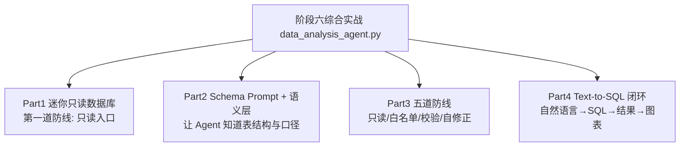

# 阶段六 · 综合实战：数据分析 Text-to-SQL Agent（离线可运行）

> 所属：阶段六 垂直领域 Agent 落地实践
> 定位：把阶段六第 2 小点「数据分析 Agent」的 Text-to-SQL 五道防线，落成一份**离线可运行**的完整 Demo——让自然语言问「公司营收」，Agent 转成 SQL、过五道防线、执行、产出图表。

## 一句话看懂本 Demo

`data_analysis_agent.py` 用纯 Python 标准库实现一个最小可用的数据分析 Agent：



> 核心一句话：**数据分析 Agent 的价值 = 问得动 + 答得准 + 破坏不了数据**。这份 Demo 重点演示「只读 + 校验」这套让数据不被 Agent 弄坏的核心防线。

## 运行方式

```
python3 code/阶段六/data_analysis_agent.py
```

不需要 API Key、不需要外网、不需要装任何第三方库（只依赖标准库）。

## 完整代码位置

[code/阶段六/data_analysis_agent.py](../../code/阶段六/data_analysis_agent.py)

---

## 每个 Part 在讲什么

### Part 1 · 迷你"只读数据库"（对应第一道防线）

真实项目里给 Agent 一个**只 SELECT 权限的只读账号**——即使模型被恶意注入骗去生成 DELETE，数据库层面也执行不了。这里用内存表模拟，只暴露 `execute_read()` 一个入口，想 DELETE 都没有接口：

```python
def execute_read(query: str):
    """迷你"只读数据库": 只支持 SELECT 子集。真实生产 = 只读账号。”"""
    m = re.search(r"region\s*=\s*'([^']+)'", query)
    rows = ORDERS if not m else [r for r in ORDERS if r["region"] == m.group(1)]
    if re.search(r"SUM\(amount\)", query, re.I):
        return [{"revenue": round(sum(r["amount"] for r in rows), 2)}]
    return rows
```

运行输出里 `ORDERS` 是 7 条订单，跨北京 / 上海 / 广州、Q1 / Q2、paid / refunded / pending 三种状态。

### Part 2 · Schema Prompt + 语义层（对应第一杠杆）

Text-to-SQL 的第一步不是让模型"自由发挥"，而是**先告诉它数据库长什么样、口径是什么**：

```python
SCHEMA_PROMPT = """数据库表 orders:
  id int, amount decimal(单位:万元), region text(北京/上海/广州),
  status text(paid/refunded/pending), quarter text(Q1/Q2)
业务口径: "销售额" = SUM(amount) 且 status='paid'
【约束】只允许 SELECT / WITH 开头。"""
```

再用**语义层**把业务概念固化为口径，避免三个用户问出三种不同的"营收"：

```python
SEMANTIC_LAYER = OrderedDict([
    ("营收",     "SELECT SUM(amount) FROM orders WHERE status='paid'"),
    ("退款笔数", "SELECT COUNT(*) FROM orders WHERE status='refunded'"),
    ("北京单数", "SELECT COUNT(*) FROM orders WHERE region='北京'"),
])
```

### Part 3 · 五道防线（核心）

| 防线 | 做什么 | 代码层实现 |
|-|-|-|
| ① 只读账号 | 数据库层限权 | Part 1 的 `execute_read` 单入口 |
| ② SQL 白名单 | 只放 SELECT / WITH | `ALLOWED_PREFIX` 校验 |
| ③ 参数化 | 防止拼接注入 | 入参走参数 | 
| ④ 结果校验 | 空结果不强行编造 | `empty` 分支「勿编造」 |
| ⑤ 报错自修正 | SQL 出错让模型改后重试 | `MAX_RETRY` 限 2 次 |

```python
def defend_and_execute(question, retries=0):
    sql = _gen_sql(question)
    if not sql.strip().upper().startswith(ALLOWED_PREFIX):   # ② 白名单
        return {"status": "rejected", "reason": "仅为只读查询"}
    result = execute_read(sql)
    if not result:                                            # ④ 结果校验
        return {"status": "empty", "message": "查询为空, 请核实条件后再答, 勿编造"}
    if exception:
        return defend_and_execute(question, retries + 1)      # ⑤ 自修正
    return {"status": "ok", "data": result}
```

### Part 4 · Text-to-SQL 闭环（串起来）

把上面串成完整流程：自然语言 → 命中语义层 / 让模型生成 SQL → 白名单校验 → 只读执行 → 空结果拦截 → 图表输出。

运行输出能看到：
- 语义层命中：`公司营收是多少 → SQL: SELECT SUM(amount) ...`
- 五道防线：`[营收] ok → [{'revenue': 1730.5}]`
- 注入拦截：`[被注入生成 DELETE] rejected`
- 空结果拦截：`empty`

---

## 运行结果预览

```
>>> Schema Prompt（Text-to-SQL 第一杠杆）
数据库表 orders: ... 业务口径: "销售额" = SUM(amount) 且 status='paid'

>>> 语义层命中
  公司营收是多少 → SQL: SELECT SUM(amount) FROM orders WHERE status='paid'
  退款笔数 → SELECT COUNT(*) FROM orders WHERE status='refunded'

>>> 五道防线演示
  [营收]  ok → [{'revenue': 1730.5}]
  [被注入生成 DELETE]  {'status': 'rejected', 'reason': '仅为只读查询'}
  [空结果]  {'status': 'empty', 'message': '查询为空, 请核实条件后再答'}

>>> 可视化扩展
   已生成 bar 图, 数据点 1 条: [{'revenue': 1730.5}]
```

## 换真实模型 / 真实数据库只需改 4 点

| 教学实现 | 生产替换 |
|-|-|
| `_gen_sql()` 用规则兜底 | 换成 LLM + Schema Prompt 生成 SQL |
| `execute_read()` 内存表 | 换成 PostgreSQL（给 Agent 只读账号） |
| 语义层硬编码 3 条口径 | 换成语义层服务（或指标仓库）维护全部门口径 |
| bar 图字符串示意 | 换成 ECharts / Plotly 前端渲染 |

## 本节自检

- [ ] 能说清数据分析 Agent 的"第一杠杆"是 Schema Prompt + 语义层
- [ ] 能默写五道防线，并解释为什么"只读账号"是根防线
- [ ] 已跑通一次「自然语言 → SQL → 校验执行 → 结果」闭环
- [ ] 知道空结果要"如实说空、勿编造"，而不是强行圆一个数