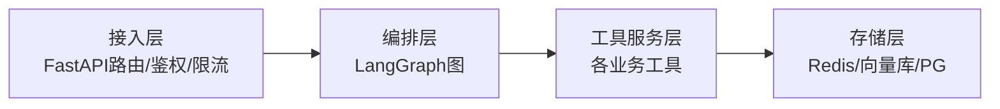
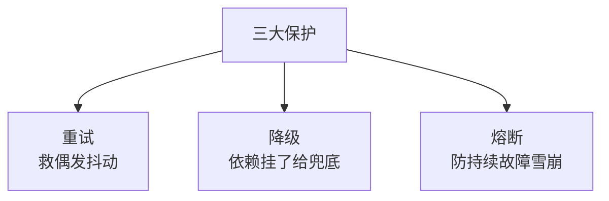

# 阶段七 · 小点 1：Agent 工程化最佳实践

> 所属：阶段七 工程化、部署与运维
> 定位：最大坑——Demo 跑得很好，上线生产大量异常。**Agent 本质是状态机服务，不是简单接口。** 这一讲给出生产落地必须的四件事：四层架构、状态持久化、容错降级、成本优化。

## 精简大纲

1. 四层架构与插件化工具注册中心
2. 状态持久化（临时 vs 持久）
3. 容错降级：重试 / 降级 / 熔断
4. 配置管理与成本优化（Token 统计 / 语义缓存 / 步骤限流）

## 学习内容详情

> 核心认知：把 Agent 当「一次请求一个答案的接口」是致命的——它有状态、会循环、调用外部资源，必须按**服务**工程化。

### 1. 四层架构（每层可独立测试替换）



1. **API 接入层**（FastAPI 路由 / 鉴权 / 限流）
2. **Agent 编排层**（LangGraph 图）
3. **工具服务层**（各业务工具）
4. **存储层**（Redis / 向量库 / PG）

- **价值**：换模型不动工具、加工具不改编排——各层依赖单向、可独立替换与测试。

#### 插件化工具注册中心

- 工具自注册进注册表，编排层按权限动态取用——**新增工具零改动核心代码**（开闭原则落地）。

```python
# 插件化注册中心: 工具自注册, 编排层按需取用
class ToolRegistry:
    _tools = {}

    @classmethod
    def register(cls, name, fn, permission="user"):
        """工具自注册: 新增工具只需调用一行, 不动核心编排代码"""
        cls._tools[name] = {"fn": fn, "permission": permission}

    @classmethod
    def get(cls, user_role, name):
        """编排层按权限动态取用: 权限不够取不到, 天然的门禁"""
        tool = cls._tools.get(name)
        if tool is None:
            return None
        if role_level(user_role) < role_level(tool["permission"]):
            return None                          # 权限拦截
        return tool["fn"]


# 新增业务工具 = 在模块加载处注册一行, 核心代码零改动
ToolRegistry.register("search", search_impl, permission="user")
ToolRegistry.register("transfer", transfer_impl, permission="admin")   # 高危需admin
```

### 2. 状态持久化

- **临时状态** vs **持久化状态**：
  - 临时 = 单次请求内中间变量（随请求销毁）；
  - 持久 = 跨请求必须存活的（会话历史 / 任务进度 / 记忆）。
- **判断标准：进程重启丢了会不会坏事——会就落库。**

```python
def decide_persist(state: dict) -> bool:
    """判断某状态是否该持久化: 重启丢了会不会坏事? 会就落库"""
    PERSIST_KEYS = {"conversation", "task_progress", "memory"}  # 跨请求存活
    return any(k in state for k in PERSIST_KEYS)   # True → 应落 Redis/PG
```

### 3. 容错降级（三大保护机制）

#### 3.1 三者的关系



- **超时重试**：救**偶发抖动**。
- **降级（Degradation）：** 依赖故障时返回兜底而非报错：知识库挂了 →「暂时无法查询，已记录您的问题」；搜索超时 → 跳过搜索直接答。原则：**核心链路（回答用户）永不为辅助能力的故障而中断**。
- **熔断器（Circuit Breaker）**：连续 N 次失败后**快速失败**一段时间（不再真的调用），避免雪崩——故障工具拖死所有请求线程；半开状态试探恢复。

> 与「重试」方向相反：重试救偶发抖动，熔断防持续故障——别对持续故障的工具傻傻重试，那会把它越拖越死。

```python
class CircuitBreaker:
    """极简熔断器: 连续失败N次 → 开(快速失败) → 半开试探 → 恢复/保持"""
    def __init__(self, fail_threshold=3, cooldown=10.0):
        self.fails, self.state, self.opened_at = 0, "closed", None
        self.fail_threshold, self.cooldown = fail_threshold, cooldown

    def allow(self) -> bool:
        if self.state == "closed":
            return True
        if self.state == "open" and time.time() - self.opened_at > self.cooldown:
            self.state = "half_open"          # 半开试探, 只放一个请求试水
            return True
        return False                          # open / 半开失败态: 快速失败不真调

    def record(self, ok: bool):
        if ok:
            self.state, self.fails = "closed", 0   # 成功 → 关闭
        else:
            self.fails += 1
            if self.state == "half_open" or self.fails >= self.fail_threshold:
                self.state = "open"; self.opened_at = time.time()  # 打开
```

```python
def call_with_cb(cb: CircuitBreaker, fn, fallback):
    """熔断 + 降级合一: 熔断开→不真调, 失败→给兜底而非报错"""
    if not cb.allow():
        return fallback("服务临时不可用")      # 熔断: 快速失败 + 降级兜底
    try:
        r = fn(); cb.record(True); return r
    except Exception:
        cb.record(False)
        return fallback("服务异常, 已记录了您的问题")   # 降级(降级≠报错)
```

### 4. 配置管理与成本优化

- **配置管理**：开发 / 测试 / 生产多环境隔离；密钥不入库不入 git；配置变更可审计（Apollo / Nacos 或最小版 `.env` + 启动参数）。

| 项 | 手段 |
|-|-|
| 多环境隔离 | 按环境读不同配置 / `.env` |
| 密钥安全 | 不入库不入 git，走 Secret / 环境变量 |
| 变更可审计 | 配置版本化，变更留痕 |

- **Token 消耗统计**：每次 LLM 调用记录 usage（`prompt_tokens` / `completion_tokens`）按会话 / 用户 / 工具聚合——**不知道钱花在哪，就谈不上优化**。

```python
def log_usage(session: str, user: str, prompt_tk: int, completion_tk: int):
    """Token 统计: 按会话/用户聚合, 找不到钱在哪就没法优化"""
    entry = {"session": session, "user": user,
             "prompt_tokens": prompt_tk, "completion_tokens": completion_tk}
    agg = AGG[user] = AGG.get(user, {"prompt": 0, "completion": 0})
    agg["prompt"] += prompt_tk; agg["completion"] += completion_tk
    return entry
```

- **模型缓存（语义缓存）**：相同（或语义相近）问题直接返回缓存答案，省完整一轮 LLM 调用。**注意 TTL 与业务容忍度：时效性问题（天气 / 库存）不可缓存。**

```python
def semantic_cache(key: str, ttl: int, cache) -> callable:
    """语义缓存装饰: 命中即复用上次答案, 省一轮 LLM 调用。
    一定要配 TTL —— 时效性问题(天气/库存)不可缓存, 应设 ttl=0。"""

    def deco(fn):
        def wrapper(*a, **kw):
            val = cache.get(key, ttl)
            if val is not None:
                return val                    # 命中 → 返回缓存
            val = fn(*a, **kw)
            if ttl > 0:
                cache.set(key, val, ttl)      # 写入带 TTL
            return val
        return wrapper
    return deco
```

- **步骤限流（per-user rate limit）**：按用户限制 Agent 执行步数 / 轮次——**防恶意用户构造「无限循环问题」烧钱**，成本侧的最后闸门。

```python
def step_budget(user: str, budget: dict, limit=20) -> bool:
    """步骤限流: 每用户每会话限制执行轮次, 超限强制停止"""
    used = budget.get(user, 0)
    if used >= limit:
        print(f"[限流] 用户 {user} 本轮次已达上限 {limit}, 强制停止")
        return False
    budget[user] = used + 1
    return True
```

## 本节自检

- [ ] 能说清四层架构与各自职责
- [ ] 能实现熔断 + 降级 + Token 统计 + 步骤限流的工程化骨架
- [ ] 能判断一个状态该不该持久化（重启丢了会不会坏）
- [ ] 能说清重试 / 降级 / 熔断三者的适用场景