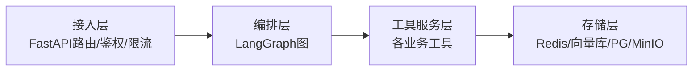
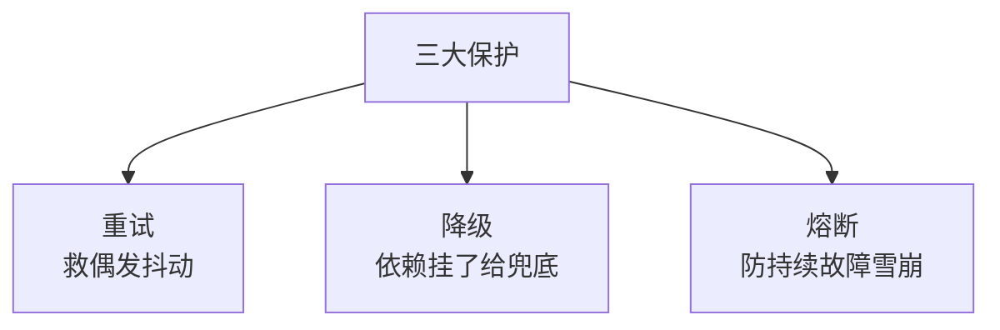

# 阶段七 · 小点 1：Agent 工程化最佳实践

> 所属：阶段七 工程化、部署与运维
> 定位：最大坑——Demo 跑得很好，上线生产大量异常。**Agent 本质是状态机服务，不是简单接口。** 这一讲给出生产落地必须的四件事：四层架构、状态持久化、容错降级、成本优化。

## 精简大纲

1. 四层架构与插件化工具注册中心（含跨层关注点模块）
2. 状态持久化（临时 vs 持久）
3. 容错降级：重试 / 降级 / 熔断
4. 配置管理与成本优化（Token 统计 / 语义缓存 / 步骤限流）

## 学习内容详情

> 核心认知：把 Agent 当「一次请求一个答案的接口」是致命的——它有状态、会循环、调用外部资源，必须按**服务**工程化。

### 1. 四层架构（每层可独立测试替换）



1. **API 接入层**（FastAPI 路由 / 鉴权 / 限流）
2. **Agent 编排层**（LangGraph 图）
3. **工具服务层**（各业务工具）
4. **存储层**（Redis / 向量库 / PG / MinIO）
   - **MinIO（对象存储）**：放**原始文档、产物文件（图表 / 报告）、大附件**——这类二进制大文件不进 PG 也不进向量库，向量库里只存切片 embedding + MinIO 文件地址。本项目 `app/config.py` 已预置 `minio_endpoint / minio_access_key / minio_secret_key / minio_bucket` 四项配置，启动时从 `.env` 读取即可接上。

- **价值**：换模型不动工具、加工具不改编排——各层依赖单向、可独立替换与测试。

#### 插件化工具注册中心

- 工具自注册进注册表，编排层按权限动态取用——**新增工具零改动核心代码**（开闭原则落地）。

```python
# 插件化注册中心: 工具自注册, 编排层按需取用
class ToolRegistry:
    _tools = {}

    @classmethod
    def register(cls, name, fn, permission="user"):
        """工具自注册: 新增工具只需调用一行, 不动核心编排代码"""
        cls._tools[name] = {"fn": fn, "permission": permission}

    @classmethod
    def get(cls, user_role, name):
        """编排层按权限动态取用: 权限不够取不到, 天然的门禁"""
        tool = cls._tools.get(name)
        if tool is None:
            return None
        if role_level(user_role) < role_level(tool["permission"]):   # role_level 为示意函数(比较权限级别), 需自行定义
            return None                          # 权限拦截
        return tool["fn"]


# 新增业务工具 = 在模块加载处注册一行, 核心代码零改动
ToolRegistry.register("search", search_impl, permission="user")
ToolRegistry.register("transfer", transfer_impl, permission="admin")   # 高危需admin
```

> ⏳ **短期可不深究**：上面 `permission="user"/"admin"` + `role_level()` 比较只是"示意版"权限门禁——真实生产的权限体系（RBAC 角色、细粒度字段级/动作级权限、密钥脱敏）复杂度不小，第一遍只要理解"注册表天然能做门禁"即可，具体权限模型后续按需再补。

#### 跨层关注点模块：schemas / config / errors / dependencies

四层之外还有一组**横切模块**——不属于任何一层，却被所有层引用，且**不依赖任何业务层**（依赖方向永远指向内，谁都能 import 它们、它们不 import 谁）。本项目 `app/` 的实际落地正是这个结构：`api/ agents/ tools/ storage/` 四个业务层目录 + 下面四个横切模块。

| 模块 | 职责 | 本项目落地 |
|-|-|-|
| `schemas/` | 跨层共享的**类型契约** | 请求 / 响应模型、SSE 协议模型（`event: token / done / error`）——api 层出口与 agents 层内部共用同一套模型，序列化格式永不漂移 |
| `config.py` | 全应用唯一配置入口 | pydantic-settings 读 `.env`（模型密钥 / PG / Redis / MinIO / Qdrant），业务模块禁止散落 `os.getenv` |
| `errors.py` | 统一错误语义 | `AppError` 基类 + `biz_code` 业务码 + 全局异常处理器——任何层 `raise AppError`，api 层出口自动转成统一 JSON（`code / message / trace_id`） |
| `dependencies.py` | Depends 注入 | `get_settings`（配置单例）、`get_trace_id`（链路 ID）——需要什么就声明注入什么，不在路由里手动 new |

```python
# app/errors.py —— 任何层 raise, api 层全局处理器统一转 JSON
class AppError(Exception):
    biz_code = BizCode.INTERNAL_ERROR       # 业务码: 前端据此提示
    http_status = 500

# app/dependencies.py —— 横切能力一律 Depends 注入
async def get_trace_id(request: Request) -> str:
    return request.state.trace_id            # 中间件预置, 全链路同一 ID
```

> 判断一个模块该不该进这组横切层的标准：**被所有层引用、不依赖任何业务层**。若某模块开始 import `agents/` 或 `tools/`，它就不属于横切层，应下沉到对应业务层。

### 2. 状态持久化

- **临时状态** vs **持久化状态**：
  - 临时 = 单次请求内中间变量（随请求销毁）；
  - 持久 = 跨请求必须存活的（会话历史 / 任务进度 / 记忆）。
- **判断标准：进程重启丢了会不会坏事——会就落库。**

```python
def decide_persist(state: dict) -> bool:
    """判断某状态是否该持久化: 重启丢了会不会坏事? 会就落库"""
    PERSIST_KEYS = {"conversation", "task_progress", "memory"}  # 跨请求存活
    return any(k in state for k in PERSIST_KEYS)   # True → 应落 Redis/PG
```

### 3. 容错降级（三大保护机制）

#### 3.1 三者的关系



- **超时重试**：救**偶发抖动**。
- **降级（Degradation）：** 依赖故障时返回兜底而非报错：知识库挂了 →「暂时无法查询，已记录您的问题」；搜索超时 → 跳过搜索直接答。原则：**核心链路（回答用户）永不为辅助能力的故障而中断**。
- **熔断器（Circuit Breaker）**：连续 N 次失败后**快速失败**一段时间（不再真的调用），避免雪崩——故障工具拖死所有请求线程；半开状态试探恢复。

> 与「重试」方向相反：重试救偶发抖动，熔断防持续故障——别对持续故障的工具傻傻重试，那会把它越拖越死。

```python
class CircuitBreaker:
    """极简熔断器: 连续失败N次 → 开(快速失败) → 半开试探 → 恢复/保持"""
    def __init__(self, fail_threshold=3, cooldown=10.0):
        self.fails, self.state, self.opened_at = 0, "closed", None
        self.fail_threshold, self.cooldown = fail_threshold, cooldown

    def allow(self) -> bool:
        if self.state == "closed":
            return True
        if self.state == "open" and time.time() - self.opened_at > self.cooldown:
            self.state = "half_open"          # 半开试探, 只放一个请求试水
            return True
        return False                          # open / 半开失败态: 快速失败不真调

    def record(self, ok: bool):
        if ok:
            self.state, self.fails = "closed", 0   # 成功 → 关闭
        else:
            self.fails += 1
            if self.state == "half_open" or self.fails >= self.fail_threshold:
                self.state = "open"; self.opened_at = time.time()  # 打开
```

> ⏳ **短期可不深究**：熔断器的成败计数与窗口（`fail_threshold`/`cooldown`/`half_open`）这个极简实现只是原理示意——生产里直接引 resilient / tenacity 等现成库（它们往往用"时间窗内的失败率"而非简单计数），第一遍知道"连续失败就快速失败、半开试探、成功恢复"这件事即可。

```python
def call_with_cb(cb: CircuitBreaker, fn, fallback):
    """熔断 + 降级合一: 熔断开→不真调, 失败→给兜底而非报错"""
    if not cb.allow():
        return fallback("服务临时不可用")      # 熔断: 快速失败 + 降级兜底
    try:
        r = fn(); cb.record(True); return r
    except Exception:
        cb.record(False)
        return fallback("服务异常, 已记录了您的问题")   # 降级(降级≠报错)
```

> 🔬 **深度理解 · 重试 / 降级 / 熔断三件套**：
> 1. **本质**：三者处理"外部依赖故障"的同一问题，但分工不同——**重试假设故障是短时抖动（值得再试）**，**熔断假设故障是持续恶化的（先别试）**，**降级则承认失败、但给主反馈一个兜底而非硬报错**。
> 2. **机制**：重试要看"操作是否幂等 + 退避策略"（指数退避 + 随机抖动 jitter 避免恢复瞬间惊群）；熔断用失败率/失败次数驱动 `closed → open → half-open` 三态迁移，open 期间不真调、half-open 放少量请求试探恢复；降级是"旁路"，在超时或熔断触发时返回预先设计的兜底路径。
> 3. **为什么重要**：没有重试，一次瞬间抖动就误伤成功率；只有重试没有熔断，持续故障的工具会被所有请求反复打爆以致雪崩；没有降级，任何一个辅助工具（搜索/知识库/百科）挂掉都会终结"给出回答"这条主链路。三者按"抖动→持续→兜底"组合，才能在保可用性的同时不加重故障。
> 4. **易错点**：① 对**非幂等**操作盲目重试，造成重复副作用（转账扣两次）；② 重试时不退避，故障刚恢复就被并发冲垮；③ 把熔断与降级混为一谈——熔断管"我不再调用它"，降级管"我最终给用户什么"；④ **别对持续故障的工具无限重试**，那会把它越拖越死，熔断正是为限制这一点而生（呼应上一行正文）。

### 4. 配置管理与成本优化

- **配置管理**：开发 / 测试 / 生产多环境隔离；密钥不入库不入 git；配置变更可审计（Apollo / Nacos 或最小版 `.env` + 启动参数）。

| 项 | 手段 |
|-|-|
| 多环境隔离 | 按环境读不同配置 / `.env` |
| 密钥安全 | 不入库不入 git，走 Secret / 环境变量 |
| 变更可审计 | 配置版本化，变更留痕 |

- **Token 消耗统计**：每次 LLM 调用记录 usage（`prompt_tokens` / `completion_tokens`）按会话 / 用户 / 工具聚合——**不知道钱花在哪，就谈不上优化**。

```python
def log_usage(session: str, user: str, prompt_tk: int, completion_tk: int):
    """Token 统计: 按会话/用户聚合, 找不到钱在哪就没法优化"""
    entry = {"session": session, "user": user,
             "prompt_tokens": prompt_tk, "completion_tokens": completion_tk}
    agg = AGG[user] = AGG.get(user, {"prompt": 0, "completion": 0})
    agg["prompt"] += prompt_tk; agg["completion"] += completion_tk
    return entry
```

- **模型缓存（语义缓存）**：相同（或语义相近）问题直接返回缓存答案，省完整一轮 LLM 调用。**注意 TTL 与业务容忍度：时效性问题（天气 / 库存）不可缓存。**

```python
def semantic_cache(key: str, ttl: int, cache) -> callable:
    """语义缓存装饰: 命中即复用上次答案, 省一轮 LLM 调用。
    一定要配 TTL —— 时效性问题(天气/库存)不可缓存, 应设 ttl=0。"""

    def deco(fn):
        def wrapper(*a, **kw):
            val = cache.get(key, ttl)
            if val is not None:
                return val                    # 命中 → 返回缓存
            val = fn(*a, **kw)
            if ttl > 0:
                cache.set(key, val, ttl)      # 写入带 TTL
            return val
        return wrapper
    return deco
```

> 🔬 **深度理解 · 语义缓存**：
> 1. **本质**：用 LLM embedding 把"问题"映射成高维向量，命中"语义相近"的旧答案时直接返回，省掉一整轮"prompt 编排 + LLM 在线推理（可能还带工具调用）"，是对成本和延迟的双重复用。
> 2. **机制**：它不是完全匹配的 KV，而是存 `(问题向量 → 答案)`：查询时对候选做向量相似度匹配（常用余弦相似度），超过阈值即命中共用旧答案；未命中才真正调用 LLM，再写回缓存并带 TTL。命中后通常还要校验内容的版本 / 时效属性。
> 3. **为什么重要**：LLM 生成的 token 贵且慢，语义缓存把"算过一次的答案"复用，能直接降成本、降 P95；**边界**在于它绕过了真实推理——对时效性与个性化场景（天气、库存、带用户上下文的回答）会返回"看起来合理但已过期/不适用"的结果，所以必须有 TTL 与业务容忍度约束。
> 4. **易错点**：① 只配缓存不配 TTL/版本失效，缓存悄悄"撒谎"给过期答案；② 相似度阈值设太松（把"明天会下雨吗"误命中成"后天会下雨吗"）返回错误答案，设太紧又基本不命中；③ key 忘了带会话/用户上下文，导致跨用户串结果；④ 不与下文 Token 统计联动，不知道缓存到底省没省钱、阈值合不合理。

- **步骤限流（per-user rate limit）**：按用户限制 Agent 执行步数 / 轮次——**防恶意用户构造「无限循环问题」烧钱**，成本侧的最后闸门。

```python
def step_budget(user: str, budget: dict, limit=20) -> bool:
    """步骤限流: 每用户每会话限制执行轮次, 超限强制停止"""
    used = budget.get(user, 0)
    if used >= limit:
        print(f"[限流] 用户 {user} 本轮次已达上限 {limit}, 强制停止")
        return False
    budget[user] = used + 1
    return True
```

> 🔬 **深度理解 · 步骤限流（rate limit / step budget）**：
> 1. **本质**：把"单个用户/会话可消耗的计算额度"显式设上限，是**成本与安全侧的最后闸门**——因为 Agent 是循环的，坏 prompt 一旦进来就可能在一次请求内在多个"LLM 调用 + 工具执行"间无限自旋，把预算烧光。
> 2. **机制**：通常按 user+session 各维护一个计数器，Agent 每执行一步就 `used+1`，超过阈值即强制终止本轮并给出"本轮已用完"的结算信息；进阶做法用**令牌桶（token bucket）**按时间窗口放行，而非常用的"会话累计"粗粒度判断。
> 3. **为什么重要**：语义缓存是"省"、Token 统计是"看"，而步骤限流是"断"——它能真正防住恶意/病态请求耗尽预算；**边界**在于它保护的是"额度"，不是"瞬时高并发"，两者目标不同要分开设计（并发保护靠限流器/队列，额度保护靠步数上限）。
> 4. **易错点**：① 只限 LLM 调用次数、不限工具执行，攻击者转向在工具循环里烧资源；② 粒度选错——全局计数误伤正常用户、仅按用户又漏掉多开刷量，通常用 user+session；③ 超限时直接裸报错而不是优雅降级，应返回"本轮使用已达上限"并可引导续用。

## 本节自检

- [ ] 能说清四层架构与各自职责
- [ ] 能实现熔断 + 降级 + Token 统计 + 步骤限流的工程化骨架
- [ ] 能判断一个状态该不该持久化（重启丢了会不会坏）
- [ ] 能说清重试 / 降级 / 熔断三者的适用场景

---

## 本节常见面试题（深度解析）

> 针对本节核心知识的面试高频点，配合"本质+机制"式理解，能让你答得既有深度又有广度。

### 面试题 1：重试（Retry）、降级（Degradation）、熔断（Circuit Breaker）三者的区别？怎样配合使用？
- **面试官想考察**：是真理解了三种容错手段各自解决什么问题，还是只会背名词；是否踩过"无限重试把依赖打爆"这类坑。
- **专业作答（含深度）**：
  1. **分本质**：重试假设故障是短时抖动、值得再试；熔断假设故障持续恶化、先别试；降级承认失败但保住主链路，给兜底而不报错。
  2. **分机制**：重试要配指数退避+jitter 且只对幂等操作重试；熔断在 closed/open/half-open 三态迁移，控制"要不要真去调用"；降级由超时或熔断触发，返回预设兜底路径。
  3. **配合链路**：偶发抖动→重试；重试仍失败→计入熔断器；熔断打开→不再真调、转快速失败→触发降级兜底；冷却后 half-open 试水，成功后熔断关闭。
  4. **边界**：三者不可互相替代——无重试误伤成功率，无熔断会雪崩，无降级则任一辅助工具故障都会终结主回答链路。
- **加分亮点 / 深度追问**：可主动补一句"持续故障的工具绝不要无限重试，那会把它越拖越死，熔断正是为了限住它"；被追问"非幂等操作（如转账）如何安全重试"时，答"引入幂等键或先查后写，避免重复扣款"。

### 面试题 2：语义缓存该怎么做？它主要的坑在哪？
- **面试官想考察**：是否有缓存的实际工程经验，能否识别"缓存命中"与"业务正确性"之间的冲突。
- **专业作答（含深度）**：
  1. **做法**：embedding 把问题向量化→与缓存候选做相似度匹配→超阈值即命中、直接复用答案；未命中调用 LLM 后再按 `(相似问题→答案)` 写回并带 TTL。
  2. **关键权衡**：相似度阈值决定"命中率 vs 正确率"，需靠评测调参；TTL 决定时效性，天气/库存这类必须 `ttl=0` 不缓存。
  3. **与 Token 统计配合**：先统计同类问题重复度和高昂成本，判断缓存值不值；再用"省了多少 token"验证阈值与命中质量是否合理。
- **加分亮点 / 深度追问**：可提"key 要带版本号/会话上下文，避免跨用户串答案"；被追问"语义相近但答案必须不同（含用户上下文）"时，答"对这类请求强制 miss 或把上下文纳入向量，从根上避免误命中"。

### 面试题 3：Agent 服务为什么要做"步骤限流"？限流键怎么选？
- **面试官想考察**：是否意识到 Agent 相对普通接口的独特风险（循环、多步调用），以及成本与安全的工程素养。
- **专业作答（含深度）**：
  1. **为什么**：Agent 是循环的，一次请求可触发多次 LLM+工具调用；恶意/病态请求能构造"无限循环问题"把预算烧光，步骤限流是成本安全的最后闸门。
  2. **与缓存/统计的分工**：缓存是"省"、Token 统计是"看"、步骤限流是"断"，三者职责清晰缺一不可。
  3. **键的选择**：常取 user+session 双粒度——纯全局会误伤正常用户、纯按用户又拦不住多开；超限用"本轮已用完可续用"的优雅降级而非裸报错。
- **加分亮点 / 深度追问**：可主动区分"额度保护（step budget）"与"瞬时并发保护（rate limiting）"是两回事要分开设计；被追问时再展开令牌桶（token bucket）与固定窗口计数在限流里的区别。