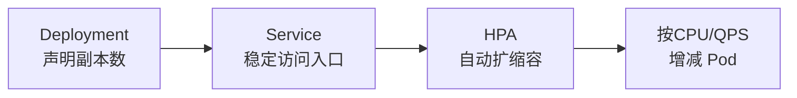
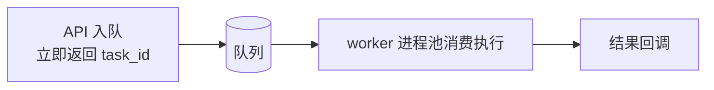
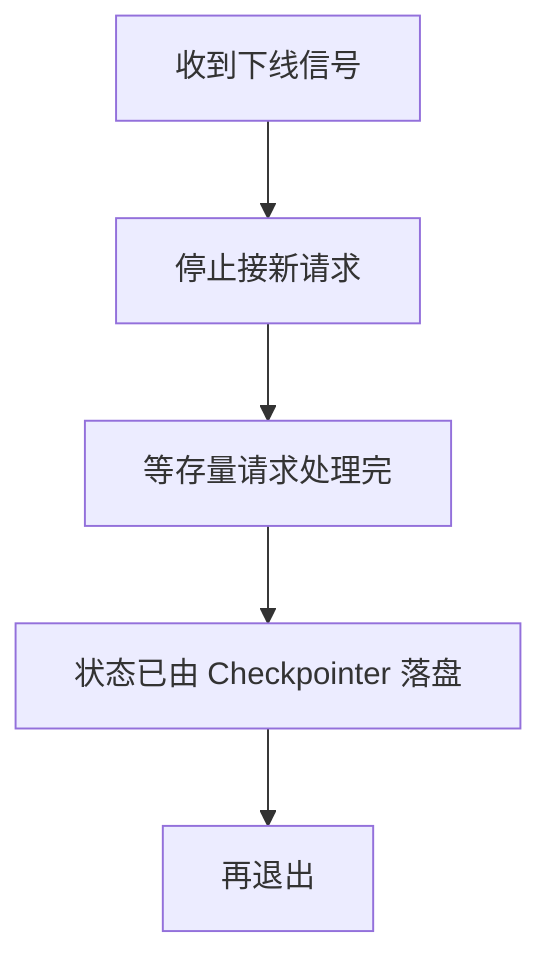
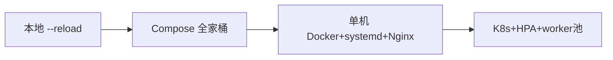

# 阶段七 · 小点 2：部署与伸缩

> 所属：阶段七 工程化、部署与运维
> 定位：怎么把 Agent 从「我本机能跑」一步步扩展到「团队共享」再到「生产可扩」。这一讲走一遍容器化 → 云原生 → 部署演进路线，并讲清任务队列与优雅停机两个关键机制。

## 精简大纲

1. 容器化：Docker / Compose 本地整套环境
2. 云原生：K8s 部署、HPA、任务队列、优雅停机
3. 部署演进路线（量力而行）
4. 边缘轻量方案

## 学习内容详情

> 核心认知：部署的宗旨是「量力而行」。内部场景多数停在 Compose / 单机 Docker 就够，**别为 3 个用户上 K8s 集群**。

### 1. 容器化（Compose 本地全家桶）

`docker-compose.yml` 一键拉起「应用 + worker + Redis（队列 broker / 会话缓存）+ PostgreSQL（Checkpointer）+ Qdrant（向量库）」。

```yaml
# docker-compose.yml (最小全家桶: 应用 + worker + 三个存储)
services:
  api:                        # ① API 接入层
    image: my-agent:1.0
    command: uvicorn app.main:app --host 0.0.0.0 --port 8000
    ports: ["8000:8000"]      # 仅 api 对外暴露
    depends_on: [redis, pg, qdrant]
    environment:
      REDIS_URL: redis://redis:6379
      DATABASE_URL: postgres://agent:agent@pg/agent
  worker:                     # ② 长任务 worker: 同镜像不同入口
    image: my-agent:1.0
    command: arq app.worker.main.WorkerSettings   # 换 arq 入口即可
    depends_on: [redis, pg, qdrant]
    deploy:
      replicas: 3             # 可水平加 worker 扩吞吐
  redis:
    image: redis:7            # 队列 broker / 会话缓存
  pg:
    image: postgres:16        # Checkpointer 状态落库
  qdrant:
    image: qdrant/qdrant      # 向量库
```

- **worker 与 API 同镜像不同入口**（command 换 arq 入口），生产省略 ports（不对外暴露）。

### 2. 云原生（K8s 生产部署）



#### 2.1 K8s 最小集

- **Deployment**（声明副本数）+ **Service**（稳定访问入口）+ **HPA**（自动扩缩容）。
- **Pod**：最小部署单元；需要本地模型时可「应用容器 + 模型 sidecar 容器」同 Pod 共享网络。
- **HPA**：按指标（CPU / 自定义 QPS）自动增减 Pod。**注意：扩容解决「请求多」，解决不了「单请求慢」**（那要靠异步任务 + 队列）。

#### 2.2 任务队列（Task Queue）



- **作用**：长耗时 Agent 任务的缓冲带——**API 只入队即返回 `task_id`**，worker 进程池消费执行（Celery / Arq / RQ）。
- **价值**：
  1. **削峰**：突发流量排队而非打垮服务；
  2. **隔离**：慢任务不占 API 资源；
  3. **可水平加 worker 扩吞吐**。

```python
# API 侧: 入队即返回, 不阻塞 (Arq 示意)
async def submit_task(request, queue):
    job_id = await queue.enqueue_job("run_agent", request.model.table_dump())
    return {"task_id": job_id.id, "status": "queued"}   # 立即返回, 不等结果
```

#### 2.3 优雅停机（Graceful Shutdown）



- 收到下线信号后**停止接新请求 → 等存量请求处理完 → 状态已由 Checkpointer 落盘 → 再退出**。没有它，每次发布都会切断在途 Agent 任务。

#### 2.4 其他要点

- **滚动发布**：`rollingUpdate` 策略 + `readinessProbe`（就绪探针，没好不接流量）。
- 镜像带版本号禁用 `latest`；密钥走 K8s Secret。

### 3. 部署演进路线（量力而行）

| 阶段 | 方案 |
|-|-|
| 阶段 0 本地 | `uvicorn --reload` 直接跑 |
| 阶段 1 团队 | Compose 全家桶——一键起，环境一致 |
| 阶段 2 小生产 | 单机 Docker + systemd 自启 + Nginx 反代（K8s 前不必上） |
| 阶段 3 规模化 | K8s + HPA + worker 池 + Secret 管理密钥 |
| 阶段 4 补充形态 | Serverless / 云函数——低并发、事件驱动、突发流量（如定时批处理、webhook 触发的 Agent 任务）；AWS Lambda / 阿里云函数计算 / Cloudflare Workers |



- **务实建议**：大多数内部 Agent 服务停在**阶段 2** 就够了——**别为 3 个用户上 K8s 集群**。
- **Serverless / 云函数（补充形态，不替代常驻服务）**：适合低并发、事件驱动、突发流量的任务型 Agent（定时批处理、webhook 触发的报告生成 / 通知），零闲置按调用计费；主流平台 AWS Lambda / 阿里云函数计算 / Cloudflare Workers。
  > ⚠️ **两个硬限制**：① **冷启动延迟**——实例按需拉起，首次调用多出秒级甚至更久的冷启，**不适合对话首响**这类延迟敏感链路；② **流式长连接支持受限**——Agent 的 SSE 流式输出需要平台支持响应流（部分函数平台不支持或不完整），不支持就得退化成「一次性返回 / 轮询」。

### 4. 边缘轻量方案

- 用 1~4B 小模型（Qwen2.5-1.5B 级）跑端侧（手机 / 盒子）原型：**隐私好、离线可用**。
- 代价是**能力断崖**——只适合窄场景固定流程，别指望复杂工具调用。

## 本节自检

- [ ] 能编写 Compose 全家桶并一键拉起整套环境
- [ ] 能说清任务队列解决什么问题、优雅停机为什么必要
- [ ] 能画出部署演进四个阶段并判断当前该停在哪