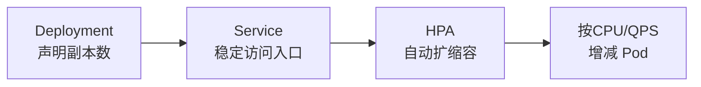
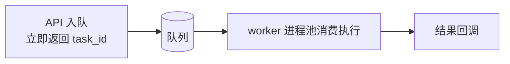
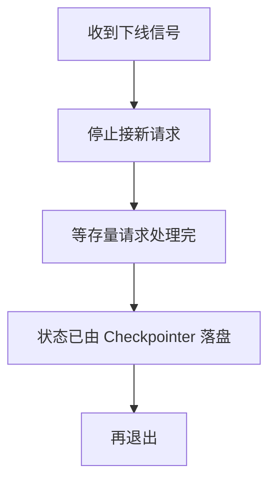
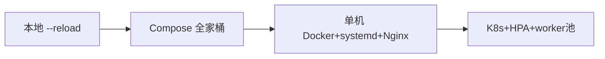

# 阶段七 · 小点 2：部署与伸缩

> 所属：阶段七 工程化、部署与运维
> 定位：怎么把 Agent 从「我本机能跑」一步步扩展到「团队共享」再到「生产可扩」。这一讲走一遍容器化 → 云原生 → 部署演进路线，并讲清任务队列与优雅停机两个关键机制。

## 精简大纲

1. 容器化：Docker / Compose 本地整套环境
2. 云原生：K8s 部署、HPA、任务队列、优雅停机
3. 部署演进路线（量力而行）
4. 边缘轻量方案

## 学习内容详情

> 核心认知：部署的宗旨是「量力而行」。内部场景多数停在 Compose / 单机 Docker 就够，**别为 3 个用户上 K8s 集群**。

### 1. 容器化（Compose 本地全家桶）

`docker-compose.yml` 一键拉起「应用 + worker + Redis（队列 broker / 会话缓存）+ PostgreSQL（Checkpointer）+ Qdrant（向量库）」。

```yaml
# docker-compose.yml (最小全家桶: 应用 + worker + 三个存储)
services:
  api:                        # ① API 接入层
    image: my-agent:1.0
    command: uvicorn app.main:app --host 0.0.0.0 --port 8000
    ports: ["8000:8000"]      # 仅 api 对外暴露
    depends_on: [redis, pg, qdrant]
    environment:
      REDIS_URL: redis://redis:6379
      DATABASE_URL: postgres://agent:agent@pg/agent
  worker:                     # ② 长任务 worker: 同镜像不同入口
    image: my-agent:1.0
    command: arq app.worker.main.WorkerSettings   # 换 arq 入口即可
    depends_on: [redis, pg, qdrant]
    deploy:
      replicas: 3             # 可水平加 worker 扩吞吐(普通 `docker compose` 会忽略 replicas, 需 swarm 或 --compatibility)
  redis:
    image: redis:7            # 队列 broker / 会话缓存
  pg:
    image: postgres:16        # Checkpointer 状态落库
  qdrant:
    image: qdrant/qdrant      # 向量库
```

> ⏳ **短期可不深究**：上面 worker 服务里的 `deploy.replicas: 3` 在**普通 `docker compose` 下会被忽略**（只有 swarm 模式或加 `--compatibility` 才生效）——第一遍只要知道"worker 想水平扩展需要 swarm/真正的集群工具"，不用纠结这个 yaml 字段在单机 compose 下的行为差异。

> 🔬 **深度理解 · 容器化与环境隔离**：
> 1. **本质**：把"应用 + 它运行所需的完整依赖"打包成一个可移植的标准镜像，从根本上把"环境差异"从部署问题里剥离——同一份镜像在本地、CI、与生产跑出的行为一致。
> 2. **机制**：Docker 借助 Linux 内核的 namespace（进程/网络/文件系统隔离）与 cgroup（CPU/内存限额）做轻量虚拟化；Compose 再用一条 yaml 把"应用 + worker + 存储"声明成服务编排，容器间靠内部 DNS 名互相访问，只把对外端口暴露出去。
> 3. **为什么重要**：Agent 服务依赖众多（模型密钥、PG、Redis、Qdrant、MinIO），不做环境隔离最容易犯"我本机能跑、别人不行"的系统性错误；容器化正好对应阶段七"状态机服务"的复杂度——依赖封闭后，搬家常驻环境都比裸进程简单。
> 4. **易错点**：① 只容器化却不挂数据卷（volume），容器重建即丢数据（这里 PG/Redis/Qdrant 必须持久化）；② 用 `latest` 标签不锁版本，环境不可复现；③ 密钥写死在镜像里（应走环境变量 / Secret）；④ 误以为"容器化 = 生产就绪"，真正的隔离还有网络策略、资源限额与可观测三件事要补。

- **worker 与 API 同镜像不同入口**（command 换 arq 入口），生产省略 ports（不对外暴露）。

### 2. 云原生（K8s 生产部署）



#### 2.1 K8s 最小集

- **Deployment**（声明副本数）+ **Service**（稳定访问入口）+ **HPA**（自动扩缩容）。
- **Pod**：最小部署单元；需要本地模型时可「应用容器 + 模型 sidecar 容器」同 Pod 共享网络。

> ⏳ **短期可不深究**：这个「应用容器 + 模型 sidecar 容器」共处一个 Pod 的做法，是**需要在本地跑私有/离线模型**时才用到的偏冷场景——大多数调用云端 API 的 Agent 用不到，第一遍知道有 sidecar 这个模式即可。

- **HPA**：按指标（CPU / 自定义 QPS）自动增减 Pod。**注意：扩容解决「请求多」，解决不了「单请求慢」**（那要靠异步任务 + 队列）。

> 🔬 **深度理解 · 无状态伸缩与存储粘性**：
> 1. **本质**：**"能水平扩缩"的前提是服务无状态**——任意一个副本都必须能平等地接请求、处理完不依赖"我这台机器"上的私有记忆；一旦副本里存了只有自己知道的会话/进度，扩容出的新副本接不了活，缩容又可能丢状态。
> 2. **机制**：HPA 按 CPU / 自定义 QPS 等指标增减 Pod，这就要求把**可变状态外置**到共享存储——会话历史进 Redis、Checkpointer 进 PG、向量切片进 Qdrant、文件进 MinIO，副本退化成"无脑执行"的计算单元。
> 3. **为什么重要**：Agent 比普通服务更易踩"粘性"坑——若把会话上下文放**内存**，负载均衡随机转发，用户请求漂移到别的副本就会"追问丢了上文、上下文断了"；这在单机演示时完全看不出来，一上 K8s + HPA 就露馅。这正是 Compose 里把 Redis/PG/Qdrant 单独起成服务的本质原因。
> 4. **易错点**：① 把"无状态的模型推理"误当有状态——它是可无限扩的，有状态的只是上下文/进度这类可变数据；② 会话缓存做在**内存级**且负载均衡无亲和性（sticky session），用户漂移即丢上下文，要用共享的 Redis 解决；③ 只给计算侧扩容、存储侧（Redis 单点 / PG 无主备）没跟上，照样成为新瓶颈——"计算可扩，存储要跟上"。

#### 2.2 任务队列（Task Queue）



- **作用**：长耗时 Agent 任务的缓冲带——**API 只入队即返回 `task_id`**，worker 进程池消费执行（Celery / Arq / RQ）。
- **价值**：
  1. **削峰**：突发流量排队而非打垮服务；
  2. **隔离**：慢任务不占 API 资源；
  3. **可水平加 worker 扩吞吐**。

```python
# API 侧: 入队即返回, 不阻塞 (Arq 示意)
async def submit_task(request, queue):
    job_id = await queue.enqueue_job("run_agent", request.model.table_dump())
    return {"task_id": job_id.id, "status": "queued"}   # 立即返回, 不等结果
```

#### 2.3 优雅停机（Graceful Shutdown）



- 收到下线信号后**停止接新请求 → 等存量请求处理完 → 状态已由 Checkpointer 落盘 → 再退出**。没有它，每次发布都会切断在途 Agent 任务。

> 🔬 **深度理解 · 优雅停机（Graceful Shutdown）**：
> 1. **本质**：在进程/副本被终止前，给"在途请求"处理善后的机会——先停接新流量，把正在跑的 Agent 任务跑完或安全落盘再退出；否则每次发布、缩容、节点驱逐都会硬切断在途任务。
> 2. **机制**：收到下线信号（SIGTERM）后：① 把自己从负载均衡/服务发现中摘除，不再接着新请求；② 在**宽限期**内等存量请求处理完（超过宽限期仍会强制终止，防止拖死）；③ 把 Agent 关键状态交给 Checkpointer 落盘（会话/任务进度写 PG / Redis）；④ 处理完毕再 exit。K8s 侧由 `preStop` hook、`terminationGracePeriodSeconds` 与 readiness/startup probe 配合完成。
> 3. **为什么重要**：Agent 任务往往长耗时（一次对话几十秒到几分钟），发布又是常态；没有优雅停机，每次发布都批量打断在途 Agent 请求、丢进度——用户侧表现为"回答到一半断了"。这也是把 Agent 当"服务"而非"脚本"的关键差别之一。
> 4. **易错点**：① 收到 SIGTERM 但不真正等待存量请求（等于没做）；② 宽限期设太短，长任务没跑完就被强杀；③ 只"等"却不落盘——停机后再拉起仍需靠 Checkpointer 恢复，光等也白等；④ 忽略强杀（KILL）之外的兜底，重负载下对已在途的操作仍需幂等重试。

#### 2.4 其他要点

- **滚动发布**：`rollingUpdate` 策略 + `readinessProbe`（就绪探针，没好不接流量）。
- 镜像带版本号禁用 `latest`；密钥走 K8s Secret。

### 3. 部署演进路线（量力而行）

| 阶段 | 方案 |
|-|-|
| 阶段 0 本地 | `uvicorn --reload` 直接跑 |
| 阶段 1 团队 | Compose 全家桶——一键起，环境一致 |
| 阶段 2 小生产 | 单机 Docker + systemd 自启 + Nginx 反代（K8s 前不必上） |
| 阶段 3 规模化 | K8s + HPA + worker 池 + Secret 管理密钥 |
| 阶段 4 补充形态 | Serverless / 云函数——低并发、事件驱动、突发流量（如定时批处理、webhook 触发的 Agent 任务）；AWS Lambda / 阿里云函数计算 / Cloudflare Workers |



- **务实建议**：大多数内部 Agent 服务停在**阶段 2** 就够了——**别为 3 个用户上 K8s 集群**。
- **Serverless / 云函数（补充形态，不替代常驻服务）**：适合低并发、事件驱动、突发流量的任务型 Agent（定时批处理、webhook 触发的报告生成 / 通知），零闲置按调用计费；主流平台 AWS Lambda / 阿里云函数计算 / Cloudflare Workers。
  > ⚠️ **两个硬限制**：① **冷启动延迟**——实例按需拉起，首次调用多出秒级甚至更久的冷启，**不适合对话首响**这类延迟敏感链路；② **流式长连接支持受限**——Agent 的 SSE 流式输出需要平台支持响应流（部分函数平台不支持或不完整），不支持就得退化成「一次性返回 / 轮询」。

### 4. 边缘轻量方案

- 用 1~4B 小模型（Qwen2.5-1.5B 级）跑端侧（手机 / 盒子）原型：**隐私好、离线可用**。
- 代价是**能力断崖**——只适合窄场景固定流程，别指望复杂工具调用。

> ⏳ **短期可不深究**：端侧小模型（1~4B 跑在手机/盒子）属边缘/偏门场景，模型能力迭代又快——第一遍了解"有这条路：隐私好、离线可用、能力断崖"即可，真要做端侧原型时再按当时的最新小模型评估选型，不必现在深挖。

## 本节自检

- [ ] 能编写 Compose 全家桶并一键拉起整套环境
- [ ] 能说清任务队列解决什么问题、优雅停机为什么必要
- [ ] 能画出部署演进四个阶段并判断当前该停在哪

---

## 本节常见面试题（深度解析）

> 针对本节核心知识的面试高频点，配合"本质+机制"式理解，能让你答得既有深度又有广度。

### 面试题 1：为什么"扩容 / 加机器"解决不了"单请求慢"？任务队列怎么补上这一块？
- **面试官想考察**：是否真正理解水平扩缩的本质与"异步化"的用途，而非只会搬 HPA 名词。
- **专业作答（含深度）**：
  1. **根本区别**：扩容提升的是**并发吞吐**（单请求内部的 LLM 调用延迟是固有的，加副本也改变不了单个请求要花几十秒）；"单请求慢"要靠**延迟优化**（缓存、小模型、精简 prompt）与**异步化**处理。
  2. **任务队列的作用**：API 入队即返回 `task_id` → worker 池消费执行 → 结果回调；提供**削峰**（突发排队不把服务打垮）、**隔离**（慢任务不占 API 资源）、**可水平加 worker 扩吞吐**三条价值。
  3. **两者配合**：把长耗时的 Agent 任务从同步请求里拆出去，用队列做缓冲带，再用加 worker 的方式扩消费；这样"并发高"与"单请求慢"两类问题分开解决。
- **加分亮点 / 深度追问**：可主动点明"HPA 解决并发容量、队列解决长任务、缓存/小模型解决延迟，三者解决的是不同维度的问题"；被追问"为什么不让 API 直接同步做"时，答"长任务会占满 API 工作线程，把简单快请求也拖垮，且无超时兜底"。

### 面试题 2：优雅停机（Graceful Shutdown）为什么必要？一个 Agent 服务如何做到？
- **面试官想考察**：是否有服务化发布的成熟度，是否踩过"发布切流打断请求"的坑。
- **专业作答（含深度）**：
  1. **必要性**：Agent 任务长耗时，且常驻服务要频繁滚动发布；无优雅停机，每次发布/缩容都会硬切断在途 Agent 请求、丢进度。
  2. **四步做法**：收到 SIGTERM → 摘除流量、不再接新请求 → 宽限期内等存量跑完 → Checkpointer 把关键状态落盘 → 再退出；K8s 用 `preStop` + `terminationGracePeriodSeconds` + readiness probe 配好。
  3. **与 Checkpointer 的关系**：停机前必须把进行中的会话/进度落盘，否则重启无法恢复——"等存量"与"落盘"两者缺一不可。
- **加分亮点 / 深度追问**：可补一句"滚动发布要配就绪探针，新副本 readiness 通过前不接流量"；被追问"宽限期设多少"时，答"参考 P95/P99 长尾定，超过宽限期强杀后依赖幂等重试兜底"。

### 面试题 3：Agent 服务为什么必须"无状态"才能水平扩缩？Redis 会话缓存又为何会造成"粘性"？
- **面试官想考察**：是否理解状态与伸缩的关系、分布式里的粘性问题，以及"共享存储外置"的动机。
- **专业作答（含深度）**：
  1. **无状态的前提**：任意副本都能平等接请求、不依赖本机私有记忆；一旦有私有状态，扩容新副本接不了活、缩容丢状态，水平扩缩就失去意义。
  2. **外置原则**：会话历史进 Redis、Checkpointer 进 PG、向量进 Qdrant、文件进 MinIO，副本只做无脑计算。
  3. **粘性怎么来**：若把会话缓存放**单实例内存**，负载均衡随机转发时用户请求漂移到别的副本就丢上下文（产生粘性依赖）；共享的 Redis 正是为了打破这种"状态长在某台机器上"。
- **加分亮点 / 深度追问**：可主动补充"计算侧无状态解决了伸缩，但存储侧（Redis/PG 自身）的扩容与一致性是下一个瓶颈"；被追问"Redis 会话如何避免多副本写冲突"时，答"靠会话 ID 分片 / 单写多读或引入事务边界，需求不同权衡不同"。