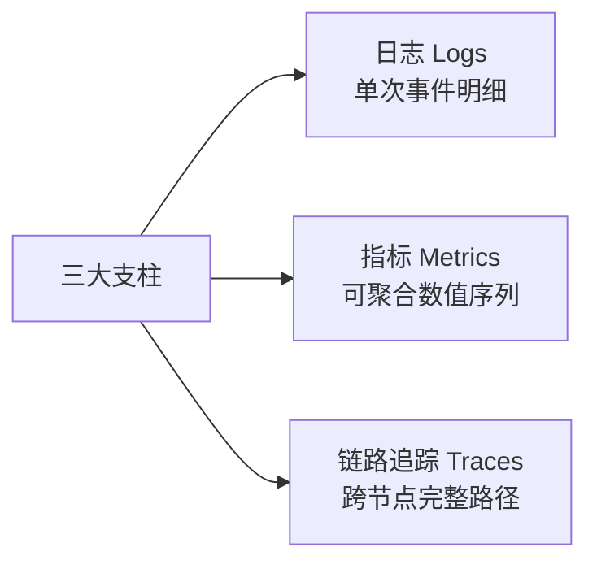
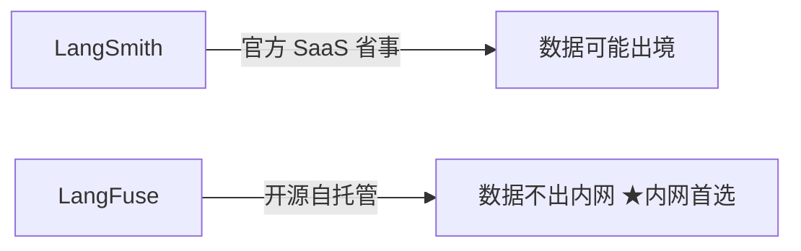
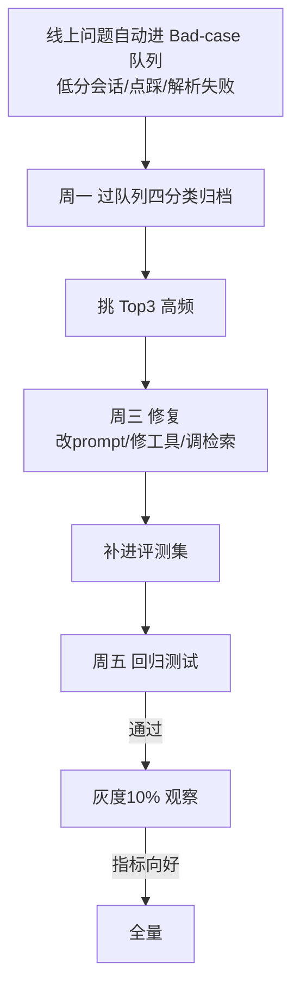

# 阶段七 · 小点 3：监控与运维

> 所属：阶段七 工程化、部署与运维
> 定位：上线只是开始，能不能持续观察到健康度、及时告警、闭环迭代，决定了 Agent 能不能长期跑稳。这一讲讲清三大监控支柱、黄金四指标、告警分级与上线迭代闭环。

## 精简大纲

1. 三大监控支柱：Logs / Metrics / Traces
2. 黄金四指标（Agent 版）
3. 告警阈值与分级
4. 观测平台：LangSmith / LangFuse / 自建 / OpenTelemetry
5. 上线迭代闭环（Bad-case 收集 → 归类 → 修复 → 回归）

## 学习内容详情

> 核心认知：Agent 运维三样都要——日志、指标、追踪，缺一样排障就"盲"。

### 1. 三大监控支柱（Logs / Metrics / Traces）



- **日志**：单次事件的明细记录（谁、何时、发生了什么）。
- **指标**：可聚合的数值时间序列（QPS、成功率、P95 耗时）。
- **链路追踪**：一次请求跨节点 / 跨步骤的完整路径。
- **Agent 运维三样都要**，缺一样排障就盲。
  - 链路追踪：Agent 每一步完整日志；
  - **工具调用审计日志**——谁调用、入参、返回值（安全与排障关键）。

> 🔬 **深度理解 · 分布式追踪与 trace_id**：
> 1. **本质**：trace_id 是一次请求在整个分布式系统里"横穿多个节点 / 多次调用"的公共身份证——只要每步埋点都带上同一个 ID，就能把一次 Agent 会话里零散的日志、多个 span、多条工具调用串成一条完整路径。
> 2. **机制**：入口（网关 / API）生成 trace_id（常见随机 / ULID），通过 HTTP header 或消息元数据层层透传给下游；每段执行被打包成一个 span（含开始/结束、父子关系、语义属性），所有 span 凭同一 trace_id 归并成一条 trace；落到 OTel 即 `trace_id + span_id + parent_span_id` 的三级结构。
> 3. **为什么重要**：Agent 一次回答往往跨"LLM 调用 + 多个工具 + 检索"，排障时要先回答"用户报的问题对应哪次请求、走到哪一步挂的"——没有 trace_id，日志是散的、跨服务也无法关联；它也是下文 Bad-case 闭环里"带完整 trace_id 进队列"的前提，能一键回到根因。
> 4. **易错点**：① 只在 API 层打点、不把 ID 透传给下游/worker，跨进程链就断了——**透传是追踪的灵魂**；② 异步任务（队列 consumer）里忘了从任务元数据带 trace_id，导致"后台任务对不上会话"；③ 日志记了 ID，却在指标/归一化层不关联，三支柱"对不起来"；④ 用手工拼接而非标准的上下文传播（Context Propagation）传 ID，下游读不到。

```python
def audit_tool_call(user, tool, params, result):
    """工具调用审计日志: 谁调用 / 入参 / 返回值——排障与安全审计都需要"""
    print(f"[AUDIT] user={user} tool={tool} "
          f"params={str(params)[:100]} -> {str(result)[:100]}")   # 生产写日志系统
```

### 2. 黄金四指标（Google SRE，Agent 版）

| 黄金四指标 | 含义 |
|-|-|
| **P95 延迟** | 接口延迟第 95 百分位 |
| **QPS** | 流量 |
| **LLM 调用失败率** | 错误率 |
| **token 消耗速率** | 饱和度 |

- **P95 意义**：95% 的请求快于该值，比平均值更真实——LLM 延迟长尾严重（偶发 30s+ 拖高均值），看 P95/P99 才知道真实体感。
- **记住**：任何告警规则先从这四个里挑。

```python
def p95(values: list) -> float:
    """P95: 排序后取第95百分位的值, 比平均更能反映 LLM 长尾的真实体感"""
    s = sorted(values)
    idx = int(len(s) * 0.95)
    return 0.0 if not s else s[min(idx, len(s) - 1)]

lats = [1.2, 1.5, 2.1, 3.0, 20.5, 1.8, 1.4]   # 有一个 20s 的长尾偶发
print(f"均值≈{round(sum(lats)/len(lats),1)}s  P95≈{p95(lats)}s")
# 均值被长尾拉高但 P95 更能反映大多数用户体验
```

> 🔬 **深度理解 · 百分位指标（P95 / P99）与长尾**：
> 1. **本质**：P95 是"把耗时排序后第 95 百分位的值"，回答"95% 的请求比它快"，是**对大多数用户体感**的分位数刻画，而非平均——LLM 延迟有显著长尾（偶发 30s+），均值会被少数极端值剧烈拖夸而失真。
> 2. **机制**：生产里不存全量明细去精确排序，而是按耗时**分桶直方图（Histogram）**累计计数（Prometheus 用 `le` 桶），查询时由累计分位数估算出 P95；它天然是"可聚合数值序列"（Metrics），无需保留每条请求的原始日志。
> 3. **为什么重要**：容量判断与告警要用"代表性"而非"平均"——均值 2s 完全掩盖了"偶尔有 15% 的人等了 8s"的糟糕体感；把 P50 / P95 / P99 横着看，能同时定位"多数有多快、典型慢、极端长尾"，信息量远大于单一均值。
> 4. **易错点**：① 误以为生产 P95 是精确排序——它来自直方图分桶的**近似估算**，不同后端精度有差异；② 只看 P95 不看 P99，最尾端的极端用户被忽略；③ 把 P95 与"最大值"混谈；④ 用一个全局 P95 阈值套所有业务——客服对话与批处理报表的 SLO 天然不同（呼应下文"分场景基线"）。

- **第五个维度——成本指标（Agent 特有，也最易失控）**：黄金四指标之外必须加盯 **token 消耗速率与单次会话成本**——前者看「烧得多快」（饱和度），后者看「一次对话花多少钱」（乘以会话量就是日账单）。模型换代、prompt 变长、循环失控都会让成本悄悄翻倍，而延迟与成功率可能纹丝不动——**四指标都绿、账单爆了，只有成本指标能第一时间暴露**。

### 3. 告警阈值与分级

- 阈值要「**可行动**」——告了没人处理的告警等于噪音。

| 级别 | 触发条件 | 处理 |
|-|-|-|
| **P0** | 成功率跌破 90% | 立即电话 |
| **P1** | 失败率 > 5% | 工单 |
| **P2** | P95 变慢 | 次日关注 |

- **分场景基线**：阈值来自**各自场景的 SLO**，不是全局统一值——客服对话**首响 < 3s 是硬指标**（首响应慢一秒用户就流失），离线批处理报表跑 10 分钟也无可厚非。先给每类场景定 SLO，再由 SLO 推导各自的阈值与分级，别拿一条 P95 阈值套所有业务。

> 🔬 **深度理解 · SLI / SLO 与"可行动"告警**：
> 1. **本质**：SLI（服务等级指标）回答"你到底在测什么"——如首响应耗时、成功率；SLO（服务等级目标）回答"你承诺它要达标到什么程度"——如"客服首响 P95 < 3s、月度达标 99%"；告警阈值 = 从 SLO **反推**出的"该反应了"红线。
> 2. **机制**：先定 SLI（要可量化、可采集、且与用户体感相关）→ 再定 SLO（目标值 + 观测窗口）→ 由 SLO 推导告警阈值与分级（P0 是破 SLO 红线，P1 / P2 是红线前的预警档）→ 用 SLO 达成情况做迭代反馈。SLO 常配"错误预算（error budget）"：一个月内允许若干未达标，预算耗尽前预警而非瞬间刷屏。
> 3. **为什么重要**：没有 SLO 的告警是"拍脑袋的阈值"，告了也说不清"到底紧不紧急"；有了 SLO，告警才有"是否危及契约"的语义，也才能做到"阈值可行动、不刷屏"的分级。不同业务 SLO 不同，这正是"别拿一条 P95 套所有业务"的根源。
> 4. **易错点**：① 把 SLI 定义成"好测但与用户体验无关"的指标（测进程存活却不测首响延迟）；② 不设观测窗口 /错误预算，把 SLO 当瞬时值，导致告警抖动刷屏；③ 先拍阈值、再回头"圆"SLO，而不是由 SLO 推导阈值；④ 不分业务场景、全站共用一个 SLO。

```python
def alert(metric: str, value: float):
    """告警分级: 阈值可行动, 别刷屏"""
    rules = {
        "success_rate":  ((0.90, 0.05), "P0", "立即电话"),
        "failure_rate":  ((0.05, 0.01), "P1", "工单"),
        "p95_latency":   ((2.0, 1.0),   "P2", "次日关注"),
    }
    for name, ((high, low), level, action) in rules.items():
        pass  # 示意: 按 metric 匹配阈值并分级告警
```

### 4. 观测平台

- **LangSmith**：官方 SaaS；**LangFuse**：开源自托管（数据不出内网时首选）：记录每次 run 的 LLM 输入输出、工具调用、token 成本，自带看板与评测。



- **自建最小观测体系**：metrics（计数器 + 直方图）→ 内存时序 → 告警判定 → Bad-case 队列；生产等价物 Prometheus + Grafana。

#### OpenTelemetry：可观测性标准协议

- **OTel 是 2025-2026 可观测性事实标准**：CNCF 开源项目，一套 API / SDK + OTLP 传输协议统一 Logs / Metrics / Traces 三支柱的采集与上报——不必再为每个观测后端各写一套埋点。
- **GenAI 语义约定（Semantic Conventions）**：OTel 的 GenAI SIG 已为 LLM / Agent 定义标准 span 属性——`gen_ai.operation.name`（`chat` / `embeddings` / `invoke_agent` / `execute_tool`）、`gen_ai.model.name`、token 用量属性（`gen_ai.usage.input_tokens` / `gen_ai.usage.output_tokens`）。按约定命名属性，任何后端都能「读懂」你的 Agent 链路，成本与耗时可直接聚合。
- **Agent / 框架层 span 约定已发布**：GenAI SIG 已含《GenAI agent/framework spans》规范（`invoke_agent` / `execute_tool` / `invoke_workflow` 等操作名），落地时按此约定命名即可，自定义属性留扩展位。

> ⏳ **短期可不深究**：OTel GenAI 的 agent/framework spans 语义约定还在随社区快速迭代，具体操作名可能调整——第一遍只要知道"有标准约定、落地时按规范命名字段"即可，那几个 `invoke_agent / execute_tool` 的具体名在你真要埋点时再看最新规范，不必现在记。
- **价值：一次埋点、多后端**——Langfuse / LangSmith 均支持 OTLP 接入，同一份埋点也可发 Jaeger（traces）/ Prometheus（metrics）。换观测平台不重写一行代码，只改 exporter 的 endpoint。

最小接入（`pip install opentelemetry-sdk opentelemetry-exporter-otlp`）：

```python
from opentelemetry import trace
from opentelemetry.sdk.trace import TracerProvider
from opentelemetry.sdk.trace.export import BatchSpanProcessor
from opentelemetry.exporter.otlp.proto.grpc.trace_exporter import OTLPSpanExporter

# 一次埋点 → OTLP 发给任意支持的后端(Langfuse / LangSmith / Jaeger ...)
provider = TracerProvider()
provider.add_span_processor(                            # BatchSpanProcessor: 批量异步导出
    BatchSpanProcessor(OTLPSpanExporter(endpoint="http://localhost:4317"))
)
trace.set_tracer_provider(provider)

tracer = trace.get_tracer(__name__)
with tracer.start_as_current_span("agent_run") as span:        # Agent 一步 = 一个 span
    span.set_attribute("gen_ai.operation.name", "invoke_agent")   # GenAI 语义约定
    span.set_attribute("gen_ai.model.name", "deepseek-chat")
    span.set_attribute("gen_ai.usage.input_tokens", 1200)      # token 用量进 span
    ...                                                         # Agent 主流程
```

- **框架自动埋点**：不想手写 span，可用 Traceloop 的 **openllmetry**——OTel 生态的 LLM 框架 instrumentation，支持 LangGraph / CrewAI / LlamaIndex 等主流框架，装包 + 配 OTLP endpoint，框架内部调用自动成 trace。

> ⏳ **短期可不深究**：openllmetry 这类"框架自动埋点"工具迭代很快、对各框架支持度参差，第一遍不必深挖——上面手写 span 的接入原理已经够用，等真要为项目上链路追踪时再评估选型、查其当时支持哪些框架。

### 5. 上线迭代闭环（Bad-case 闭环）



- **Bad-case 上报通道**：线上问题自动进队列：低分会话 / 用户点踩 / 解析失败异常 → **带完整 `trace_id`** 进 Bad-case 表。
- **失败四分类**：prompt / 模型 / 工具 / 检索（对照阶段五评测）。
- **每周迭代 SOP**：
  - **周一**：过 Bad-case 队列按四分类归类 → 挑 Top3 高频问题；
  - **周三**：修复（改 prompt / 修工具 / 调检索）→ 补进评测集；
  - **周五**：回归测试通过 → 灰度 10% 流量观察指标 → 全量。

> **指标趋势向上（成功率 / 成本 / 延迟）= 闭环健康；原地打转 = 回头查根因**，别在同一个根因上反复打补丁。

```python
def badcase_close(opened: list, who: str, fix: str, eval_ok: bool) -> str:
    """一条 Bad-case 的完整闭环: 归类→修复→回归通过才关闭"""
    if not eval_ok:
        return f"[{who}] 修复后回归未通过, 不关闭, 进入复查"
    return f"[{who}] 已修复({fix})并通过评测回归, 关闭"
```

## 本节自检

- [ ] 能说清日志 / 指标 / 追踪三支柱与黄金四指标（+ 成本第五维）
- [ ] 能说清 OpenTelemetry 的价值（一次埋点多后端）与 GenAI 语义约定
- [ ] 已实现至少一项业务监控告警（任务成功率 / LLM 失败率）
- [ ] 已跑通一次 Bad-case 收集 → 归类 → 修复 → 评测回归的闭环
- [ ] 能画出并执行「周一归类 → 周三修复 → 周五回归」的每周 SOP

---

## 本节常见面试题（深度解析）

> 针对本节核心知识的面试高频点，配合"本质+机制"式理解，能让你答得既有深度又有广度。

### 面试题 1：为什么监控要看 P95 / P99 而不是只看平均值？
- **面试官想考察**：是有统计素养还是只会背"分位数"名词，是否理解长尾与容量决策的关系。
- **专业作答（含深度）**：
  1. **本质**：均值被少数极端值（长尾）剧烈拖夸，既说不清"大多数用户多快"、也没暴露"究竟有多少人很慢"，信息量最差；百分位回答"有 X% 的请求比它快"，直面体感。
  2. **机制**：LLM 延迟天然长尾（偶发 30s+、重试放大、排队），均值失真严重；生产用**直方图分桶**估算百分位，无需保留全量明细。
  3. **成组看**：把 P50 / P95 / P99 放一起，区分"多数有多快、典型慢、极端长尾"，比单个均值信息量大得多；P95 明显慢于 P50、P99 又远大于 P95，说明长尾重，应优先优化慢请求。
  4. **与告警/容量结合**：阈值用 P95/P99 按场景定，容量与排障都更有代表性。
- **加分亮点 / 深度追问**：可主动说"生产 P95 是直方图近似、不是精确排序第 95 位"体现原理深度；被追问"长尾怎么来的、怎么排掉"时，答"来自偶发慢调用+重试放大+排队，可用超时上限、缓存、小模型、异步化削减"。

### 面试题 2：trace_id 是如何在分布式 / Agent 链路里贯穿的？为什么说它是排障与 Bad-case 闭环的基石？
- **面试官想考察**：是否真正落地过分布式追踪，而不只是知道"有个 ID"。
- **专业作答（含深度）**：
  1. **贯穿路径**：入口生成 trace_id → 通过 HTTP header / 消息元数据**逐层透传**给下游 → 每段执行打包成 span → 凭同一 trace_id 归并成一条 trace（OTel 即 trace_id + span_id + parent_span_id 三级）。
  2. **异步续传**：队列 consumer / worker 必须从任务元数据里带出 trace_id，否则"后台任务对不上会话"。
  3. **基石作用**：Agent 一次回答跨 LLM + 工具 + 检索，排障要先回答"对应哪次请求、走到哪步挂的"；日志带 trace_id 才能与 span、指标对起来；Bad-case 带完整 trace_id 进队列才能一键回到根因。
- **加分亮点 / 深度追问**：可提"透传是追踪的灵魂、context propagation 规范"体现严谨；被追问"三支柱怎么才算对起来"时，答"指标异常→用 trace_id 定位 trace→再拉同一 trace_id 的日志明细"。

### 面试题 3：P0 / P1 / P2 告警分级应该怎么定？它和 SLI / SLO 是什么关系？
- **面试官想考察**：告警是否"可行动、不刷屏"，有没有 SLI/SLO 工程素养，而非只会背几个级别。
- **专业作答（含深度）**：
  1. **由 SLO 反推**：先定 SLI（可量化且与用户体感相关）→ 再定 SLO（目标值 + 观测窗口）→ 由 SLO 推导阈值与分级：P0 破红线（如成功率 < 90%）立即处理，P1/P2 是红线前的预警档。
  2. **可行动**：告警要能被"分级处理"对应（电话 / 工单 / 次日关注），告了没人处理等于噪音。
  3. **分场景**：不同业务 SLO 不同（客服首响 < 3s vs 批处理跑 10 分钟），不能用一条全局阈值套所有场景。
- **加分亮点 / 深度追问**：可主动提"错误预算（error budget）与告警抖动抑制，避免瞬时抖动刷屏"；被追问"SLO 定了 99% 怎么算 error budget"时，答"月度可容忍未达标时间 = (1−99%) × 当月总时长，预算逼近 0 时预警而非立即报警"。