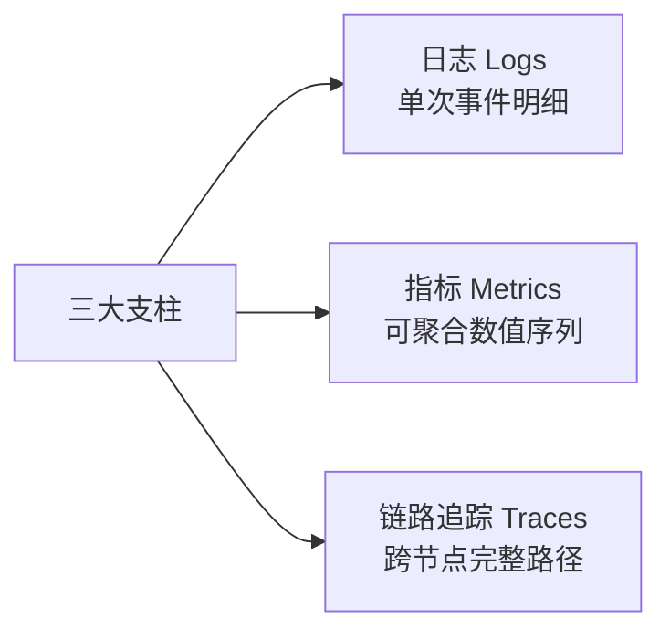
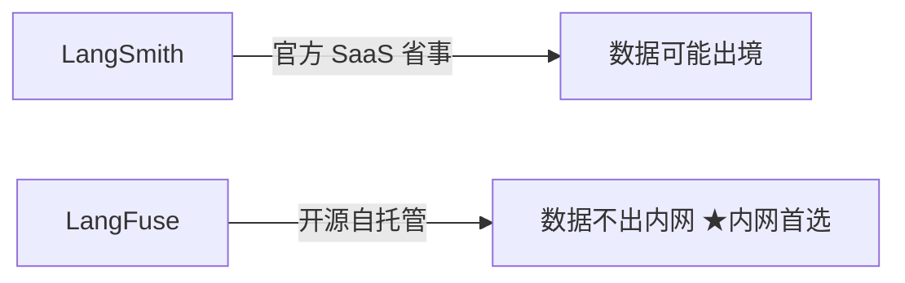
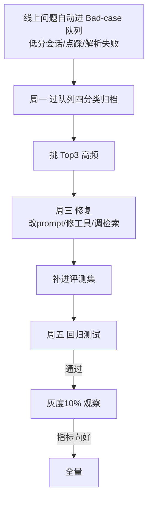

# 阶段七 · 小点 3：监控与运维

> 所属：阶段七 工程化、部署与运维
> 定位：上线只是开始，能不能持续观察到健康度、及时告警、闭环迭代，决定了 Agent 能不能长期跑稳。这一讲讲清三大监控支柱、黄金四指标、告警分级与上线迭代闭环。

## 精简大纲

1. 三大监控支柱：Logs / Metrics / Traces
2. 黄金四指标（Agent 版）
3. 告警阈值与分级
4. 观测平台：LangSmith / LangFuse / 自建
5. 上线迭代闭环（Bad-case 收集 → 归类 → 修复 → 回归）

## 学习内容详情

> 核心认知：Agent 运维三样都要——日志、指标、追踪，缺一样排障就"盲"。

### 1. 三大监控支柱（Logs / Metrics / Traces）



- **日志**：单次事件的明细记录（谁、何时、发生了什么）。
- **指标**：可聚合的数值时间序列（QPS、成功率、P95 耗时）。
- **链路追踪**：一次请求跨节点 / 跨步骤的完整路径。
- **Agent 运维三样都要**，缺一样排障就盲。
  - 链路追踪：Agent 每一步完整日志；
  - **工具调用审计日志**——谁调用、入参、返回值（安全与排障关键）。

```python
def audit_tool_call(user, tool, params, result):
    """工具调用审计日志: 谁调用 / 入参 / 返回值——排障与安全审计都需要"""
    print(f"[AUDIT] user={user} tool={tool} "
          f"params={str(params)[:100]} -> {str(result)[:100]}")   # 生产写日志系统
```

### 2. 黄金四指标（Google SRE，Agent 版）

| 黄金四指标 | 含义 |
|-|-|
| **P95 延迟** | 接口延迟第 95 百分位 |
| **QPS** | 流量 |
| **LLM 调用失败率** | 错误率 |
| **token 消耗速率** | 饱和度 |

- **P95 意义**：95% 的请求快于该值，比平均值更真实——LLM 延迟长尾严重（偶发 30s+ 拖高均值），看 P95/P99 才知道真实体感。
- **记住**：任何告警规则先从这四个里挑。

```python
def p95(values: list) -> float:
    """P95: 排序后取第95百分位的值, 比平均更能反映 LLM 长尾的真实体感"""
    s = sorted(values)
    idx = int(len(s) * 0.95)
    return s[-1] if not s else s[min(idx, len(s) - 1)]

lats = [1.2, 1.5, 2.1, 3.0, 20.5, 1.8, 1.4]   # 有一个 20s 的长尾偶发
print(f"均值≈{round(sum(lats)/len(lats),1)}s  P95≈{p95(lats)}s")
# 均值被长尾拉高但 P95 更能反映大多数用户体验
```

### 3. 告警阈值与分级

- 阈值要「**可行动**」——告了没人处理的告警等于噪音。

| 级别 | 触发条件 | 处理 |
|-|-|-|
| **P0** | 成功率跌破 90% | 立即电话 |
| **P1** | 失败率 > 5% | 工单 |
| **P2** | P95 变慢 | 次日关注 |

```python
def alert(metric: str, value: float):
    """告警分级: 阈值可行动, 别刷屏"""
    rules = {
        "success_rate":  ((0.90, 0.05), "P0", "立即电话"),
        "failure_rate":  ((0.05, 0.01), "P1", "工单"),
        "p95_latency":   ((2.0, 1.0),   "P2", "次日关注"),
    }
    for name, ((high, low), level, action) in rules.items():
        pass  # 示意: 按 metric 匹配阈值并分级告警
```

### 4. 观测平台

- **LangSmith**：官方 SaaS；**LangFuse**：开源自托管（数据不出内网时首选）：记录每次 run 的 LLM 输入输出、工具调用、token 成本，自带看板与评测。



- **自建最小观测体系**：metrics（计数器 + 直方图）→ 内存时序 → 告警判定 → Bad-case 队列；生产等价物 Prometheus + Grafana。

### 5. 上线迭代闭环（Bad-case 闭环）



- **Bad-case 上报通道**：线上问题自动进队列：低分会话 / 用户点踩 / 解析失败异常 → **带完整 `trace_id`** 进 Bad-case 表。
- **失败四分类**：prompt / 模型 / 工具 / 检索（对照阶段五评测）。
- **每周迭代 SOP**：
  - **周一**：过 Bad-case 队列按四分类归类 → 挑 Top3 高频问题；
  - **周三**：修复（改 prompt / 修工具 / 调检索）→ 补进评测集；
  - **周五**：回归测试通过 → 灰度 10% 流量观察指标 → 全量。

> **指标趋势向上（成功率 / 成本 / 延迟）= 闭环健康；原地打转 = 回头查根因**，别在同一个根因上反复打补丁。

```python
def badcase_close(opened: list, who: str, fix: str, eval_ok: bool) -> str:
    """一条 Bad-case 的完整闭环: 归类→修复→回归通过才关闭"""
    if not eval_ok:
        return f"[{who}] 修复后回归未通过, 不关闭, 进入复查"
    return f"[{who}] 已修复({fix})并通过评测回归, 关闭"
```

## 本节自检

- [ ] 能说清日志 / 指标 / 追踪三支柱与黄金四指标
- [ ] 已实现至少一项业务监控告警（任务成功率 / LLM 失败率）
- [ ] 已跑通一次 Bad-case 收集 → 归类 → 修复 → 评测回归的闭环
- [ ] 能画出并执行「周一归类 → 周三修复 → 周五回归」的每周 SOP