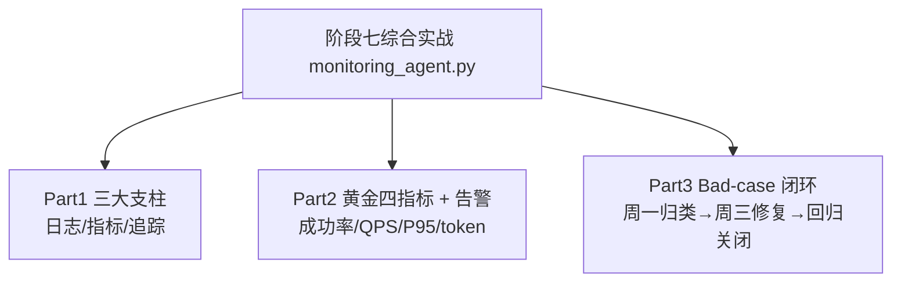

# 阶段七 · 综合实战：Agent 观测台 + 告警 + Bad-case 闭环（离线可运行）

> 所属：阶段七 工程化、部署与运维
> 定位：把阶段七第 3 小点「监控与运维」的三大支柱、黄金四指标、告警分级、Bad-case 闭环，落成一份**离线可运行**的最小观测体系——模拟一批 Agent 请求，观察健康度、触发告警、把低分会话归类修复。

## 一句话看懂本 Demo

`monitoring_agent.py` 用纯 Python 标准库模拟一个 Agent 服务的"观测台"：



> 核心一句话：**上线只是开始，能不能持续看到健康度、及时告警、闭环迭代，决定 Agent 能不能长期跑稳**。这份 Demo 就是最小可用的观测闭环。

## 运行方式

```
python3 code/阶段七/monitoring_agent.py
```

不需要 API Key、不需要外网、不需要装任何第三方库（只依赖标准库）。

## 完整代码位置

[code/阶段七/monitoring_agent.py](../../code/阶段七/monitoring_agent.py)

---

## 每个 Part 在讲什么

### Part 1 · 三大支柱（Logs / Metrics / Traces）

三个收集器分别对应监控三支柱：

| 支柱 | 类 | 记录什么 |
|-|-|-|
| 日志 Logs | `LogCollector` | 谁、何时、发生了什么（`agent start / done / failed`） |
| 指标 Metrics | `MetricsCollector` | 可聚合数值（耗时、成败、token） |
| 追踪 Traces | `TraceCollector` | 一次请求的跨步骤链路（`agent start` → `llm` span） |

```python
def simulate_traffic(mat, logs, traces, n=60):
    """模拟 60 次请求, 产生日志/指标/追踪 + 一些失败样本"""
    # 用函数属性自增计数生成全局唯一 trace_id(等价真实环境的 UUID)
    simulate_traffic.i = getattr(simulate_traffic, "i", 0) + 1
    tid = f"t{simulate_traffic.i:03d}"
    logs.info(tid, "agent start", step="receive")
    traces.start(tid, "llm")
    ok = random.random() > 0.28                 # 约两成失败
    lat = random.uniform(0.4, 3.4) if ok else random.uniform(2.0, 8.0)
    mat.record_call(lat, ok, prompt_tk=..., completion_tk=...)
```

> 运维铁律：**一次请求可以从日志看到明细、从追踪看到路径、从指标看到聚合**，三样对起来才能排障，缺一样就"盲"。

### Part 2 · 黄金四指标 + 告警（Google SRE · Agent 版）

`evaluate_golden()` 从指标收集器里取数，逐条做可行动告警：

```python
def evaluate_golden(mat) -> dict:
    r = mat.report()
    out = {"QPS": r["QPS"], "token累积": r["token累积"]}
    sr = r["成功率"]; fr = 1 - sr; p95 = r["P95延迟(s)"]
    alerts = []
    if sr < 0.90:
        alerts.append(("P0", "成功率跌破90%", "立即电话"))
    elif fr > 0.05:
        alerts.append(("P1", "失败率>5%", "工单"))
    if p95 > 2.0:
        alerts.append(("P2", "P95变慢", "次日"))
    return out                # 阈值"可行动", 告了不处理的等于噪音
```

Demo 里 `p95` vs `mean` 同时打印，能直观看到 LLM 长尾——均值被偶发慢请求拉高，P95 才反映大多数用户真实体感。

### Part 3 · Bad-case 闭环（周一归类 → 周三修复 → 回归关闭）

`BadCaseLoop` 实现每周迭代 SOP：

```python
def weekly_sop(self):
    """周一: 过队列四分类归档 → 挑 Top3 高频"""
    cats = {}
    for item in self.queue:
        c = classify(item["case"])            # prompt / 模型 / 工具 / 检索
        cats[c] = cats.get(c, 0) + 1
    return sorted(cats.items(), key=lambda x: x[1], reverse=True)[:3]
```

闭环逻辑：问题进队列 → 四分类归档 → 挑 Top3 → 修复 → 补评测集 → 回归通过才关闭；回归不通过不关闭。

```
[周一归类] 失败四分类: {'tool': 17} → Top3: [('tool', 17)]
[修复] tool 类 17 条, fix=给工具加超时+重试, 回归通过, 已关闭
```

---

## 运行结果预览

```
>>> Part 1 三大支柱
  [追踪] 最新一次请求 spans: ['llm']
  [日志] 该请求日志: [('info','agent start'), ('info','agent done')]

>>> Part 2 黄金四指标 + 告警
  QPS: 1.0      token累积: 43967      成功率: 0.717
  告警: [('P0','成功率跌破90%','立即电话'), ('P2','P95变慢','次日')]
  P95 vs 均值: 2.773 vs 6.759

>>> Part 3 Bad-case 闭环
[周一归类] 失败四分类: {'tool': 17} → Top3: [('tool', 17)]
[修复] tool 类 17 条, fix=给工具加超时+重试, 回归通过, 已关闭
```

## 换真实生产只需对号入座

| 教学实现 | 生产替换 |
|-|-|
| `MetricsCollector` 内存计数器 + 直方图 | Prometheus（counter / histogram） |
| `evaluate_golden` 逐条告警判定 | Prometheus 告警规则 / Alertmanager 分级通知 |
| `TraceCollector` 内存 span | LangFuse / LangSmith / Jaeger |
| `BadCaseLoop` 内存队列 | 线上低分会话自动入库（带 trace_id） |
| 每周 SOP 手写 | 结合阶段五的 LLM-as-judge 批量回归 |

## 本节自检

- [ ] 能说清日志 / 指标 / 追踪三支柱，知道排障为什么三者要对起来
- [ ] 能默写黄金四指标，并解释为什么看 P95 而不是只看均值
- [ ] 已实现至少一项可行动告警（成功率 / LLM 失败率）
- [ ] 已跑通一次「Bad-case 收集 → 归类 → 修复 → 评测回归」闭环