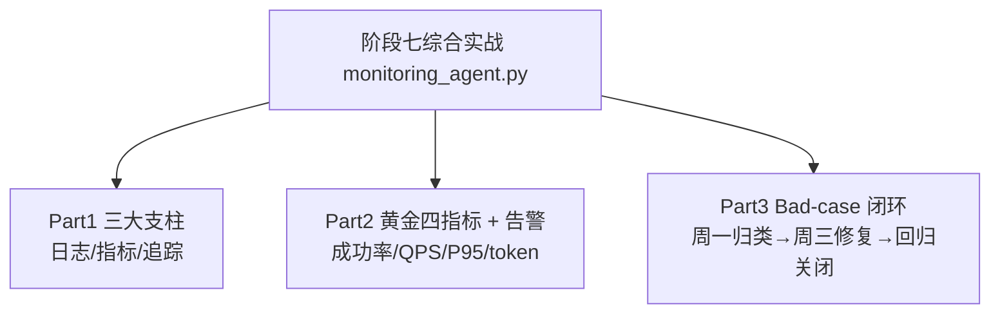

# 阶段七 · 综合实战：Agent 观测台 + 告警 + Bad-case 闭环（离线可运行）

> 所属：阶段七 工程化、部署与运维
> 定位：把阶段七第 3 小点「监控与运维」的三大支柱、黄金四指标、告警分级、Bad-case 闭环，落成一份**离线可运行**的最小观测体系——模拟一批 Agent 请求，观察健康度、触发告警、把低分会话归类修复。

## 一句话看懂本 Demo

`monitoring_agent.py` 用纯 Python 标准库模拟一个 Agent 服务的"观测台"：



> 核心一句话：**上线只是开始，能不能持续看到健康度、及时告警、闭环迭代，决定 Agent 能不能长期跑稳**。这份 Demo 就是最小可用的观测闭环。

## 运行方式

```
python3 code/阶段七/monitoring_agent.py
```

不需要 API Key、不需要外网、不需要装任何第三方库（只依赖标准库）。

## 完整代码位置

[code/阶段七/monitoring_agent.py](../../code/阶段七/monitoring_agent.py)

---

## 每个 Part 在讲什么

### Part 1 · 三大支柱（Logs / Metrics / Traces）

三个收集器分别对应监控三支柱：

| 支柱 | 类 | 记录什么 |
|-|-|-|
| 日志 Logs | `LogCollector` | 谁、何时、发生了什么（`agent start / done / failed`） |
| 指标 Metrics | `MetricsCollector` | 可聚合数值（耗时、成败、token） |
| 追踪 Traces | `TraceCollector` | 一次请求的跨步骤链路（`agent start` → `llm` span） |

```python
def simulate_traffic(mat, logs, traces, n=60):
    """模拟 60 次请求, 产生日志/指标/追踪 + 一些失败样本"""
    # 用函数属性自增计数生成全局唯一 trace_id(等价真实环境的 UUID)
    simulate_traffic.i = getattr(simulate_traffic, "i", 0) + 1
    tid = f"t{simulate_traffic.i:03d}"
    logs.info(tid, "agent start", step="receive")
    traces.start(tid, "llm")
    ok = random.random() > 0.28                 # 约两成失败
    lat = random.uniform(0.4, 3.4) if ok else random.uniform(2.0, 8.0)
    mat.record_call(lat, ok, prompt_tk=..., completion_tk=...)
```

> ⏳ **短期可不深究**：里面 `simulate_traffic.i = getattr(...)` 用"函数属性自增"生成全局唯一 `trace_id` 只是离线 Demo 省依赖的**教学技巧**——真实生产是在网关/中间件用 UUID/ULID 生成并经 header 透传，第一遍不必在这点抠细节。
> ⏳ **短期可不深究**：`random.random()>0.28`（成败比）和 `random.uniform` 的延迟区间只是**随机模拟参数**，为了让例子出现告警而设——第一遍理解"它造出失败/长尾样本供演示告警与闭环"即可，不用纠结这些概率/区间取值是否贴合真实分布。

> 运维铁律：**一次请求可以从日志看到明细、从追踪看到路径、从指标看到聚合**，三样对起来才能排障，缺一样就"盲"。

> 🔬 **深度理解 · 三支柱为什么要"对起来"排障**：
> 1. **本质**：日志、指标、追踪是同一个问题的三种"视图"——日志给"这一次发生了什么"的明细，指标给"整体长什么样"的可聚合数字，追踪给"请求跨了哪些步骤"的路径；单独看任何一个都是"盲人摸象"，只有用同一个 `trace_id` 把三者串起来，才能完成"现象 → 定位 → 根因"的闭环。
> 2. **机制**：真实生产里 Prometheus 扛指标（每秒 QPS / 成功率 / 延迟分位）、Jaeger / LangFuse 扛 span（一次 Agent 会话的调用树）、日志库每行带 `trace_id`；排障动作为"看指标发现异常 → 用 trace_id 追到那一次 trace 看走到哪一步 → 再拉同一 trace_id 的日志明细"，三者在同一请求 / 同一时间窗口上对齐。
> 3. **为什么重要**：Demo 里三个 Collectors 都在内存、天然"对得起来"；到生产一分家就断——若不强制带 `trace_id`、不打通三套系统，你会看到"QPS 掉了（指标）"却不知是模型超时还是工具报错，因为追踪和日志无从翻起。这正是"缺一样就盲"的真正含义。
> 4. **易错点**：① 三套系统各自埋点却不用同一个 `trace_id`，跨系统对不上号；② 只存指标不存日志明细，异常窗口无法复盘；③ 把 span 当日志、把日志当 span，单一视图信息残缺；④ 忘了给 Bad-case 补 `trace_id`，导致后续闭环无从定位。

### Part 2 · 黄金四指标 + 告警（Google SRE · Agent 版）

`evaluate_golden()` 从指标收集器里取数，逐条做可行动告警：

```python
def evaluate_golden(mat) -> dict:
    r = mat.report()
    out = {"QPS": r["QPS"], "token累积": r["token累积"]}
    sr = r["成功率"]; fr = 1 - sr; p95 = r["P95延迟(s)"]
    alerts = []
    if sr < 0.90:
        alerts.append(("P0", "成功率跌破90%", "立即电话"))
    elif fr > 0.05:
        alerts.append(("P1", "失败率>5%", "工单"))
    if p95 > 2.0:
        alerts.append(("P2", "P95变慢", "次日"))
    return out                # 阈值"可行动", 告了不处理的等于噪音
```

Demo 里 `p95` vs `mean` 同时打印，能直观看到 LLM 长尾——均值(2.77s)反映大多数请求较快，而 P95(6.76s)提示确有相当比例的慢请求；只看均值会低估极端延迟，这正是要盯 P95/P99 的原因。

> 🔬 **深度理解 · 为什么"只看均值会低估极端延迟"**：
> 1. **本质**：均值把所有请求耗时代数平均，一个极端长尾就足以把整体均值抬高，既不能告诉"大多数用户多快"、也没暴露"究竟有多少人很慢"，是信息量最差的一类汇总；分位数（P95 / P99）回答"有 X% 的请求比它快"，直击体感。
> 2. **机制**：LLM 服务延迟几乎必然长尾（偶发慢调用、重试放大、排队使后面请求等更久），均值被右尾剧烈拖动；只有 `min/P50/P95/P99/max` 成组看，才能同时看清轮廓（P50）、普遍体感（P95）、极端长尾（P99 / max）。
> 3. **为什么重要**：它直接决定扩容 / 加超时 / 做缓存这类决策的质量——均值 2.9s 看着还行、P95 6.7s 说明确有相当比例的慢请求，若只看均值会误判"还不错"、漏掉该被优化的长尾用户；这也是容量告警要按分位数定的原因。
> 4. **易错点**：① 把生产 P95 当成精确排序第 95 位——它来自直方图分桶的**近似估算**；② 观察窗口混入非典型批次（上线一批重型任务）让 P95 失真；③ 单看均值或单看 P95 都片面，要**成组看趋势**。

### Part 3 · Bad-case 闭环（周一归类 → 周三修复 → 回归关闭）

`BadCaseLoop` 实现每周迭代 SOP：

```python
def weekly_sop(self):
    """周一: 过队列四分类归档 → 挑 Top3 高频"""
    cats = {}
    for item in self.queue:
        c = classify(item["case"])            # prompt / 模型 / 工具 / 检索
        cats[c] = cats.get(c, 0) + 1
    return sorted(cats.items(), key=lambda x: x[1], reverse=True)[:3]
```

闭环逻辑：问题进队列 → 四分类归档 → 挑 Top3 → 修复 → 补评测集 → 回归通过才关闭；回归不通过不关闭。

> 🔬 **深度理解 · 失败四分类与 Bad-case 闭环**：
> 1. **本质**：把"线上用户觉得不对"的坏例，先归到 **prompt / 模型 / 工具 / 检索** 四类根因之一，再按频率挑 Top 修复——本质上是一套"用错误样本驱动迭代"的 RAG / Agent 质量方法论，让改进有方向、而非凭感觉乱调。
> 2. **机制**：低分会话 / 点踩 / 解析失败自动进队列（带 `trace_id`）→ 按四分类归类（prompt 措辞歧义 / 模型能力不足 / 工具报错、参数错、超时 / 检索召回或排序不对）→ 统计频次挑 Top3 → 针对性修复（改 prompt / 修工具 / 调检索）→ 把修复样本**补进评测集** → 回归通过才 close，不过进复查。
> 3. **为什么重要**：没有分类维度，"迭代"就退化成"反复改、无方向"；四分类恰好对照阶段五评测的三个环节，让"线上坏例"与"离线评测"用同一套语言，坏例还能反哺评测集，形成"评测越来越准、线上越来越好"的正循环。
> 4. **易错点**：① 用"症状"当"根因"分类（模型答错其实可能是检索没喂对上下文，却归成模型类）；② 只看数量不按影响力排，高频但影响小 vs 低频但致命要分开加权；③ 修复了不补评测集，回归只能靠感觉、无法防回归；④ 回归不通过也 close，导致闭环"假关闭"。

```
[周一归类] 失败四分类: {'tool': 17} → Top3: [('tool', 17)]
[修复] tool 类 17 条, fix=给工具加超时+重试, 回归通过, 已关闭
```

---

## 运行结果预览

```
>>> Part 1 三大支柱
  [追踪] 最新一次请求 spans: ['llm']
  [日志] 该请求日志: [('info','agent start'), ('info','agent done')]

>>> Part 2 黄金四指标 + 告警
  QPS: 1.0      token累积: 43967      成功率: 0.717
  告警: [('P0','成功率跌破90%','立即电话'), ('P2','P95变慢','次日')]
  P95 vs 均值: 约 7.0 vs 约 2.9  (示例值, 数值随随机延迟分布而变)

>>> Part 3 Bad-case 闭环
[周一归类] 失败四分类: {'tool': 17} → Top3: [('tool', 17)]
[修复] tool 类 17 条, fix=给工具加超时+重试, 回归通过, 已关闭
```

## 换真实生产只需对号入座

| 教学实现 | 生产替换 |
|-|-|
| `MetricsCollector` 内存计数器 + 直方图 | Prometheus（counter / histogram） |
| `evaluate_golden` 逐条告警判定 | Prometheus 告警规则 / Alertmanager 分级通知 |
| `TraceCollector` 内存 span | LangFuse / LangSmith / Jaeger |
| `BadCaseLoop` 内存队列 | 线上低分会话自动入库（带 trace_id） |
| 每周 SOP 手写 | 结合阶段五的 LLM-as-judge 批量回归 |

## 本节自检

- [ ] 能说清日志 / 指标 / 追踪三支柱，知道排障为什么三者要对起来
- [ ] 能默写黄金四指标，并解释为什么看 P95 而不是只看均值
- [ ] 已实现至少一项可行动告警（成功率 / LLM 失败率）
- [ ] 已跑通一次「Bad-case 收集 → 归类 → 修复 → 评测回归」闭环

---

## 本节常见面试题（深度解析）

> 针对本节核心知识的面试高频点，配合"本质+机制"式理解，能让你答得既有深度又有广度。

### 面试题 1：这份"内存版"观测 Demo 换到生产，要替换成什么？为什么能"一条线对应替换"？
- **面试官想考察**：能否把教学抽象正确映射到真实技术栈，是否理解"抽象 vs 实现"的关系，而不只是会跑 Demo。
- **专业作答（含深度）**：
  1. **逐项替换**：`MetricsCollector`（内存计数器+直方图）→ Prometheus（counter / histogram）；`evaluate_golden`（逐条告警判定）→ Prometheus 告警规则 / Alertmanager 分级通知；`TraceCollector`（内存 span）→ OpenTelemetry + Jaeger / LangFuse / LangSmith；`BadCaseLoop`（内存队列）→ 线上低分会话自动入库（带 trace_id）；每周 SOP 手写 → 用 LLM-as-judge 批量回归。
  2. **为何能对应**：因为教学里的"类"本就是真实组件的共性抽象——Counter / Histogram、告警规则、span、闭环流程是同一套概念，只是从"内存实现"换成"生产实现"。
  3. **生产要点**：三支柱要用同一个 `trace_id` 打通、指标与追踪走 OpenTelemetry 标准协议（一次埋点多后端），否则"对起来排障"在生产里会失效。
- **加分亮点 / 深度追问**：可主动点明"用 OTLP 标准协议是为了避免锁死某个厂商观测后端"；被追问"Prometheus histogram 的 bucket 该怎么设计"时，答"按 LLM 延迟的典型区间（0.5s/1s/2s/5s/10s...）设计，桶太粗精度差、太细成本高"。

### 面试题 2：为什么说"只看均值会低估极端延迟"？你在实际观测里看什么？
- **面试官想考察**：对 LLM 长尾与分位数指标是否有实践层面理解，能否落地到决策。
- **专业作答（含深度）**：
  1. **本质**：均值被长尾剧烈拖夸、又掩盖了"有多少人很慢"，是失真最严重的汇总；回到本 Demo 示例——均值 2.9s 但 P95 6.7s，正是长尾的诊断信号。
  2. **看什么**：成组看 `P50 / P95 / P99 / max`，P99 远超 P95 说明长尾重，就该去优化慢请求（缓存、小模型、超时上限、异步化），而不是盲目加机器。
  3. **生产注意**：P95 来自直方图分桶的近似估算；观察窗口要避开刚上线的非典型批次，否则 P95 会失真。
- **加分亮点 / 深度追问**：可补"长尾常来自偶发慢调用 + 重试放大 + 排队效应，P99 更适合做容量规划"；被追问"长尾怎么量化判断是否改善"时，答"比较同口径同窗口的 P99 趋势，而不是均值"。

### 面试题 3：Bad-case 闭环里的"失败四分类"为什么重要？如何防止闭环"假关闭"？
- **面试官想考察**：是否有质量数据闭环意识，是否理解"用坏例驱动迭代、且用评测防回归"。
- **专业作答（含深度）**：
  1. **四分类为何重要**：prompt / 模型 / 工具 / 检索提供了改进的"根因定向"，避免无方向乱改；它对照阶段五评测环节，让线上坏例与离线评测用同一套语言。
  2. **闭环流程**：坏例自动进队列（带 trace_id）→ 四分类归档 → 按频次×影响挑 Top → 修复 → **补进评测集** → 回归通过才 close。
  3. **防"假关闭"**：回归不通过绝不 close、用症状当根因要纠正、先看影响再看频次——"补评测集 + 回归门禁"是防止假关闭的关键。
- **加分亮点 / 深度追问**：可主动讲"坏例反哺评测集形成正循环、用 LLM-as-judge 批量回归扩大覆盖"；被追问"四分类边界模糊、某类内部还要细分"时，答"可在类内再拆子类，如工具类分超时/报错/参数错误，便于精准修复"。