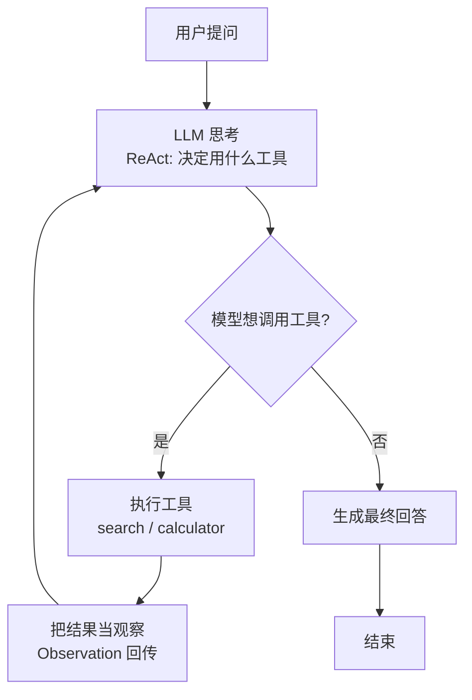

# 阶段八 · 项目 1：Level1 入门 —— ReAct 智能问答 Agent

> 所属：阶段八 从入门到生产的实战项目路线
> 定位：让一切从「手写一个 Agent 循环」开始。这一级不追求花哨，只求你把「思考-行动-观察」这套最底层的循环亲手写一遍、跑一遍、拆一遍，再套上框架——只有亲手写过，才知道框架帮你做了什么。

## 项目概览

| 项 | 内容 |
|-|-|
| 难度 | Level1 入门 |
| 核心功能 | 集成搜索 + 计算器，实现「思考-行动-观察」闭环 |
| 技术栈 | LangGraph + OpenAI + Tavily |
| 周期 | 1-2 周 |
| 核心学习目标 | 手写理解 Agent 循环；工具调用流程；状态流转；处理解析异常 |

## 一句话看懂本项目的循环



> 核心认知：**Agent 的本质就是一个「想 → 做 → 看 → 再想」的循环**，直到模型确认答案。掌握这个循环，后面所有花哨能力都是它的变体。

> 🔬 **深度理解 · ReAct 智能问答（思考-行动-观察循环）**：
> 1. **本质**：ReAct 不是某种框架或库，而是"推理（Reasoning）"与"行动（Acting）"交替进行的推理范式——模型先把自然语言问题转成语义清晰的推理链，再把推理链拆成可执行的工具动作，最后把动作结果读回上下文继续推理，直至不需要再动作为止。
> 2. **机制**：每一轮沿「Thought（我该查什么/算什么）→ Action（选定工具+参数）→ Observation（工具返回值回填到对话历史）」推进；关键的闭环在于 `Observation` 必须放进输入上下文，模型下一轮才能"基于事实再推理"。这里的 `max_turns` 熔断对应 LangGraph 的 `recursion_limit`，本质都是用"步数上限"把不可控的循环收敛成有限步。
> 3. **为什么重要**：它把"怎么查、查完怎么办"的决策权交给模型而非写死规则，让一个 Agent 能应对开放式、非预枚举的问题；它也是后面所有高级能力（RAG、多智能体、Text-to-SQL）的最底层公共骨架，任何 Agent 都逃不开这个循环。
> 4. **易错点/常见误解**：不要以为 ReAct 就是"调两三次 API"——最难的是每一步的失败分支（动作解析失败、工具报错、结果为空）。真正的工程难点是让模型在"观察到了坏结果时改变方案"而不是继续原样复读；同理，"不加熔断"不是性能问题而是资金/算力风险，`max_turns` 不是可选的便利而是必须的底线。

## 学习内容详情

### 1. 为什么先手写、再套框架

先用阶段二的 [react_agent.py](../../code/阶段二/react_agent.py) 手写一遍，再用 LangGraph 重写一遍。对比的关键在「框架帮你做了什么」：状态管理、循环终止、错误兜底、断点重放，框架都封装好了，但你得先见过它们裸写的样子，才知道自己改的是什么。

> ⏳ **短期可不深究**：LangGraph 等框架封装的「断点重放 / Checkpoint 持久化」这类内部机制，第一遍知道"它存在、解决跨进程恢复状态的问题"即可，等你真正需要做状态落库（对应 Level5）时再深挖实现。

### 2. 必须亲手验证的三个现象

这三个现象，是判断你「真的懂了」而非「跑通了就行」的分水岭：

| 现象 | 为什么重要 | 对应代码 |
|-|-|-|
| 工具返回「错误」时模型自我纠错 | 决策质量来自反馈循环 | `tool_result` 错误被回传，模型换方案 |
| 网络抖动时的重试 | 真实环境不可能零失败 | `except` 捕获 + 指数退避重试 |
| 去掉 `max_turns` 后无解问题无限循环 | 上线的烧钱风险源头 | 熔断必须存在 |

### 3. 手写骨架（对照阶段二）

```python
def run_agent(question: str, tools: dict, max_turns: int = 6) -> str:
    """极简 ReAct 主循环: 思考→行动→观察, 加了 max_turns 熔断"""
    messages = [{"role": "user", "content": question}]
    for turn in range(max_turns):                # 熔断: 防死循环烧钱
        thought = llm.invoke(messages)           # ① 思考
        action = parse_action(thought)           # ② 解析是否要调工具
        if action is None:                        # ③ 不再调工具 → 给出结论
            return thought
        result = tools[action["name"]](**action["args"])   # ④ 行动
        messages.append({"role": "tool", "content": str(result)})  # ⑤ 观察回传
    return "已达最大轮次, 请重新提问"             # 熔断兜底
```

要点：状态就是 `messages` 这个列表，每一轮在它上面追加「行动 + 观察」，保持完整现场。

> ⏳ **短期可不深究**：`parse_action` 内部怎么把模型的自然语言转成结构化工具调用（正则 / JSON 解析 / few-shot 提示）这套细节，第一遍知道"解析失败要兜底"即可，真实生产基本会交给 LangGraph 等框架的工具调用机制去处理，不用自己手写解析器。

## 本节验收清单

- [ ] 手写版 ReAct 能跑通搜索 + 计算两个工具
- [ ] LangGraph 版实现同样的闭环，并能解释每个 Node / Edge
- [ ] 设置了 `recursion_limit` 熔断并验证生效
- [ ] 复现过至少一种失败模式（格式解析失败 / 死循环 / 幻觉）并修复

## 排期与前置依赖

- **前置**：阶段二 ReAct（第 6 周手写基础）、阶段三 LangGraph 核心（第 7-8 周同步推进）。
- **建议排期**：第 7-8 周，1-2 周完成。
- **配套 Demo**：[阶段二手写 Agent](../../code/阶段二/react_agent.py) + [阶段三 LangGraph Agent](../../code/阶段三/react_langgraph_agent.py)，先把这两个都跑通，再对照双手写对比笔记。

## 本节常见面试题（深度解析）

> 针对本节核心知识的面试高频点，配合"本质+机制"式理解，能让你答得既有深度又有广度。

### 面试题 1：请解释什么是 ReAct，它和"直接叫模型回答"或"纯 Prompt"的本质区别是什么？
- **面试官想考察**：你是否把 ReAct 当作"三步循环"的运行范式而非某个具体 API，以及你是否理解它对模型能力边界（上下文长度、推理步数）的依赖。
- **专业作答（含深度）**：
  1. 先给定义：ReAct = Reasoning + Acting 交织的推理范式，把任务拆成「思考 → 行动 → 观察」交替进行。
  2. 对比三者的差异：纯 Prompt 是一次性生成、模型"只能想象不能动手"；ReAct 通过工具行动把外部世界（检索、计算、API）拉进推理，Observe 结果再回填上下文继续思考。
  3. 点出关键本质：不是模型"更聪明了"，而是我们给模型搭建了"可观察、可修正"的环境；同一模型下 ReAct 能解决单次推理解不了的组合型、需要外部信息的任务。
  4. 补充边界：ReAct 有成本（多轮 token）与延迟（串行多步），且依赖模型工具调用稳定（解析、参数、JSON），因此熔断与容错必不可少。
- **加分亮点 / 深度追问**：可主动提到 ReAct 与 CoT（思维链）的关系——CoT 只有推理不落地执行，ReAct 在 CoT 之上加了行动与环境反馈；追问时能回答"何时该纯 CoT、何时该 ReAct（是否需要外部信息/工具）"更显功力。

### 面试题 2：为什么 Agent 循环里必须有 `max_turns` / `recursion_limit` 熔断？去掉会怎样？
- **面试官想考察**：你有没有真正想过"无限循环"在实际系统中的危害，而不仅是背了"要有熔断"这个结论。
- **专业作答（含深度）**：
  1. 熔断的本质：给不可控的递归给一个上界，把"可能无限/超长"的执行收敛成有限步，是工程上的终止性保障。
  2. 后果层面的三层危害：钱（每轮都调 LLM + 工具，token 与 API 费用随轮数线性上涨）、延迟（用户等不起，服务线程被占满可能损及整体 QPS）、正确性（模型在无解问题上容易原地打转，产出重复或无意义输出）。
  3. 机制澄清：`max_turns` 不是"防止模型想太久"的性能参数，而是资金/算力/可用性的安全底线；达到上限应给出明确兜底回复而非静默失败。
  4. 关联现实：生产系统常叠加超时、重试上限、工具失败降级，熔断只是第一道，Level4 的"报错自修正限 2 次"就是同一思路的不同形态。
- **加分亮点 / 深度追问**：可补充"熔断阈值怎么定"——需权衡正常任务的轮数分布与极端场景，设太紧会截断合法多步任务、太松烧钱；被追问"如何观察是否该调阈值"时可答"用链路日志做轮数分布统计"。

### 面试题 3：Agent 在工具调用时返回了错误或异常，一个"能上生产"的实现该如何处理？
- **面试官想考察**：你如何处理失败分支，是否理解"反馈闭环"是 ReAct 质量的关键，而不只是"报错就好"。
- **专业作答（含深度）**：
  1. 原则：把错误当 Observation 回传，让模型基于事实决策，而不是崩溃或忽略——这正是"自我纠错"的来源。
  2. 分层处理：捕获异常并结构化成对模型友好的错误文本（含可重试提示）；对可重试的抖动（网络、限流）用指数退避重试；对逻辑错误（参数不合法）回传后让模型换方案。
  3. 兜底防线：重试要有上限（如 MAX_RETRY=2），外加总轮数熔断，防止"修不好就无限修"烧钱。
  4. 可观测：错误信息带上 trace/环节标识，便于定位是哪一步失败，为 Bad-case 沉淀打基础。
- **加分亮点 / 深度追问**：可提到"错误信息设计"本身是 prompt 工程的一部分——给模型看到"可行动"的错误（"参数 x 需为整数"）比看到裸堆栈更能促成修正；追问"什么情况不该重试"时可答参数类/业务类错误重试无意义，应直接回传模型调整方案。