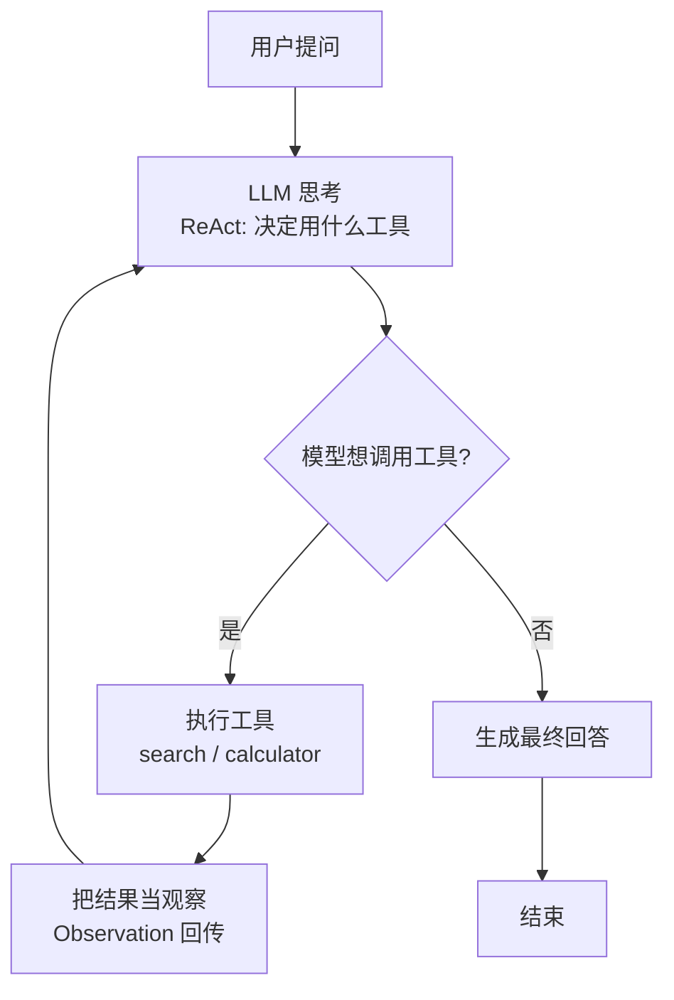

# 阶段八 · 项目 1：Level1 入门 —— ReAct 智能问答 Agent

> 所属：阶段八 从入门到生产的实战项目路线
> 定位：让一切从「手写一个 Agent 循环」开始。这一级不追求花哨，只求你把「思考-行动-观察」这套最底层的循环亲手写一遍、跑一遍、拆一遍，再套上框架——只有亲手写过，才知道框架帮你做了什么。

## 项目概览

| 项 | 内容 |
|-|-|
| 难度 | Level1 入门 |
| 核心功能 | 集成搜索 + 计算器，实现「思考-行动-观察」闭环 |
| 技术栈 | LangGraph + OpenAI + Tavily |
| 周期 | 1-2 周 |
| 核心学习目标 | 手写理解 Agent 循环；工具调用流程；状态流转；处理解析异常 |

## 一句话看懂本项目的循环



> 核心认知：**Agent 的本质就是一个「想 → 做 → 看 → 再想」的循环**，直到模型确认答案。掌握这个循环，后面所有花哨能力都是它的变体。

## 学习内容详情

### 1. 为什么先手写、再套框架

先用阶段二的 [react_agent.py](../../code/阶段二/react_agent.py) 手写一遍，再用 LangGraph 重写一遍。对比的关键在「框架帮你做了什么」：状态管理、循环终止、错误兜底、断点重放，框架都封装好了，但你得先见过它们裸写的样子，才知道自己改的是什么。

### 2. 必须亲手验证的三个现象

这三个现象，是判断你「真的懂了」而非「跑通了就行」的分水岭：

| 现象 | 为什么重要 | 对应代码 |
|-|-|-|
| 工具返回「错误」时模型自我纠错 | 决策质量来自反馈循环 | `tool_result` 错误被回传，模型换方案 |
| 网络抖动时的重试 | 真实环境不可能零失败 | `except` 捕获 + 指数退避重试 |
| 去掉 `max_turns` 后无解问题无限循环 | 上线的烧钱风险源头 | 熔断必须存在 |

### 3. 手写骨架（对照阶段二）

```python
def run_agent(question: str, tools: dict, max_turns: int = 6) -> str:
    """极简 ReAct 主循环: 思考→行动→观察, 加了 max_turns 熔断"""
    messages = [{"role": "user", "content": question}]
    for turn in range(max_turns):                # 熔断: 防死循环烧钱
        thought = llm.invoke(messages)           # ① 思考
        action = parse_action(thought)           # ② 解析是否要调工具
        if action is None:                        # ③ 不再调工具 → 给出结论
            return thought
        result = tools[action["name"]](**action["args"])   # ④ 行动
        messages.append({"role": "tool", "content": str(result)})  # ⑤ 观察回传
    return "已达最大轮次, 请重新提问"             # 熔断兜底
```

要点：状态就是 `messages` 这个列表，每一轮在它上面追加「行动 + 观察」，保持完整现场。

## 本节验收清单

- [ ] 手写版 ReAct 能跑通搜索 + 计算两个工具
- [ ] LangGraph 版实现同样的闭环，并能解释每个 Node / Edge
- [ ] 设置了 `recursion_limit` 熔断并验证生效
- [ ] 复现过至少一种失败模式（格式解析失败 / 死循环 / 幻觉）并修复

## 排期与前置依赖

- **前置**：阶段二 ReAct（第 6 周手写基础）、阶段三 LangGraph 核心（第 7-8 周同步推进）。
- **建议排期**：第 7-8 周，1-2 周完成。
- **配套 Demo**：[阶段二手写 Agent](../../code/阶段二/react_agent.py) + [阶段三 LangGraph Agent](../../code/阶段三/react_langgraph_agent.py)，先把这两个都跑通，再对照双手写对比笔记。