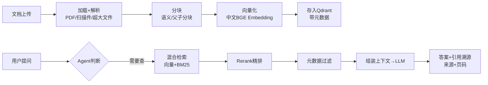

# 阶段八 · 项目 2：Level2 进阶 —— 知识库 RAG Agent

> 所属：阶段八 从入门到生产的实战项目路线
> 定位：给 Agent 装上「自己的资料」。这一级把文档变成可检索的知识底座，并让它按需查询、带来源作答，是绝大多数「企业知识问答」产品的最小原型。

## 项目概览

| 项 | 内容 |
|-|-|
| 难度 | Level2 进阶 |
| 核心功能 | 文档上传、知识库问答、引用溯源、流式输出 |
| 技术栈 | LlamaIndex + Qdrant + LangGraph + Streamlit |
| 周期 | 2-3 周 |
| 核心学习目标 | RAG 与 Agent 结合；向量库使用；流式输出；文档解析各类异常 |

## 一句话看懂本项目的数据流



> 核心认知：**RAG 的价值在于「能用公司的资料回答，而不是编」**。检索质量（分块、混合、精排）直接决定回答质量，检索垃圾，模型再强也答不对。

## 学习内容详情

### 1. 数据链路（离线索引阶段）

文档加载 → 分块（语义分块 / 父子分块）→ 向量化（中文 BGE Embedding）→ 存入 Qdrant。这一步只做一次，产出可检索的向量索引。

### 2. 检索进阶（在线查询阶段）

| 手段 | 作用 | 说明 |
|-|-|-|
| 混合检索 | 召回更全 | 向量（语义）+ BM25（关键词）互补 |
| Rerank 精排 | 排序更准 | 对召回结果做交叉注意力精排 |
| 元数据过滤 | 更精准 | 按文档 / 章节 / 权限过滤，只查该查的 |

### 3. Agent 化：Agent-RAG 而非普通 RAG

把检索封装成 `@tool`，用 LangGraph 编排——模型自主决定「何时查、查几轮、要不要追问」，区别于一次性「查完就答」的朴素 RAG。

```python
@tool("search_kb")
def search_kb(query: str, top_k: int = 5) -> list:
    """Agent-RAG 的检索工具: 模型自主决定何时调用、调几轮"""
    hits = hybrid_search(query, top_k=top_k)   # 向量+BM25 混合
    hits = rerank(query, hits)                  # 精排
    return [{"content": h.text, "source": h.meta["file"], "page": h.meta["page"]}
            for h in hits[:top_k]]
```

### 4. 引用溯源 + 流式输出

- **引用溯源**：答案必须标注来源文件与页码（生产必备，否则答错无从追责）。
- **流式输出**：用 SSE 逐 token 返回，前端 Streamlit / 浏览器呈现打字机效果，体感更快。

## 必须处理的异常

- **文档解析**：PDF 乱码、扫描件（需 PaddleOCR）、超大文件分块、编码问题——这是索引阶段最现实的一批坑。
- **检索无结果 / 低分块干扰**：加 score 阈值过滤，宁可「不知道」也不乱答。
- **模型输出 JSON 残缺**：pydantic 兜底 + 让模型重写（对照阶段四 RAG 与阶段六内容创作）。

## 本节验收清单

- [ ] 能上传多种格式文档并完成知识库索引
- [ ] 问答带引用溯源（来源 + 页码）
- [ ] 实现了 SSE 流式输出
- [ ] 混合检索 + Rerank 已落地并对比过单路检索的提升

## 排期与前置依赖

- **前置**：阶段四 RAG 技术体系 + 向量数据库记忆存储（[rag_agent.py](../../code/阶段四/rag_agent.py) 先跑通）。
- **建议排期**：第 9-10 周，2-3 周完成；与阶段八 Level4（数据分析）共享向量库与检索经验。
- **关键对照**：本项目是「文档知识」RAG；Level4 是「结构化数据库」SQL Agent，两者共同点是都要求「答得准、可追溯」。