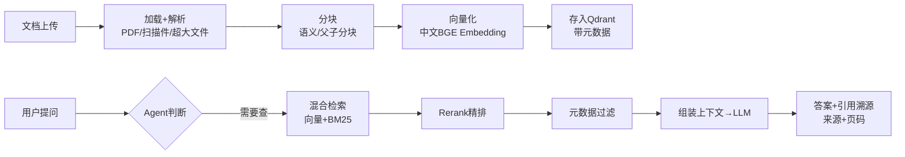

# 阶段八 · 项目 2：Level2 进阶 —— 知识库 RAG Agent

> 所属：阶段八 从入门到生产的实战项目路线
> 定位：给 Agent 装上「自己的资料」。这一级把文档变成可检索的知识底座，并让它按需查询、带来源作答，是绝大多数「企业知识问答」产品的最小原型。

## 项目概览

| 项 | 内容 |
|-|-|
| 难度 | Level2 进阶 |
| 核心功能 | 文档上传、知识库问答、引用溯源、流式输出 |
| 技术栈 | LlamaIndex + Qdrant + LangGraph + Streamlit |
| 周期 | 2-3 周 |
| 核心学习目标 | RAG 与 Agent 结合；向量库使用；流式输出；文档解析各类异常 |

## 一句话看懂本项目的数据流



> 核心认知：**RAG 的价值在于「能用公司的资料回答，而不是编」**。检索质量（分块、混合、精排）直接决定回答质量，检索垃圾，模型再强也答不对。

> 🔬 **深度理解 · 知识库 RAG（检索增强生成）**：
> 1. **本质**：RAG 不是一种检索算法，而是"先检索、再把检索结果拼进上下文让它生成"的组合范式——它通过"给模型在生成时喂入外部事实"，把模型的生成能力约束在"基于证据回答"上，从而缓解幻觉与知识过期。
> 2. **机制**：离线把文档切块 Embedding 成向量入库；在线把用户提问也 Embedding 成向量，用相似度在库里召回 Top-K 片段，将片段拼入 prompt 后让 LLM 基于这些内容作答。质量的关键不在 Embedding 本身，而在"怎么切块、怎么召回、怎么排序（分块质量 + 混合检索 + Rerank）"这条链路。
> 3. **为什么重要**：它解决了 LLM 三大硬伤里最现实的两种——知识不在训练集内（新文档/私有资料）与知识过期（模型训练截止后的事实），且比微调更轻、可控、可追溯来源。
> 4. **易错点/常见误解**：最容易踩的坑是"检索到的片段顺序/相关性不够也硬答"——RAG 提升的是"答对的概率"，前提是检索质量过关；同时别忘了"检索无关内容也算污染"，垃圾进则垃圾出，模型再强也救不回低质量检索，所以必须有 score 阈值与"宁可不答"的兜底。

## 学习内容详情

### 1. 数据链路（离线索引阶段）

文档加载 → 分块（语义分块 / 父子分块）→ 向量化（中文 BGE Embedding）→ 存入 Qdrant。这一步只做一次，产出可检索的向量索引。

> ⏳ **短期可不深究**：语义分块 vs 父子分块的具体切分算法（如何感知段落边界、父块与子块如何映射）第一遍知道"分块影响检索粒度"即可，等真正遇到"长文档召回碎片化/上下文不足"再回来调分块策略，不必一开始就纠结原理。

### 2. 检索进阶（在线查询阶段）

| 手段 | 作用 | 说明 |
|-|-|-|
| 混合检索 | 召回更全 | 向量（语义）+ BM25（关键词）互补 |
| Rerank 精排 | 排序更准 | 对召回结果做交叉注意力精排 |
| 元数据过滤 | 更精准 | 按文档 / 章节 / 权限过滤，只查该查的 |

### 3. Agent 化：Agent-RAG 而非普通 RAG

把检索封装成 `@tool`，用 LangGraph 编排——模型自主决定「何时查、查几轮、要不要追问」，区别于一次性「查完就答」的朴素 RAG。

> 🔬 **深度理解 · Agent-RAG vs 一次性朴素 RAG**：
> 1. **本质**：两者的差别不在"会不会检索"，而在"检索是不是一个可被模型在推理过程中反复决策的动作"。朴素 RAG 是"查一次就答"的流水线，Agent-RAG 把检索变成可多轮调用的工具。
> 2. **机制**：朴素 RAG 在生成前强行走一遍"向量化→召回→拼接"，一次成型；Agent-RAG 则让模型自主决定「这个问题要不要查、查几轮、查到什么程度再回答」——可以在中途追问用户、可以基于上一轮检索结果再查，把检索从固定步骤升级为策略性动作。
> 3. **为什么重要**：它解决了朴素 RAG 的两个弱点——"无需检索的闲聊也硬查一遍（浪费+引入噪声）"和"一个问题需要分解成多次检索（复杂查询一次查不完）"。
> 4. **易错点/常见误解**：不要把"多轮检索"等同于"质量自动更高"——给模型更多检索自由度也意味着更多失败点与成本，通常要配检索失败降级、轮次上限与 score 阈值；Agent-RAG 适合复杂、多跳查询，简单事实问答用朴素 RAG 已经足够且更稳。

```python
@tool("search_kb")
def search_kb(query: str, top_k: int = 5) -> list:
    """Agent-RAG 的检索工具: 模型自主决定何时调用、调几轮"""
    hits = hybrid_search(query, top_k=top_k)   # 向量+BM25 混合
    hits = rerank(query, hits)                  # 精排
    return [{"content": h.text, "source": h.meta["file"], "page": h.meta["page"]}
            for h in hits[:top_k]]
```

### 4. 引用溯源 + 流式输出

- **引用溯源**：答案必须标注来源文件与页码（生产必备，否则答错无从追责）。
- **流式输出**：用 SSE 逐 token 返回，前端 Streamlit / 浏览器呈现打字机效果，体感更快。

## 必须处理的异常

- **文档解析**：PDF 乱码、扫描件（需 PaddleOCR）、超大文件分块、编码问题——这是索引阶段最现实的一批坑。
- **检索无结果 / 低分块干扰**：加 score 阈值过滤，宁可「不知道」也不乱答。
- **模型输出 JSON 残缺**：pydantic 兜底 + 让模型重写（对照阶段四 RAG 与阶段六内容创作）。

> ⏳ **短期可不深究**：扫描件的 PDF 需要 PaddleOCR 这类 OCR 方案把图片文字还原成可检索文本，这一课第一遍遇到"文档能读"即可跳过，等真正拿到大量扫描件/图片型 PDF 的业务场景再专门攻坚 OCR，属于"遇到再学"的边缘需求。

## 本节验收清单

- [ ] 能上传多种格式文档并完成知识库索引
- [ ] 问答带引用溯源（来源 + 页码）
- [ ] 实现了 SSE 流式输出
- [ ] 混合检索 + Rerank 已落地并对比过单路检索的提升

## 排期与前置依赖

- **前置**：阶段四 RAG 技术体系 + 向量数据库记忆存储（[rag_agent.py](../../code/阶段四/rag_agent.py) 先跑通）。
- **建议排期**：第 9-10 周，2-3 周完成；与阶段八 Level4（数据分析）共享向量库与检索经验。
- **关键对照**：本项目是「文档知识」RAG；Level4 是「结构化数据库」SQL Agent，两者共同点是都要求「答得准、可追溯」。

## 本节常见面试题（深度解析）

> 针对本节核心知识的面试高频点，配合"本质+机制"式理解，能让你答得既有深度又有广度。

### 面试题 1：请解释 RAG 的工作流程，并指出决定其问答质量的关键环节是什么？
- **面试官想考察**：你是把 RAG 当成"检索+生成"两步，还是真的理解整条链路里每个环节都在影响质量。
- **专业作答（含深度）**：
  1. 流程拆环：文档加载 → 分块 → Embedding 向量化 → 入库；查询时把用户问题向量化 → 相似度召回 → 拼接上下文 → 让 LLM 基于证据作答。可补充混合检索（向量+BM25）与 Rerank 作为提升召回/排序的手段。
  2. 点出关键：质量瓶颈通常不在 LLM，而在检索链——分块粒度决定"召回的是块还是破碎片段"，召回质量决定"喂进上下文的证据对不对"，排序质量决定"正确片段是否排在前面被采信"。
  3. 给出判断标准：检索垃圾 → 生成必错（垃圾进垃圾出）；所以要配 score 阈值、"宁可不答"与引用溯源来兜底。
  4. 适当抽象：RAG 本质是"给生成加证据约束"，与微调的差别在于不动模型权重、可控、可溯源。
- **加分亮点 / 深度追问**：可主动对比"朴素 RAG vs Agent-RAG"与"向量检索 vs 混合检索"，并提到父子分块解决"召回碎片化"这类进阶痛点；追问"RAG 与微调怎么选"时可答"资料私有/更新频繁用 RAG，风格/领域能力固化用微调，二者常互补"。

### 面试题 2：为什么单靠向量（语义）检索还不够，还要上混合检索和 Rerank？
- **面试官想考察**：你是否理解语义检索的盲区，以及"召回"与"精排"两个阶段目标的不同。
- **专业作答（含深度）**：
  1. 说清向量检索的盲区：它擅长"语义近义"（"退款流程"召回"退货怎么操作"），但对精确标识符/专有名词准召回弱（如 SKU、型号、人名/编号），关键词组成的边界硬查询反而查不准。
  2. 混合检索的分工：BM25 精准命中关键词/专有词，向量捕捉词面不同但意思相近的表达，两者互补召回更全。
  3. Rerank 解决的问题：召回的 Top-K 还都是"粗排"，用交叉注意力（query 与每个片段整体做深度交互打分）把真正相关的那条顶上，修正向量距离度量的浅层局限。
  4. 权衡与误区：多一路检索与精排都增加延迟与成本，简单知识库未必需要；Rerank 是把"两阶段"质量再做一次排序增强，不是万能，召回阶段就丢了的内容精排也救不回。
- **加分亮点 / 深度追问**：可提"召回率 vs 精度的取舍（先求全再求准）"，以及"为何要先召回粗排再精排（避免对全库做昂贵交叉注意力）"；被追问时可解释 BM25 的词频—逆文档频率直觉与向量维数/度量（余弦等）的差异。

### 面试题 3：RAG 系统如何保证"答得准"并"可追溯"？产品化要注意什么？
- **面试官想考察**：你是否具备把 RAG 从 Demo 变成可靠功能的工程意识（兜底 + 问责）。
- **专业作答（含深度）**：
  1. 答得准：检索这一侧用混合检索+Rerank 提质量；判定这一侧加 score 阈值，低于阈值宁可"不知道"也不乱答，配合检索无结果/低分块过滤。
  2. 可追溯：返回结果必须带引用溯源（来源文件+页码+片段），让答案能对得上证据，查错可追责——这是企业级 RAG 的底线能力。
  3. 结构可靠性：模型输出做结构化校验（JSON pydantic 兜底、残缺重写），避免下游解析崩。
  4. 工程闭环：建评测集验证"改检索参数/改动 prompt"是否真的变好，避免凭感觉调参；与 Level5 的 Bad-case 回流与回归测试联动。
- **加分亮点 / 深度追问**：可主动引入"索引与查询分离（离线建好库、在线只查）"，并提到权限控制（按元数据过滤控制谁能查哪些文档）；追问"低分结果该不该暴露给用户"时可答倾向不暴露并给引导式回复，避免误导。