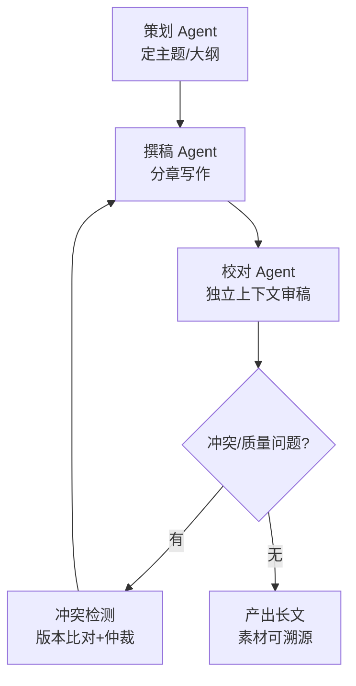

# 阶段八 · 项目 3：Level3 高级 —— 多角色内容创作团队

> 所属：阶段八 从入门到生产的实战项目路线
> 定位：把「一个人干到底」升级成「一个团队分工协作」。这一级用多个 Agent 各司其职（策划 / 撰稿 / 校对）自动产出长文，你要学会的是角色分工、任务调度与协作冲突的处理——多智能体落地的最小完整闭环。

## 项目概览

| 项 | 内容 |
|-|-|
| 难度 | Level3 高级 |
| 核心功能 | 策划 + 撰稿 + 校对多 Agent 协作，自动产出长文 |
| 技术栈 | CrewAI / LangGraph 多智能体 + 搜索工具 |
| 周期 | 3-4 周 |
| 核心学习目标 | 多 Agent 角色分工；任务调度；消息通信；处理协作冲突 |

## 一句话看懂本项目的协作流水线



> 核心认知：多 Agent 的价值不是「数更多」，而是**每个角色拥有独立上下文和专一职责**。策划管全局、撰稿管表达、校对管挑错——各自只盯着自己那部分，反而比一个「全能 Agent」更可控。

> 🔬 **深度理解 · 多角色内容创作（多智能体协作 + 独立上下文）**：
> 1. **本质**：它不是"同时跑多个 LLM"，而是把一条大任务按"专业分工"拆成多个各有**独立上下文窗口**的执行单元，让"任务状态"而非"同一个对话历史"在角色间传递——每个 Agent 只携带它职责所需的上下文。
> 2. **机制**：由一个流程/主管把产出物（大纲、分章、审稿意见）作为显式的 `context` 注入下一角色；角色间通过"任务产出物 + 引用"通信而不是共享全部 token，避免上下文爆炸与相互污染。冲突时用优先规则/仲裁/人工兜底收口。
> 3. **为什么重要**：单个 Agent 一旦把"全局+细节"全塞进一个上下文，会出现长文本失控、自相矛盾、"每个角色都想抢话筒"；多角色通过责权隔离提升可解释性、可质量控制和可溯源，也对应"让对的人看对的上下文"。
> 4. **易错点/常见误解**：别以为角色越多越好——每多一个角色就多一层编排成本与失败点；真正的关键是"职责边界清不清晰、context 传得准不准"，而非"Agent 数量"。误把"多个角色"做成"共享同一上下文的分身"就是空壳多智能体，拿不到分工红利。

## 学习内容详情

### 1. 角色分工与职责边界

| 角色 | 职责 | 独立上下文 |
|-|-|-|
| 策划 | 定主题、搭大纲、定读者与风格 | 只看到主题与目标 |
| 撰稿 | 按大纲分章写作 | 只看到大纲 + 已写章节摘要 |
| 校对 | 审稿挑错、一致性检查 | 只看到成稿，独立于写作过程 |

### 2. 实现二选一

- **CrewAI**：快速上手，用 `role + goal + backstory + task.expected_output` 声明式配置，适合体验多 Agent 协作。
- **LangGraph Supervisor**：更可控，由主管 Agent 路由派活（对照阶段三示例 36、阶段五多智能体 Supervisor）。生产团队更常用这种「主管派活、工人干活」的图式。

> ⏳ **短期可不深究**：CrewAI 的 `backstory`/`goal` 等声明式字段怎么写才能"调教出好角色"这类偏框架内套路细节，第一遍照着模板配通即可；重点是理解"每个角色独立上下文+专人负责"，别把时间耗在框架专属配置的调优上。

### 3. 消息通信：防互相污染

任务 `context` 显式声明「上游产出注入」，每个角色只拿到它该看的，避免一个 Agent 的中间输出污染另一个的判断。

### 4. 素材必须来自搜索（事实底座）

所有论点必须由搜索工具提供来源，防止产出一台「高级编造机」。这是长文「可溯源」而不是「像真的」的底线（对照阶段五防幻觉、阶段六内容创作）。

## 必须处理的问题

| 问题 | 处理 |
|-|-|
| 协作冲突 | 两个 Agent 对同一内容结论矛盾 → 冲突检测（版本比对）+ 优先级规则 / 人工仲裁 |
| 长文本失控 | 大纲锚定 + 章节摘要传递，一次只写一章（对照阶段六内容创作） |
| 素材编造 | 引用必须来自搜索工具，缺来源即打回 |

```python
def resolve_conflict(v1: str, v2: str, priority_roles: list) -> str:
    """冲突仲裁: 按优先级规则解决两个角色的矛盾结论, 必要时转人工"""
    for role in priority_roles:            # 例如 校对 > 撰稿
        if v1.get("role") == role:
            return v1["content"]
    return "MANUAL_REVIEW"                 # 无法自动裁决 → 人工拍板
```

> ⏳ **短期可不深究**：冲突检测里"版本比对"具体用哪种文本 diff 算法（如按行/按句相似度、编辑距离）第一遍不用深究，知道"靠相似度/结构化比对找出两版差异、再按优先级仲裁"的思路即可，真到做长文一致性校验时再按需选工具。

## 本节验收清单

- [ ] 三个角色分工明确，长文自动产出完整
- [ ] 能说清所用框架的状态流转方式（CrewAI 或 LangGraph 图）
- [ ] 处理过一次协作冲突并给出解决策略
- [ ] 产出内容可溯源到素材，非凭空编造

## 排期与前置依赖

- **前置**：阶段五多智能体系统进阶 + 阶段六内容创作 Agent；阶段三 CrewAI / LangGraph supervisor 至少跑通一个。
- **建议排期**：第 12 周，3-4 周完成。
- **配套 Demo**：阶段五[多智能体工作流 Agent](../../code/阶段五/planning_memory_agent.py)（含 Supervisor 分工、断点恢复、冲突仲裁思路），先读懂它的三个 Worker 是怎么被调度的。

## 本节常见面试题（深度解析）

> 针对本节核心知识的面试高频点，配合"本质+机制"式理解，能让你答得既有深度又有广度。

### 面试题 1：多 Agent 协作和"一个 Agent 用很长的 prompt 分步干完"相比，优势到底在哪？什么情况下它反而没必要？
- **面试官想考察**：你是否明白多智能体的价值不是为了"堆数量"，而是"独立上下文 + 职责隔离"，以及是否能判断它的适用边界。
- **专业作答（含深度）**：
  1. 关键差异：多 Agent 的核心是**每个角色的独立上下文窗口与专一职责**，而非单纯的流程分步——single Agent 分步仍共享同一上下文与同一系统人格。
  2. 优势四条：上下文隔离防"互相污染与被无关信息稀释"；职责单一使每步的 prompt 更聚焦、更易控制质量；可溯源（哪个角色产出了什么）；独立编排与并行/重试。
  3. 适用边界：任务复杂、需要不同专业知识与观点交锋（策划/撰文/校对）、产出可拆分为有界子任务时更划算；简单、单线任务上多 Agent 是徒增延迟、token 与失败点。
  4. 一句话总结：多智能体是"用结构换可控"，只有职责隔离能带来收益时才值得上。
- **加分亮点 / 深度追问**：可主动提"上下文隔离 vs 上下文共享的 token 成本权衡"和"主管-工人（Supervisor-Worker）vs 全连接 Sha 拓扑差异"；经追问可谈"何时该把角色合并/拆细，取决于子任务是否需要独立的 prompt 状态"。

### 面试题 2：多 Agent 之间如何通信才能避免"上下文污染"？
- **面试官想考察**：你如何处理多 Agent 的消息/上下文传递，是否理解"传产出物而非共享全部历史"。
- **专业作答（含深度）**：
  1. 原则：优先传递"该角色完成任务所需的产出物"（大纲、章节摘要、审稿意见），通过显式 `context` 声明依赖，而不是让所有 Agent 共享同一份对话历史。
  2. 这样做的三点收益：控制每角色的上下文规模（省 token、降低噪声）；避免"上游中间不可靠输出"污染下游判断；让依赖关系可追踪、可复现。
  3. 补充务实手段：必要时只传摘要而非全文、保持每步产出可引用，确保关键事实不被改写丢失。
  4. 风险提示：过度压缩 context 会丢失细节，压缩不足又回到"传全量"——要在"信息够用"与"上下文可控"间平衡。
- **加分亮点 / 深度追问**：可提到"产出物结构化（schema）+ 可追溯引用"的设计，确保下游能对回上游原文；追问"若各角色结论冲突怎么办"正好引出下一题。

### 面试题 3：两个 Agent 对同一内容的结论互相矛盾时，你怎么设计冲突检测与仲裁？
- **面试官想考察**：你是否对"多智能体运行的现实问题（结论不一致）"有落地思路，而不只是会搭个流程。
- **专业作答（含深度）**：
  1. 冲突来源先说清：不同角色职责/视角不同，给出互相矛盾的版本是常态，不是 bug。
  2. 检测：用结构化比对/相似度找出两版的实质差异点（是真矛盾还是表述差异）。
  3. 仲裁三层：先按**优先级规则**（如校对 > 撰稿，谁更权威谁说了算）；无明确优先级时引入**第三方裁决 Agent**或历史规则；仍存疑则**转人工（MANUAL_REVIEW）**兜底，绝不让模型自行糊弄过去。
  4. 升华：仲裁结果应可解释、可审计，把"最终采用了谁的版本、为什么"记录下来，便于沉淀规则与复盘。
- **加分亮点 / 深度追问**：可补充"优先级本身就是一种领域知识，需业务方确认"，以及"多次冲突说明职责边界或 context 传错了，应回到上游排查而非只修仲裁"；追问可延伸到"如何防止仲裁 Agent 再引入新偏差"（限定其只看两版结论与理由）。