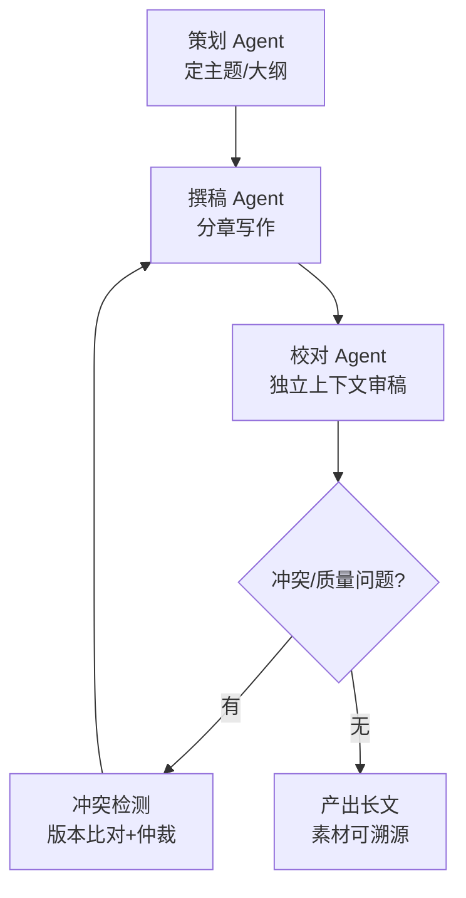

# 阶段八 · 项目 3：Level3 高级 —— 多角色内容创作团队

> 所属：阶段八 从入门到生产的实战项目路线
> 定位：把「一个人干到底」升级成「一个团队分工协作」。这一级用多个 Agent 各司其职（策划 / 撰稿 / 校对）自动产出长文，你要学会的是角色分工、任务调度与协作冲突的处理——多智能体落地的最小完整闭环。

## 项目概览

| 项 | 内容 |
|-|-|
| 难度 | Level3 高级 |
| 核心功能 | 策划 + 撰稿 + 校对多 Agent 协作，自动产出长文 |
| 技术栈 | CrewAI / LangGraph 多智能体 + 搜索工具 |
| 周期 | 3-4 周 |
| 核心学习目标 | 多 Agent 角色分工；任务调度；消息通信；处理协作冲突 |

## 一句话看懂本项目的协作流水线



> 核心认知：多 Agent 的价值不是「数更多」，而是**每个角色拥有独立上下文和专一职责**。策划管全局、撰稿管表达、校对管挑错——各自只盯着自己那部分，反而比一个「全能 Agent」更可控。

## 学习内容详情

### 1. 角色分工与职责边界

| 角色 | 职责 | 独立上下文 |
|-|-|-|
| 策划 | 定主题、搭大纲、定读者与风格 | 只看到主题与目标 |
| 撰稿 | 按大纲分章写作 | 只看到大纲 + 已写章节摘要 |
| 校对 | 审稿挑错、一致性检查 | 只看到成稿，独立于写作过程 |

### 2. 实现二选一

- **CrewAI**：快速上手，用 `role + goal + backstory + task.expected_output` 声明式配置，适合体验多 Agent 协作。
- **LangGraph Supervisor**：更可控，由主管 Agent 路由派活（对照阶段三示例 36、阶段五多智能体 Supervisor）。生产团队更常用这种「主管派活、工人干活」的图式。

### 3. 消息通信：防互相污染

任务 `context` 显式声明「上游产出注入」，每个角色只拿到它该看的，避免一个 Agent 的中间输出污染另一个的判断。

### 4. 素材必须来自搜索（事实底座）

所有论点必须由搜索工具提供来源，防止产出一台「高级编造机」。这是长文「可溯源」而不是「像真的」的底线（对照阶段五防幻觉、阶段六内容创作）。

## 必须处理的问题

| 问题 | 处理 |
|-|-|
| 协作冲突 | 两个 Agent 对同一内容结论矛盾 → 冲突检测（版本比对）+ 优先级规则 / 人工仲裁 |
| 长文本失控 | 大纲锚定 + 章节摘要传递，一次只写一章（对照阶段六内容创作） |
| 素材编造 | 引用必须来自搜索工具，缺来源即打回 |

```python
def resolve_conflict(v1: str, v2: str, priority_roles: list) -> str:
    """冲突仲裁: 按优先级规则解决两个角色的矛盾结论, 必要时转人工"""
    for role in priority_roles:            # 例如 校对 > 撰稿
        if v1.get("role") == role:
            return v1["content"]
    return "MANUAL_REVIEW"                 # 无法自动裁决 → 人工拍板
```

## 本节验收清单

- [ ] 三个角色分工明确，长文自动产出完整
- [ ] 能说清所用框架的状态流转方式（CrewAI 或 LangGraph 图）
- [ ] 处理过一次协作冲突并给出解决策略
- [ ] 产出内容可溯源到素材，非凭空编造

## 排期与前置依赖

- **前置**：阶段五多智能体系统进阶 + 阶段六内容创作 Agent；阶段三 CrewAI / LangGraph supervisor 至少跑通一个。
- **建议排期**：第 12 周，3-4 周完成。
- **配套 Demo**：阶段五[多智能体工作流 Agent](../../code/阶段五/planning_memory_agent.py)（含 Supervisor 分工、断点恢复、冲突仲裁思路），先读懂它的三个 Worker 是怎么被调度的。