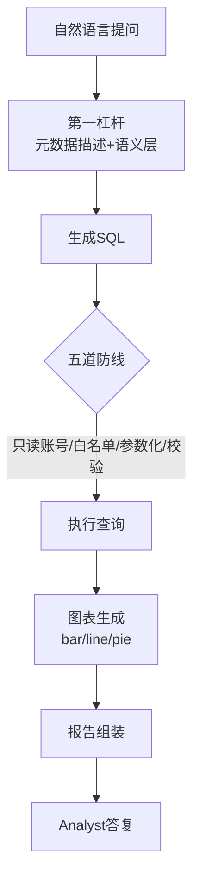

# 阶段八 · 项目 4：Level4 实战级 —— 数据分析 Agent

> 所属：阶段八 从入门到生产的实战项目路线
> 定位：让 Agent 直接对业务数据库「说人话、查数据、出图表」。这一级的核心不是『会查』，而是『既有用又安全』——能读懂业务口径、产出对的 SQL，同时一道防线都不漏，不让模型把公司数据弄坏。

## 项目概览

| 项 | 内容 |
|-|-|
| 难度 | Level4 实战级 |
| 核心功能 | 自然语言查库、自动图表、分析报告生成 |
| 技术栈 | LangGraph + SQL Agent + Pandas + FastAPI |
| 周期 | 4-6 周 |
| 核心学习目标 | Agent 对接业务数据库；SQL 风险；工具调用失败处理；输出校验 |

## 一句话看懂本项目的闭环



> 核心认知：**数据分析 Agent 的价值 = 问得动 + 答得准 + 破坏不了数据**。前两者靠元数据描述与语义层，后者靠无论如何都不越界的那道只读底线。

## 学习内容详情

### 1. Text-to-SQL：第一杠杆是元数据描述

把表 / 字段 / 注释 / 示例行 / 业务口径一次性喂给模型，它才能生成对的 SQL。描述越准，SQL 越对，比反复调 prompt 技巧更有效。

### 2. 五道防线（对照阶段六数据分析 Agent）

| 防线 | 作用 | 关键点 |
|-|-|-|
| 只读账号 | 根防线 | 数据库层限权，模型想 DELETE 也执行不了 |
| SQL 白名单校验 | 只放 SELECT / WITH | 挡在入口 |
| 参数化执行 | 防拼接注入 | 绝不字符串拼接 |
| 结果校验 | 空结果不编 | 行数 / 空结果 / 耗时异常 |
| 报错自修正 | 出错自动重试 | 限 2 次，避免无限烧 |

```python
ALLOWED_PREFIX = ("SELECT", "WITH")
MAX_RETRY = 2

def defend_and_run(sql: str, params: tuple, db) -> dict:
    """五道防线(2,3,4): 白名单 + 参数化 + 结果校验"""
    if not sql.strip().upper().startswith(ALLOWED_PREFIX):
        return {"status": "rejected", "reason": "仅为只读查询"}   # ②
    try:
        result = db.execute(sql, params)                            # ③ 参数化
        if not result:
            return {"status": "empty", "message": "查询为空, 请核实, 勿编造"}  # ④
        return {"status": "ok", "data": result}
    except Exception as e:
        return {"status": "failed", "reason": str(e)[:100]}        # ⑤ 交回模型改
```

### 3. 工具链与 API 层

- **工具链**：`run_sql`（查询）+ `plot_chart`（bar / line / pie 图表）+ `report`（报告组装）。
- **API 层**：FastAPI 暴露接口，带鉴权与限流——让 Agent 被安全地对外调用。

## 必须处理的问题

- **SQL 注入**：参数化，绝不字符串拼接。
- **工具调用失败**：报错文本回传模型自动修正（限重试 2 次，对照阶段六 `MAX_RETRY`）。
- **输出校验**：SQL 合法性 + 结果合理性（行数 / 空结果 / 耗时异常）。
- **业务语义**：语义层固化口径（「营收」= `SUM(amount) WHERE status='paid'`），避免三个用户问出三种营收。

## 本节验收清单

- [ ] 自然语言查询能正确转 SQL 并返回结果
- [ ] 五道防线全部落地并验证（含注入攻击测试）
- [ ] 能自动生成图表并组装成一份分析报告
- [ ] 错误 SQL 能自动修正并成功重跑

## 排期与前置依赖

- **前置**：阶段六数据分析 Agent（[data_analysis_agent.py](../../code/阶段六/data_analysis_agent.py) 先跑通五道防线）+ 阶段七 SQL 工具的对立工程做法。
- **建议排期**：第 13-14 周，4-6 周完成；这是阶段六 01 数据分析、阶段七监控的一次综合应用。
- **关键**：本项目给的 [Demo](../../code/阶段六/data_analysis_agent.py) 是离线教学版（内存表 + 五道防线）；本项目要把它升级到真实 PostgreSQL + FastAPI + 图表输出。