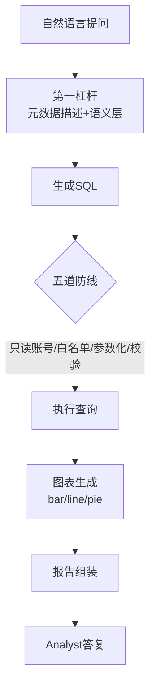

# 阶段八 · 项目 4：Level4 实战级 —— 数据分析 Agent

> 所属：阶段八 从入门到生产的实战项目路线
> 定位：让 Agent 直接对业务数据库「说人话、查数据、出图表」。这一级的核心不是『会查』，而是『既有用又安全』——能读懂业务口径、产出对的 SQL，同时一道防线都不漏，不让模型把公司数据弄坏。

> **内容复用说明**：本项目的 Schema Prompt 与五道防线实现，与阶段六 [02《数据分析 Agent》](../06-阶段六-垂直领域Agent落地实践/02-数据分析Agent.md)、[阶段六综合实战《数据分析 Text-to-SQL Agent》](../06-阶段六-垂直领域Agent落地实践/06-阶段六综合实战-数据分析Agent.md)共用同一套方案，此处不再重复贴代码；差异点在于本 Level 追加 **FastAPI 接口层 + 图表输出 + 报告生成**（见下文「工具链与 API 层」），五道防线代码也按 API 层返回结构调整（`status` 字典）。

## 项目概览

| 项 | 内容 |
|-|-|
| 难度 | Level4 实战级 |
| 核心功能 | 自然语言查库、自动图表、分析报告生成 |
| 技术栈 | LangGraph + SQL Agent + Pandas + FastAPI |
| 周期 | 4-6 周 |
| 核心学习目标 | Agent 对接业务数据库；SQL 风险；工具调用失败处理；输出校验 |

## 一句话看懂本项目的闭环



> 核心认知：**数据分析 Agent 的价值 = 问得动 + 答得准 + 破坏不了数据**。前两者靠元数据描述与语义层，后者靠无论如何都不越界的那道只读底线。

> 🔬 **深度理解 · 数据分析 Agent（Text-to-SQL + 安全边界）**：
> 1. **本质**：它把"自然语言 → SQL → 查库 → 图表/报告"串成一条可控流水线，本质是"用 LLM 做数据库的翻译器+执行器"，但真正决定成败的往往不是翻译的炫技，而是"**语义对不对、SQL 安不安全**"这两个非模型问题。
> 2. **机制**：第一杠杆是把表的 schema（字段、类型、注释、示例行）与业务口径（如"营收"的确切定义）作为上下文喂给模型，让它在"懂业务口径"的前提下生成 SQL；随后 SQL 过"白名单/参数化/校验/限重试"等多道防线才落到数据库执行，结果再转图表与报告。
> 3. **为什么重要**：它让业务人员不写 SQL 也能跨表取数出图，把数据能力平民化；同时因为是"直接对生产库"操作，安全与准确是准入条件，少了任一条防线就不是能上线的产品。
> 4. **易错点/常见误解**：最大误区是"把能力押在让模型写出更完美的 SQL 上"——事实上业务口径模糊才是错报援引的主因，所以要先做语义层/口径固化；另一误区是把"只读"想成防御的全部，实际还要叠加校验与重试上限，形成纵深防线。

## 学习内容详情

### 1. Text-to-SQL：第一杠杆是元数据描述

把表 / 字段 / 注释 / 示例行 / 业务口径一次性喂给模型，它才能生成对的 SQL。描述越准，SQL 越对，比反复调 prompt 技巧更有效。

### 2. 五道防线（对照阶段六数据分析 Agent）

| 防线 | 作用 | 关键点 |
|-|-|-|
| 只读账号 | 根防线 | 数据库层限权，模型想 DELETE 也执行不了 |
| SQL 白名单校验 | 只放 SELECT / WITH | 挡在入口 |
| 参数化执行 | 防拼接注入 | 绝不字符串拼接 |
| 结果校验 | 空结果不编 | 行数 / 空结果 / 耗时异常 |
| 报错自修正 | 出错自动重试 | 限 2 次，避免无限烧 |

```python
ALLOWED_PREFIX = ("SELECT", "WITH")
MAX_RETRY = 2

def defend_and_run(sql: str, params: tuple, db) -> dict:
    """五道防线(2,3,4): 白名单 + 参数化 + 结果校验"""
    if not sql.strip().upper().startswith(ALLOWED_PREFIX):
        return {"status": "rejected", "reason": "仅为只读查询"}   # ②
    try:
        result = db.execute(sql, params)                            # ③ 参数化
        if not result:
            return {"status": "empty", "message": "查询为空, 请核实, 勿编造"}  # ④
        return {"status": "ok", "data": result}
    except Exception as e:
        return {"status": "failed", "reason": str(e)[:100]}        # ⑤ 交回模型改
```

> 🔬 **深度理解 · 五道防线（纵深防御 Dead-Defense）**：
> 1. **本质**：它用"多条不同层级的防线叠加"来防御"同一类核心风险（模型越界/注入/出错）"，而不是指望单一道关卡完美——本质是安全工程里"纵深防御"思想在 LLM 落地控制器上的具体化。
> 2. **机制**：每一道防线的失效假设不同——只读账号连数据库层都不给写权限（最硬底线）、白名单把非 SELECT 挡在入口、参数化消除拼接注入、结果校验挡住空结果瞎编、报错自修正把失败交回模型并限 2 次——任何一道失守，其余仍可为兜底。
> 3. **为什么重要**：因为"模型是概率性的、会犯错甚至会被 prompt 诱导"，所以必须把安全交给"非 LLM 的确定性代码"来兜底——防的是"系统性的、可证明的"越界行为，而不是防某一个 prompt 漏洞。
> 4. **易错点/常见误解**：别把某道防线当"唯一保险"——只读账号虽硬，但若配合了错误的白名单/缺参数化仍可能被绕过或误伤；也别忘了"只读≠安全"，仍有排序/大表扫描把库打挂的风险，结果校验耗时异常就是要拦这个。真正确保的是"从最下层到最上层层层可拦截"。

### 3. 工具链与 API 层

- **工具链**：`run_sql`（查询）+ `plot_chart`（bar / line / pie 图表）+ `report`（报告组装）。
- **API 层**：FastAPI 暴露接口，带鉴权与限流——让 Agent 被安全地对外调用。

> ⏳ **短期可不深究**：`plot_chart` 具体用哪个绘图库（matplotlib / Plotly / ECharts 等）以及各种图表的样式参数搭配，第一遍会"给定数据出基础 bar/line/pie 图"即可；图表美化的细节等交付对外报告再按需打磨，不用一开始就钻研样式工程。

## 必须处理的问题

- **SQL 注入**：参数化，绝不字符串拼接。
- **工具调用失败**：报错文本回传模型自动修正（限重试 2 次，对照阶段六 `MAX_RETRY`）。
- **输出校验**：SQL 合法性 + 结果合理性（行数 / 空结果 / 耗时异常）。
- **业务语义**：语义层固化口径（「营收」= `SUM(amount) WHERE status='paid'`），避免三个用户问出三种营收。

> ⏳ **短期可不深究**：语义层的具体落地形态（写死口径映射表 / 在 schema 描述里带口径注释 / 建独立语义视图）第一遍知道"要解决口径不统一"即可，选哪种取决于团队的数据治理成熟度，不必一开始就实现复杂的语义中间层。

## 本节验收清单

- [ ] 自然语言查询能正确转 SQL 并返回结果
- [ ] 五道防线全部落地并验证（含注入攻击测试）
- [ ] 能自动生成图表并组装成一份分析报告
- [ ] 错误 SQL 能自动修正并成功重跑

## 排期与前置依赖

- **前置**：阶段六数据分析 Agent（[data_analysis_agent.py](../../code/阶段六/data_analysis_agent.py) 先跑通五道防线）+ 阶段七 SQL 工具的对立工程做法。
- **建议排期**：第 13-14 周，4-6 周完成；这是阶段六 01 数据分析、阶段七监控的一次综合应用。
- **关键**：本项目给的 [Demo](../../code/阶段六/data_analysis_agent.py) 是离线教学版（内存表 + 五道防线）；本项目要把它升级到真实 PostgreSQL + FastAPI + 图表输出。

## 本节常见面试题（深度解析）

> 针对本节核心知识的面试高频点，配合"本质+机制"式理解，能让你答得既有深度又有广度。

### 面试题 1：Text-to-SQL 里，为什么"元数据描述 + 语义层"是第一杠杆？比反复调 prompt 更有效在哪？
- **面试官想考察**：你是否理解"让模型写出对 SQL"的瓶颈在"输入信息（schema/口径）"而非"提示技巧"。
- **专业作答（含深度）**：
  1. 归因：SQL 写错大多是"不知道表结构/字段含义/业务口径"导致的，而不是"不会写 SQL"——补信息比洗 prompt 更对症。
  2. 具体做法：把表/字段/类型/注释/示例行/业务口径一次性喂给模型，等价于给它"残缺数据库文档"，让它在"懂口径"的前提下建模。
  3. 对比 prompt 技巧：调 prompt 是让模型"更努力猜"，元数据+语义层是"减少它需要猜的内容"，后者是决定性输入、可随 schema 变更更新，更具扩展性。
  4. 联系本项目：口径统一（「营收」有唯一定义）直接削掉"三个用户问出三种营收"，这是准确性 vs 偶然命中的分水岭。
- **加分亮点 / 深度追问**：可主动提到"few-shot 例子的 schema 上下文也能给模型接地气的模板"，以及"语义层把口径固化到系统而非 prompt 里，天然可审计"；追问"为什么同一口径不同 SQL 都算对"时可谈"结果等价 vs 写法等价"。

### 面试题 2：请完整讲一遍你的「五道防线」，并说明为什么安全不能只靠一条只读账号。
- **面试官想考察**：你是否用"纵深防御"的工程视角看待 LLM 落地控制，而不只是背五个名字。
- **专业作答（含深度）**：
  1. 逐条展开：只读账号（数据库层最硬、模型想 DELETE 也执行不了）；SQL 白名单（只放 SELECT/WITH，挡入口）；参数化执行（消除注入，杜绝字符串拼接）；结果校验（空结果/行数/耗时异常时不编造）；报错自修正（交回模型限 2 次避免无限烧）。
  2. 回答"为什么不全靠只读"：只读挡的是"写"风险，防不了注入读取越权、防不了大表全扫拖垮库、防不了空结果胡说——风险是多维的，单点防线管不住多类威胁。
  3. 机制关系：讲清"确定性代码兜底概率性模型"这一本质——防御核心交给非 LLM 的可证明逻辑，而不是信任模型永远守规矩。
  4. 举一反三：限重试/超时同样属于把"不可控的循环"收敛成有限步，体现的是同一思维。
- **加分亮点 / 深度追问**：可主动补"最小权限 + 网络层隔离（内网/只读副本）"与"关键查询加耗时看门狗"；追问"如何测试这五道防线"时可答"注入攻击测试 + 越权用例 + 空/巨量结果用例"构成验收矩阵。

### 面试题 3：模型还是一次问法查出空结果或很明显错的数据，你怎么让它"承认不知道"而不是硬编？
- **面试官想考察**：你如何处理 LLM 的幻觉在数据查询场景的放大——这是分析型 Agent 最容易失分的地方。
- **专业作答（含深度）**：
  1. 机制：在结果校验/工具层就拦截——空结果、超时、异常这些"确定性信号"由代码判定并回传，避免模型拿到空结果仍自行脑补答案。
  2. prompt 纪律：在系统层约束"空结果不许编造、要如实告知用户去核实"，把"不知道"设为显式合法态，而不是逼模型给出一个数字。
  3. 校验维度：行数、空结果、耗时异常都要看——"无数据"也是有效结论，但不能伪造成"查询成功有数据"。
  4. 工程闭环：把这类"低置信/错误"样例沉进 Bad-case 队列，持续精修 prompt 与语义层。
- **加分亮点 / 深度追问**：可对比"结构化约束"与"提示约束"——对"不给编答案"这种关键约束，优先用代码强制（校验拦截）而非仅靠 prompt 期望；追问"空结果到底该展示什么"时可答"给出'无匹配数据+可能的核实建议'而非编造数值"。