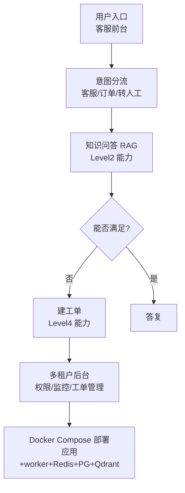

# 阶段八 · 项目 5：Level5 生产级 —— 企业智能客服 Agent

> 所属：阶段八 从入门到生产的实战项目路线
> 定位：阶段八的收尾，也是整个 16 周学习计划的毕业设计。这一级把前面所有阶段能力捏合成一个「能上线、能扩、能迭代」的完整生产系统——不是 Demo，是真的能部署给用户用的产品。

## 项目概览

| 项 | 内容 |
|-|-|
| 难度 | Level5 生产级 |
| 核心功能 | 知识库答疑 + 工单创建 + 人工转接 + 多租户后台 |
| 技术栈 | LangGraph + RAG + 工单系统 + 管理后台 + Docker 部署 |
| 周期 | 6-8 周 |
| 核心学习目标 | 完整工程落地；权限、持久化、监控告警；线上迭代闭环 |

## 一句话看懂本项目的系统分层



> 核心认知：**生产级不是在功能上加花活，而是把每个环节的『不靠谱』都堵住**——状态不丢、权限不漏、故障可控、数据可追。这才是从 0 到 1 之后真正拉开差距的地方。

> 🔬 **深度理解 · 企业智能客服（从 Demo 到生产系统）**：
> 1. **本质**：生产级不是"多了几个功能按钮"，而是把系统从"在理想条件下能跑"提升到"在真实恶劣条件下也可靠可用"——核心矛盾从'能不能实现'变成'故障/权限/合规/迭代'这些非功能属性。
> 2. **机制**：把每类『不靠谱』用确定性机制堵上——状态持久化（Checkpointer + Redis/PG，重启不丢），多租户隔离（thread_id = 租户+会话、向量元数据过滤），权限分级（高危操作审批），审计（append-only 存储 + trace_id 串链路），监控告警与优雅停机、评测/Bad-case 闭环。
> 3. **为什么重要**：它决定了系统能否进企业采购清单——补上可用性、合规、可迭代这些能力，领先的不再是"技术炫技"，而是"敢不敢交付给真实用户生产环境"。
> 4. **易错点/常见误解**：别把生产化简化成"能多租户计数 + 能 Docker 跑起来"——真正的生产指标是"故障能发现、状态不丢、数据能对齐、能力能越改越好"。也常有人以为"功能越多越生产"，恰恰相反，克制地收敛 scope、把底线机制做扎实才更接近生产。

## 学习内容详情

### 1. 项目要点（完整工程落地）

- **骨架**：意图分流 → 知识问答（RAG，复用 Level2）→ 满足不了 → 转人工 / 建工单（复用 Level4 的 SQL 与数据能力）。
- **多租户隔离**：`thread_id = 租户 ID + 会话 ID`；向量库元数据过滤实现租户级隔离（对照阶段六客服与阶段四向量库）。
- **状态持久化**：Checkpointer + 存储后端（Redis / Postgres）；服务重启任务状态不丢（对照阶段五断点、阶段七部署）。
- **权限控制**：敏感操作（查订单 / 工单）按角色权限分级；高危动作人工审批。
- **监控告警**：任务成功率 / LLM 失败率告警 + 完整链路日志（对照阶段七监控）。
- **部署**：Docker Compose 一键拉起「应用 + worker + Redis + PG + Qdrant」（对照阶段七 docker-compose）；生产规模上 K8s + HPA（呼应[阶段七 02《部署与伸缩》](../07-阶段七-工程化部署与运维/02-部署与伸缩.md)），Docker Compose 用于开发与演示。

> 🔬 **深度理解 · 多租户隔离（Multi-Tenancy）**：
> 1. **本质**：多租户隔离是在"一套系统服务多个客户（租户）"的同时，保证 A 租户的数据/会话/权限**在逻辑与物理上都不可见于 B 租户**——它不是"多用户登录"，而是"租户级的数据边界"。
> 2. **机制**：落地靠"身份贯穿 + 滤波贯穿"——每个请求都解析出租户（`thread_id = 租户+会话`），状态层按租户分上下文；检索层用向量库的元数据过滤（每个文档/块带 tenant 字段）只召回本租户内容；再叠加权限分级为租户内/跨租户的高危操作设闸。
> 3. **为什么重要**：这是企业级软件的商业前提（多租户才能规模化售卖给多客户），也是最容**易被忽略导致数据越权的重大事故点**；隔离不好，售后纠纷与合规处罚都来。
> 4. **易错点/常见误解**：最容易漏的是"只做了应用层隔离却漏了检索/缓存/后台导出的隔离"，让 B 租户通过向量检索或工单后台看到 A 租户数据；另一个误区是"用 thread_id 隔离就够"——必须贯穿状态、检索、数据库查询、文件/后台全链路，处处带租户条件。

> ⏳ **短期可不深究**：K8s + HPA（水平自动扩缩容）这套容器编排的生产细节，第一遍知道"It 是用来在更大流量下弹性部署/扩容的手段"即可；当前用 Docker Compose 跑通单机部署已经够完成学习，K8s 等真到数十倍流量/多副本的规模再系统学，属于"按需进阶"的环节。

### 2. 必须落地的工程实践

- **评测闭环**：自建评测集 + Bad-case 队列 + 回归测试（改 prompt 重跑评测，对照阶段五评测 + 阶段七 Bad-case 闭环）。
- **优雅停机**：发布时在途请求不切断（对照阶段七调用优雅停机机制）。
- **满意度回流**：低分会话自动进 Bad-case 队列（写 Click 埋点，异步入队）。
- 文档交付与复盘：项目文档 + 每周末复盘。

> ⏳ **短期可不深究**：埋点上报的具体实现（事件打点字段怎么设计、ClickHouse 这类分析库的建表/聚合写法、异步入队用哪套 MQ）第一遍知道"要记录低分会话并回流"即可，等真正做用户行为分析平台再细化，属于数据/基础设施侧的可选加分项。

```python
def thread_key(tenant_id: str, session_id: str) -> str:
    """多租户 + 会话的状态签名: 每个租户每个会话独立上下文"""
    return f"{tenant_id}:{session_id}"
```

### 3. 合规与审计（企业级必选项）

企业级与「能跑」的分水岭不是功能数量，而是合规能力——缺这一节，系统进不了企业采购清单。

**a) 审计日志**：所有敏感操作（查订单、创建工单、权限变更、转人工）统一记录四要素——**谁**（user_id）、**何时**（时间戳 + trace_id 串联完整链路）、**做了什么**（工具 + 参数）、**结果**（成功 / 失败 + 摘要）。审计日志落**独立只追加（append-only）存储**，不与业务日志混放（业务日志滚动清理，审计日志须可追溯数年）。

```python
import json, time

def audit_log(user_id, trace_id, action, params, ok, summary, sink) -> None:
    """敏感操作审计: 谁/何时/做了什么/结果 —— 独立 append-only 存储"""
    sink.append(json.dumps({          # 生产: append-only 表/日志桶, 不给 UPDATE/DELETE 权限
        "ts": round(time.time(), 3), "user_id": user_id, "trace_id": trace_id,
        "action": action, "params": params,    # 如 {"tool": "query_order", "order_id": "A1024"}
        "result": "ok" if ok else "fail", "summary": summary[:100],
    }, ensure_ascii=False))

# 查订单 / 建工单 / 权限变更 / 转人工 四类敏感操作出口统一调用
audit_log("u_1001", "tr_8f2a", "query_order", {"order_id": "A1024"},
          ok=True, summary="返回脱敏后订单摘要", sink=audit_store)
```

**b) PII 与数据分级**：三级——**明文**（非敏感业务标识，如订单号）/ **掩码**（默认展示层，手机号 138****1234）/ **加密**（原文密文落库，授权后解密）。手机号默认掩码展示，**完整值仅授权角色可见**（客服主管，或用户本人核身通过后），对照阶段六客服的 PII 脱敏小节。

**c) 数据驻留与保留期限**：GDPR / PIPL 要求数据不出境 / 境内存储——选境内区域 + 自托管观测（LangFuse 而非境外 SaaS）；用户有权请求数据删除（被遗忘权）。对话记录设保留期限（如 **180 天**）到期自动清理——定时任务同时清掉 PG 与向量库里的副本（对照阶段四：入库的 embedding 也是个人数据）。

> ⚠️ **合规是采购评审的否决项**：企业采购评审里安全与合规一票否决——功能再花哨，没有审计日志与数据分级直接出局。Level5 演示至少要落地**审计日志**这一项。

## 本节验收清单

- [ ] Docker Compose 一键部署整套环境并跑通
- [ ] 状态落库 + 中断恢复验证（重启进程任务不丢）
- [ ] 有多租户隔离与权限分级
- [ ] 敏感操作有独立审计日志（append-only，可用 trace_id 串起完整链路）
- [ ] 有完整链路日志 + 至少一项业务监控告警
- [ ] 有自建评测集并跑过一轮迭代闭环

## 排期与前置依赖

- **前置**：Level2（RAG）与 Level4（SQL 与数据）是能力底座；阶段七工程化是工程底座。
- **建议排期**：第 15-16 周，6-8 周（可与 Level4 收尾并行）。
- **毕业判定**：这份系统能独立部署、能告警自愈、能靠 Bad-case 闭环持续变好 ＞ 功能堆得多。

## 阶段八整体补充建议

- Level 1-2 对应计划第 7-10 周（见 [四个月学习计划](../09-四个月学习计划.md)）。
- Level 3-5 建议在掌握基础后串行攻坚，同一项目同时沉淀其 Bad-case 与评测脚本。
- 五个 Level 与前面阶段的能力对应：Level1→阶段二三、Level2→阶段四、Level3→阶段五、Level4→阶段六、Level5→阶段七。**每做一个 Level，就是一次对前面知识的大串讲**。

## 本节常见面试题（深度解析）

> 针对本节核心知识的面试高频点，配合"本质+机制"式理解，能让你答得既有深度又有广度。

### 面试题 1：多租户场景下，如何确保 A 租户的数据不会被 B 租户查到？你会在哪些层做隔离？
- **面试官想考察**：你是否把多租户当作"贯穿全链路的数据边界"来设计，而非只在登录层做个标识。
- **专业作答（含深度）**：
  1. 先说本质：多租户 = 身份贯穿（每个请求解析出 tenant）+ 滤波贯穿（每一层查询都带 tenant 条件），目标是租户级不可越权。
  2. 分四层展开：状态层（`thread_id = 租户+会话`，上下文按租户隔离）；检索层（向量库元数据过滤，仅召回本租户文档块）；数据库层（SQL 处处带租户条件 + 行级权限）；后台/文件层（工单、导出、缓存不跨租户）。
  3. 点出常见缺口：只做应用层而漏了检索/缓存/后台导出，是越权事故的高发点；隔离要"处处带租户条件"，不是"在某一个面加一把锁"。
  4. 补充测试意识：越权用例（用 B 租户身份访问 A 租户资源）应纳入验收清单。
- **加分亮点 / 深度追问**：可主动提"过滤的默认行为"——宁可查不到也不跨租户可查，检索兜底要做对；追问"多租户与多用户登录的关系"时可答"多用户是身份，多租户是数据边界，二者正交叠加"。

### 面试题 2：为什么敏感操作的审计日志必须用 append-only 存储，并用 trace_id 串起完整链路？
- **面试官想考察**：你是否理解审计日志与业务日志在"可信、可追溯"上的根本差异。
- **专业作答（含深度）**：
  1. 审计日志要能回答"谁、何时、做了什么、结果如何"，且**不可被事后篡改**——append-only（只追加、不给 UPDATE/DELETE 权限、物理上不滚动清理）才能保证证据可信，这是它与可清理的业务日志最本质的区别。
  2. 什么时候记：只记敏感操作（查订单、建工单、权限变更、转人工）并记录"工具+参数+结果摘要"，不过度记录以免噪声淹没关键链路。
  3. trace_id 的作用：把一次用户请求跨多个服务/规约环节的日志串成一条完整链路，任何一环出问题都能端到端定位，配合只追加存储形成"完整、不可变"的证据链。
  4. 合规加成：这直接对应 GDPP/PIPL 与采购评审对"可审计、可追责"的要求，是企业能进采购清单的前提。
- **加分亮点 / 深度追问**：可对比"审计日志（append-only、不可改）vs 业务日志（滚动清理、可变）"的取舍；追问"日志也含 PII 怎么办"时可答"敏感字段脱敏后入库 + 完整值仅授权角色可见"。

### 面试题 3：一个客服 Agent 上线后怎么保证它能"越用越好"，而不是上线即封版？
- **面试官想考察**：你是否具备线上迭代闭环（Evaluate-Bad-case-回归）的工程思路，而不是只会交付功能。
- **专业作答（含深度）**：
  1. 闭环起点：建一套自建评测集 + Bad-case 队列，把"答错的、发生率低的、新出现的反例"收集起来。
  2. 迭代机制：每次改 prompt/检索/业务规则都重跑回归测试，量化评估"是否真的变好"，用数据而非感觉决定是否上线。
  3. 主动回流：满意度低分会话异步入队，形成"线上真实信号 → 修复 → 回归"的正向循环，让系统适配真实用户分布。
  4. 兜底保障：发布走优雅停机（在途请求不切断），监控告警兜底，出事能发现、能回滚。
- **加分亮点 / 深度追问**：可把"评测集要防腐坏"（防"把评测集背进去反而过拟合"）作为进阶点，或用"Bad-case 队列就是你的微调/提示优化燃料"来串联多级能力；追问"如何衡量变好"可答"用技能指标（准确率、分流成功率、转人工率下降）对齐业务目标"。