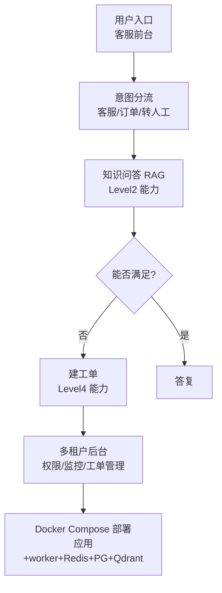

# 阶段八 · 项目 5：Level5 生产级 —— 企业智能客服 Agent

> 所属：阶段八 从入门到生产的实战项目路线
> 定位：阶段八的收尾，也是整个 16 周学习计划的毕业设计。这一级把前面所有阶段能力捏合成一个「能上线、能扩、能迭代」的完整生产系统——不是 Demo，是真的能部署给用户用的产品。

## 项目概览

| 项 | 内容 |
|-|-|
| 难度 | Level5 生产级 |
| 核心功能 | 知识库答疑 + 工单创建 + 人工转接 + 多租户后台 |
| 技术栈 | LangGraph + RAG + 工单系统 + 管理后台 + Docker 部署 |
| 周期 | 6-8 周 |
| 核心学习目标 | 完整工程落地；权限、持久化、监控告警；线上迭代闭环 |

## 一句话看懂本项目的系统分层



> 核心认知：**生产级不是在功能上加花活，而是把每个环节的『不靠谱』都堵住**——状态不丢、权限不漏、故障可控、数据可追。这才是从 0 到 1 之后真正拉开差距的地方。

## 学习内容详情

### 1. 项目要点（完整工程落地）

- **骨架**：意图分流 → 知识问答（RAG，复用 Level2）→ 满足不了 → 转人工 / 建工单（复用 Level4 的 SQL 与数据能力）。
- **多租户隔离**：`thread_id = 租户 ID + 会话 ID`；向量库元数据过滤实现租户级隔离（对照阶段六客服与阶段四向量库）。
- **状态持久化**：Checkpointer + 存储后端（Redis / Postgres）；服务重启任务状态不丢（对照阶段五断点、阶段七部署）。
- **权限控制**：敏感操作（查订单 / 工单）按角色权限分级；高危动作人工审批。
- **监控告警**：任务成功率 / LLM 失败率告警 + 完整链路日志（对照阶段七监控）。
- **部署**：Docker Compose 一键拉起「应用 + worker + Redis + PG + Qdrant」（对照阶段七 docker-compose）。

### 2. 必须落地的工程实践

- **评测闭环**：自建评测集 + Bad-case 队列 + 回归测试（改 prompt 重跑评测，对照阶段五评测 + 阶段七 Bad-case 闭环）。
- **优雅停机**：发布时在途请求不切断（对照阶段七调用优雅停机机制）。
- **满意度回流**：低分会话自动进 Bad-case 队列（写 Click 埋点，异步入队）。
- 文档交付与复盘：项目文档 + 每周末复盘。

```python
def thread_key(tenant_id: str, session_id: str) -> str:
    """多租户 + 会话的状态签名: 每个租户每个会话独立上下文"""
    return f"{tenant_id}:{session_id}"
```

## 本节验收清单

- [ ] Docker Compose 一键部署整套环境并跑通
- [ ] 状态落库 + 中断恢复验证（重启进程任务不丢）
- [ ] 有多租户隔离与权限分级
- [ ] 有完整链路日志 + 至少一项业务监控告警
- [ ] 有自建评测集并跑过一轮迭代闭环

## 排期与前置依赖

- **前置**：Level2（RAG）与 Level4（SQL 与数据）是能力底座；阶段七工程化是工程底座。
- **建议排期**：第 15-16 周，6-8 周（可与 Level4 收尾并行）。
- **毕业判定**：这份系统能独立部署、能告警自愈、能靠 Bad-case 闭环持续变好 ＞ 功能堆得多。

## 阶段八整体补充建议

- Level 1-2 对应计划第 7-10 周（见 [四个月学习计划](../09-四个月学习计划.md)）。
- Level 3-5 建议在掌握基础后串行攻坚，同一项目同时沉淀其 Bad-case 与评测脚本。
- 五个 Level 与前面阶段的能力对应：Level1→阶段二三、Level2→阶段四、Level3→阶段五、Level4→阶段六、Level5→阶段七。**每做一个 Level，就是一次对前面知识的大串讲**。