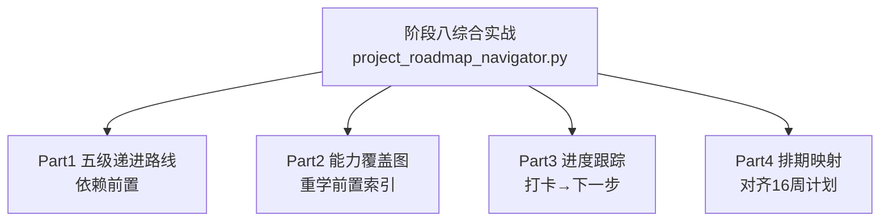

# 阶段八 · 综合实战：五级项目路线导航器（离线可运行）

> 所属：阶段八 从入门到生产的实战项目路线
> 定位：阶段八是整份学习计划的收尾，用一个「五级项目导航器」把五个 Level 的递进关系、前置依赖、能力覆盖、排期串成一张可执行的路线图——你做完每一级就勾掉一格，导航器提醒你下一步补哪些前置。它是阶段八五篇项目文档的地图。

## 一句话看懂本 Demo

`project_roadmap_navigator.py` 用纯 Python 标准库，把阶段八五级项目组织成一份可运行的路线导航器：



> 核心一句话：**实战项目最怕的不是难，而是不知道现在该做什么、缺什么前置**。这个导航器把「先修哪个阶段 → 再做哪个 Level → 覆盖什么能力」固化成一张可勾选的地图。

## 运行方式

```
python3 code/阶段八/project_roadmap_navigator.py
```

不需要 API Key、不需要外网、不需要装任何第三方库（只依赖标准库）。

## 完整代码位置

[code/阶段八/project_roadmap_navigator.py](../../code/阶段八/project_roadmap_navigator.py)

---

## 每个 Part 在讲什么

### Part 1 · 五级递进路线（对应 5 篇 Level 文档）

用 `LEVELS` 数据结构描述五个项目：「难度 / 周期 / 前置依赖 / 覆盖能力 / 关联 Demo」。它把五篇项目文档（[Level1](01-Level1-ReAct智能问答Agent.md) 到 [Level5](05-Level5-企业智能客服Agent.md)）的骨架抽出来，一眼看清递进关系：

```python
LEVELS = [
    {"id": 1, "name": "ReAct 智能问答", "difficulty": "入门", "weeks": "1-2 周",
     "inherits": ["阶段二 ReAct", "阶段三 LangGraph"],      # 前置
     "skills": ["手写Agent循环", "工具调用", "状态流转", "解析异常"]},
    ...
]
```

运行输出的要点：**每个 Level 必须先消化它的"依赖前置"里的阶段，才能顺利开工**。

### Part 2 · 能力覆盖图（重学前置索引）

把每个 Level 会用到的能力列出，帮你建立「做项目时该回去复习哪篇」的索引。例如 L4 数据分析要复用「Text-to-SQL / 五道防线」，对应回头读阶段六小点 2。

### Part 3 · 进度跟踪（打卡 → 下一步）

`RoadmapTracker` 记住你勾掉的 Level，自动给出「下一个应做的项目」和「还缺哪些前置阶段」：

```python
class RoadmapTracker:
    def __init__(self, levels):
        self.done = set()                # 已完成的 Level 编号
    def mark_done(self, level_id):
        self.done.add(level_id)          # 做完一个就打卡
    def next_up(self):
        for lv in self.levels:           # 找未完成中编号最小者
            if lv["id"] not in self.done:
                return lv
    def missing_prereq(self, lv, stage_done):
        # 截取 "阶段X" 前缀, 检查是否已在已掌握阶段集合里
        missing = [it for it in lv["inherits"]
                   if it.startswith("阶段") and it[:3] not in stage_done]
        return missing
```

运行输出演示：已完成 L1、L2 且只掌握阶段二~四时，导航器会建议「下一步 L3」并提示「仍缺前置：阶段五、阶段六 → 先去消化再开工」。这正是很多学习者会踩的坑——**跳级做高 Level，却发现前置能力还没建起来**。

### Part 4 · 排期映射（对齐四个月学习计划）

把每个 Level 的周数区间画成进度条，与 [四个月学习计划](../09-四个月学习计划.md) 对齐，让你知道本周该在哪个 Level 上发力。

---

## 运行结果预览

```
阶段八 · 五级项目路线（从入门到生产）
L1 [入门] ReAct 智能问答      (1-2 周) ->
L2 [进阶] 知识库 RAG         (2-3 周) ->
L3 [高级] 多角色内容创作       (3-4 周) ->
L4 [实战] 数据分析 SQL Agent  (4-6 周) ->
L5 [生产] 企业智能客服         (6-8 周)
...
[进度跟踪] 当前已掌握: 阶段二~四 → 建议下一步 L3, 但仍缺前置: 阶段五、阶段六
```

## 怎么用它来规划自己的学习

| 场景 | 用法 |
|-|-|
| 刚开始阶段八 | 先从 Part 1 看五级递进，决定从哪个 Level 切入 |
| 卡在某一级 | 用 Part 2 能力覆盖图，回读对应前置阶段文档补课 |
| 觉得自己能跳级 | 跑 Part 3，看导航器提示缺哪些前置 |
| 规划每周时间 | 对照 Part 4 排期条，锁定本周要攻坚的 Level |

## 本节自检

- [ ] 能只靠 Part 1 说清五级项目的递进关系
- [ ] 知道每个 Level 前置依赖的是哪些阶段（Level1→阶段二三 … Level5→阶段七）
- [ ] 能用 Part 2 说出：做 L4 数据分析前该回去读哪篇
- [ ] 已跑通导航器，并用它规划了自己下一步要做的 Level