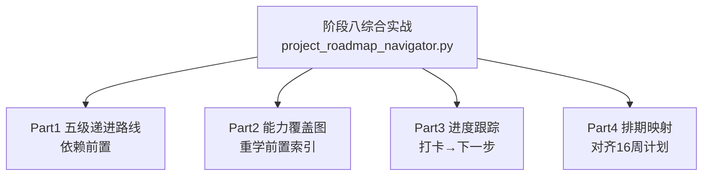

# 阶段八 · 综合实战：五级项目路线导航器（离线可运行）

> 所属：阶段八 从入门到生产的实战项目路线
> 定位：阶段八是整份学习计划的收尾，用一个「五级项目导航器」把五个 Level 的递进关系、前置依赖、能力覆盖、排期串成一张可执行的路线图——你做完每一级就勾掉一格，导航器提醒你下一步补哪些前置。它是阶段八五篇项目文档的地图。

## 一句话看懂本 Demo

`project_roadmap_navigator.py` 用纯 Python 标准库，把阶段八五级项目组织成一份可运行的路线导航器：



> 核心一句话：**实战项目最怕的不是难，而是不知道现在该做什么、缺什么前置**。这个导航器把「先修哪个阶段 → 再做哪个 Level → 覆盖什么能力」固化成一张可勾选的地图。

> 🔬 **深度理解 · 五级项目路线的递进关系与"从 Demo 走向生产"**：
> 1. **本质**：五个 Level 不是"五个并列的作业"，而是一条**递进的能力爬升带**——每一级都是上一级的知识底座加上一层新的核心心智，前级的产出物（Agent 循环、RAG、多智能体分工、SQL 安全）被后级复用在更大的系统里。
> 2. **递进机制**：Level1 打通"Agent 循环"这个最底层的骨架；Level2 给 Agent 接上"知识检索（RAG）"；Level3 升级为"多 Agent 分工协作"；Level4 转向"结构化数据 + 安全性（Text-to-SQL + 五道防线）"；Level5 把前四者的能力凝成"一个能上线、能扩、能迭代的生产系统"。每上一级，复杂度从'实现算法'上升到'管理工程与安全'。
> 3. **如何从 Demo 走向生产**：不是"功能变多"，而是逐级引入生产属性——状态不丢、权限不漏、故障可控、数据可追；Level 1-4 更多是"把能力跑通（Demo）"，Level5 是"把可靠性、合规、迭代闭环补齐（生产）"，这也是为什么 Level5 是毕业设计。
> 4. **易错点/常见误解**：别把"跳级"当捷径——每级的前置依赖是硬性的（如做 Level5 必须已有 RAG + SQL + 工程化底座），跳级常因前置能力未建而返工；也别把"Demo 跑通"误当作"生产就绪"，两者差在可靠性/合规/可迭代这些非功能属性上。

## 运行方式

```
python3 code/阶段八/project_roadmap_navigator.py
```

不需要 API Key、不需要外网、不需要装任何第三方库（只依赖标准库）。

## 完整代码位置

[code/阶段八/project_roadmap_navigator.py](../../code/阶段八/project_roadmap_navigator.py)

---

## 每个 Part 在讲什么

### Part 1 · 五级递进路线（对应 5 篇 Level 文档）

用 `LEVELS` 数据结构描述五个项目：「难度 / 周期 / 前置依赖 / 覆盖能力 / 关联 Demo」。它把五篇项目文档（[Level1](01-Level1-ReAct智能问答Agent.md) 到 [Level5](05-Level5-企业智能客服Agent.md)）的骨架抽出来，一眼看清递进关系：

```python
LEVELS = [
    {"id": 1, "name": "ReAct 智能问答", "difficulty": "入门", "weeks": "1-2 周",
     "inherits": ["阶段二 ReAct", "阶段三 LangGraph"],      # 前置
     "skills": ["手写Agent循环", "工具调用", "状态流转", "解析异常"]},
    ...
]
```

运行输出的要点：**每个 Level 必须先消化它的"依赖前置"里的阶段，才能顺利开工**。

### Part 2 · 能力覆盖图（重学前置索引）

把每个 Level 会用到的能力列出，帮你建立「做项目时该回去复习哪篇」的索引。例如 L4 数据分析要复用「Text-to-SQL / 五道防线」，对应回头读阶段六小点 2。

### Part 3 · 进度跟踪（打卡 → 下一步）

`RoadmapTracker` 记住你勾掉的 Level，自动给出「下一个应做的项目」和「还缺哪些前置阶段」：

```python
class RoadmapTracker:
    def __init__(self, levels):
        self.done = set()                # 已完成的 Level 编号
    def mark_done(self, level_id):
        self.done.add(level_id)          # 做完一个就打卡
    def next_up(self):
        for lv in self.levels:           # 找未完成中编号最小者
            if lv["id"] not in self.done:
                return lv
    def missing_prereq(self, lv, stage_done):
        # 截取 "阶段X" 前缀(兼容 "阶段二 ReAct" 与 "阶段01-数据分析" 两种命名),
        # 检查是否已在已掌握阶段集合里
        missing = [it for it in lv["inherits"]
                   if it.startswith("阶段")
                   and it.split("-")[0].split(" ")[0] not in stage_done]
        return missing
```

> ⏳ **短期可不深究**：`missing_prereq` 里"截取『阶段X』前缀来兼容两种命名（'阶段二 ReAct' 与 '阶段01-数据分析'）"这种字符串解析的小 hack，第一遍看思路即可——它只是为了统一命名格式而做的容错，不是本项目主线，不需要逐行背下来。

运行输出演示：已完成 L1、L2 且只掌握阶段二~四时，导航器会建议「下一步 L3」并提示「仍缺前置：阶段五、阶段六 → 先去消化再开工」。这正是很多学习者会踩的坑——**跳级做高 Level，却发现前置能力还没建起来**。

### Part 4 · 排期映射（对齐四个月学习计划）

把每个 Level 的周数区间画成进度条，与 [四个月学习计划](../09-四个月学习计划.md) 对齐，让你知道本周该在哪个 Level 上发力。

> ⏳ **短期可不深究**：这个 Demo 用纯标准库手画"进度条"的终端渲染细节（字符宽度、填充、对齐）只是教学展示用的实现技巧，第一遍不用纠结它画得漂不漂亮，重点是理解"排期对齐"这个学习规划的思路；真要好看的图表，交给前端或现成库即可。

---

## 运行结果预览

```
阶段八 · 五级项目路线（从入门到生产）
L1 [入门] ReAct 智能问答      (1-2 周) ->
L2 [进阶] 知识库 RAG         (2-3 周) ->
L3 [高级] 多角色内容创作       (3-4 周) ->
L4 [实战] 数据分析 SQL Agent  (4-6 周) ->
L5 [生产] 企业智能客服         (6-8 周)
...
[进度跟踪] 当前已掌握: 阶段二~四 → 建议下一步 L3, 但仍缺前置: 阶段五、阶段六
```

## 怎么用它来规划自己的学习

| 场景 | 用法 |
|-|-|
| 刚开始阶段八 | 先从 Part 1 看五级递进，决定从哪个 Level 切入 |
| 卡在某一级 | 用 Part 2 能力覆盖图，回读对应前置阶段文档补课 |
| 觉得自己能跳级 | 跑 Part 3，看导航器提示缺哪些前置 |
| 规划每周时间 | 对照 Part 4 排期条，锁定本周要攻坚的 Level |

## 本节自检

- [ ] 能只靠 Part 1 说清五级项目的递进关系
- [ ] 知道每个 Level 前置依赖的是哪些阶段（Level1→阶段二三 … Level5→阶段七）
- [ ] 能用 Part 2 说出：做 L4 数据分析前该回去读哪篇
- [ ] 已跑通导航器，并用它规划了自己下一步要做的 Level

## 本节常见面试题（深度解析）

> 针对本节核心知识的面试高频点，配合"本质+机制"式理解，能让你答得既有深度又有广度。

### 面试题 1：请讲清楚这五个 Learn 的递进关系，以及每一级分别复用了前级的哪些能力。
- **面试官想考察**：你是否把五级当作一条"能力递进链"而非五个孤立项目，能否说清每级解决了什么问题、又为后级提供了什么。
- **专业作答（含深度）**：
  1. 逐级推进：Level1 打通 Agent 基础循环（思考-行动-观察）；Level2 给循环接上知识检索（RAG，复用 Level1 的 Agent 编排）；Level3 上升为多 Agent 分工（复用前面循环+检索，叠加 Supervisor 调度）；Level4 转向结构化 DB（Text-to-SQL + 五道防线，复用 Agent 工具调用）；Level5 把上述能力凝成生产系统（复用 RAG、SQL、工程化、监控、评测）。
  2. 抽出主线：本质是"同一种 Agent 能力在不同复杂度场景的复用与加厚"——每级都在前级底座上加一个新的能力维度和一类工程质量。
  3. 关联前置阶段：Level1↔阶段二三、Level2↔阶段四、Level3↔阶段五、Level4↔阶段六、Level5↔阶段七，每级都是前面知识的综合演练。
  4. 落点：真正的收获不是"做了五个 Demo"，而是"每一级整合一次前面的知识，最终能自己组装出可上线的系统"。
- **加分亮点 / 深度追问**：可主动把"递进"抽象为"从实现算法 → 管理数据 → 协调多体 → 守护安全 → 掌控工程"的能力维度叠加；追问"为什么 Level5 是毕业设计"时可答"因为它要求前面所有非功能属性（可靠性/合规/可迭代）同时到位"。

### 面试题 2：为什么要"先修前置阶段，再做对应 Level"，跳级会带来什么后果？
- **面试官想考察**：你是否真正理解"能力依赖"而非背下结论，以及能否说清跳级的具体代价。
- **专业作答（含深度）**：
  1. 依赖关系为何必要：高级 Level 直接调用前级的"心智模型"（如没有"独立上下文"概念就无法理解多 Agent 里的 supervisor；不懂五道防线就做不了可上线的 SQL Agent），前置缺失时项目会变成"装样子跑通"。
  2. 跳级的代价展开：返工（缺失能力导致推倒重来）、误判（把"跑通"当"会了"，实际不懂底层设计）、连带失败（前置能力建立后才发现高级设计要推翻）。
  3. 用导航器落地：RoadmapTracker 的 `missing_prereq` 正是把这种依赖"程序化"——它提醒你补哪些前置，而不是让你凭感觉跳级。
  4. 结论：合理路径是"前置已握 → 再做该 Level"，这也是为什么文档明确"每个 Level 必须先消化它的依赖前置里的阶段才能顺利开工"。
- **加分亮点 / 深度追问**：可补充"我这里会跳过与本职业场景无关的前置，但对直接承担任务的 Level 前置绝不跳"的务实取舍；追问"何时可以适度并行"时可答"低耦合的前置（如基础 RAG）可与后续 Level 平行推进，但门槛性的（如 SQL 安全）必须先立"。

### 面试题 3：这份导航器把"从 Demo 走向生产"做了怎样的固化？它适合怎么用于真实项目规划？
- **面试官想考察**：你是否理解"把学习/项目路线结构化、可追踪"的工程化规划思维，而不只把它当一个小脚本。
- **专业作答（含深度）**：
  1. 它固化的不是代码，而是"递进关系 + 前置依赖 + 能力覆盖 + 排期"四类元信息——把隐性的能力因果显式化成可查询、可勾选的地图。
  2. 四个 Part 对应四种规划动作：看递进（该从哪个 Level 切入）、查能力覆盖（做某级该回读哪篇）、查前置（能不能跳级）、对齐排期（本周攻哪个）。
  3. 迁移价值：同样的"依赖建模 + 进度跟踪"思路可直接用于真实项目/团队——把任务依赖、前置技能、里程碑排期用同样的结构化数据管起来，避免"凭感觉排期、缺少约束导致延期"。
  4. 与生产的连接：这个"缺失前置就提示补齐"的机制，和 Level5 里"Bad-case 缺失就回流补齐"其实是同一种"缺口检测+补课"的循环思想。
- **加分亮点 / 深度追问**：可谈到"把路线数据化后可以做风险预测（哪些 Level 可能卡人）"，或"这套导航思想可演化为知识图谱/依赖图来承载更多课程"；追问"导航器对真实生产的局限"时可答"它是静态依赖，真实项目还有动态/并行依赖，需人工补充判断"。