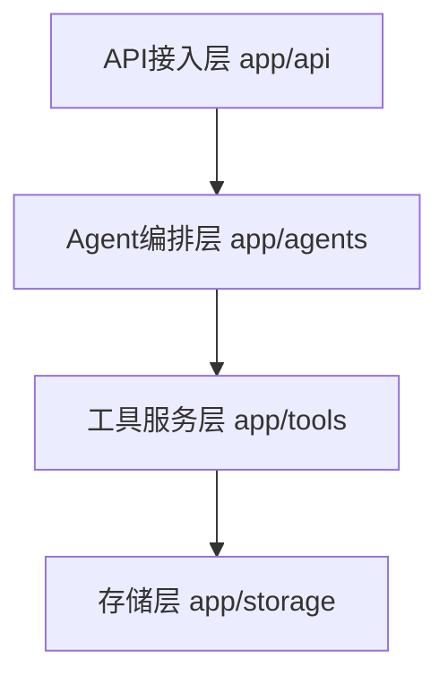

# 12 · Python 开发规范

> 适用：本学习项目（FastAPI Agent 服务骨架 + 各阶段离线 Demo）
> 目的：统一目录、文件、接口、工具函数与各层抽象的命名与组织方式，让代码层次清晰、可读、可持续演进。
> 约定本规范**面向本项目当前真实结构编写**，不做超出实际需要的理论堆砌。

## 1. 项目根布局

```
/workspace
├─ app/                  # FastAPI 服务骨架（阶段七部署到 API 的核心）
│  ├─ main.py            # 应用实例 + 生命周期 + 全局异常处理器
│  ├─ config.py          # pydantic-settings 配置（读取 .env）
│  ├─ schemas.py         # 请求/响应 Pydantic 模型
│  ├─ dependencies.py    # 可复用依赖（Depends：会话 / 鉴权 / 配置）
│  ├─ api/               # 路由（routers），按资源拆分
│  ├─ agents/            # Agent 编排层（阶段七扩展）
│  ├─ tools/             # 工具服务层（LLM / 检索 / 计算）
│  └─ storage/           # 存储层（Redis / PG / Qdrant）
├─ code/                 # 各阶段离线可运行 Demo（纯标准库优先）
├─ docs/                 # 学习文档（阶段一 ~ 八 + 配套）
├─ requirements.txt      # 服务侧依赖清单
├─ .env.example          # 环境变量模板（.env 不入库）
└─ .gitignore            # 忽略 .env / __pycache__ 等
```

- 三类代码按「**能否被 API 调用**」区分：`app/` 是服务，`code/` 是脚本型 Demo，`docs/` 非代码。
- 新增可复用的非服务工具放 `app/tools/`（详见第 5 节），新增教学示例放对应 `code/阶段N/`。
- **FastAPI 目录对齐官方 Bigger Applications 惯例**：路由按资源拆到 `api/` 各文件、`dependencies.py` 集中放 `Depends` 依赖、`schemas.py` 放模型 [$TRAE_REF](https://fastapi.tiangolo.com/tutorial/bigger-applications/#apirouter)。

## 2. app/ 分层架构与各层抽象

`app/` 采用**四层**抽象，每个模块只允许依赖其下层，禁止跨层引用：

```
API 接入层   app/api/         路由 + 请求响应对象（HTTP / SSE）
    ↓
Agent 编排层 app/agents/      规划 / 记忆 / 工具调用编排（LangGraph 等）
    ↓
工具服务层   app/tools/       可复用工具函数（llm / 检索 / 计算 ...）
    ↓
存储层       app/storage/     Redis / PG / Qdrant 访问封装
```



当前骨架已具备 `app/main.py`、`app/api/routes.py`、`app/schemas.py`；`app/agents` / `app/tools` / `app/storage` 按需新增（阶段七扩展时落地）。

### 2.1 分层职责与引用规则

| 层 | 目录 | 职责 | 允许引用 |
|-|-|-|-|
| 接入层 | `app/api/` | 路由、入参校验、响应序列化、流式返回 | 编排层、schemas |
| 编排层 | `app/agents/` | 状态机、规划、记忆、工具调用循环 | 工具服务层、存储层 |
| 工具服务层 | `app/tools/` | 一次性的可复用能力（LLM 封装、检索、计算） | 存储层 |
| 存储层 | `app/storage/` | Redis / PG / Qdrant 读写封装 | 仅驱动与配置 |

- 接入层**不得直接触碰存储层**；编排层**不得写 HTTP 路由**。
- 依赖方向永远是单向的，出现「下层 import 上层」即视为架构违规。

## 3. 文件命名规范

| 类别 | 规则 | 示例 |
|-|-|-|
| 模块文件 | 小写下划线 `snake_case.py` | `routes.py` / `llm_client.py` |
| 包目录 | 小写下划线，含 `__init__.py` | `app/api/` / `app/tools/` |
| 教学 Demo | 语义化小写，一个文件一个主题 | `react_agent.py` |
| 数据模型 | `schemas.py` 集中，或 `*_models.py` | `schemas.py` |
| 可复用依赖 | `dependencies.py`（放 `Depends` 函数） | `dependencies.py` |
| 常量/配置 | `config.py`（pydantic-settings `Settings`） | `config.py` |
| 命名 `.markdown` | 中文语义化 + 阶段编号 | `docs/07-…/01-Agent工程化…md` |

- 文件名只做一件事：一眼看出「这是什么」「属于哪层/哪阶段」。
- `code/` 下避免用 `test` / `utils` / `common` 这类无意义泛名。

## 4. 接口（API）规范

### 4.1 通用约定

- 路由集中注册：`app/api/` 下 `APIRouter(prefix=..., tags=[...])`，统一在 `main.py` `include_router`。
- 请求/响应结构一律用 Pydantic 模型声明（`schemas.py`），由 FastAPI 自动校验与生成文档。
- 健康检查统一 `GET /health`（`main.py` 内），供 K8s probe 使用，不入业务路由。
- **`tags` 必填**：路由按 `tags` 分组，Swagger 文档据此归类，禁止无 `tags` 裸挂。
- **显式 `status_code`**：每个端点声明响应码，避免默认 200 掩盖语义（创建用 201、删除用 204 等）。

```python
# app/main.py
from contextlib import asynccontextmanager

@asynccontextmanager
async def lifespan(app: FastAPI):          # 生命周期：启动/关闭时的资源管理
    # 启动：连库 / 加载模型 / 初始化配置
    yield
    # 关闭：释放连接 / 落盘状态

app = FastAPI(title="Python AI Agent 学习项目", version="0.1.0", lifespan=lifespan)
app.include_router(router)                  # 挂载 /agent 路由
app.add_exception_handler(CustomError, custom_handler)   # 全局异常处理器

@app.get("/health", tags=["system"])
async def health() -> dict:
    return {"status": "ok"}
```

### 4.2 REST 语义

| 场景 | 方法 / 路径 | `status_code` | 说明 |
|-|-|-|-|
| 对话 | `POST /agent/chat` | 200 | 请求 `ChatRequest`，返回 `ChatResponse` |
| 创建 | `POST /agent/tasks` | 201 | 创建长任务，返回任务 ID |
| 查询 | `GET /agent/tasks/{id}` | 200 | 幂等查询，无副作用 |
| 状态 | `GET /agent/tasks/{id}/status` | 200 | 查询长任务进度 |
| 取消 | `POST /agent/tasks/{id}/cancel` | 202 | 接受取消请求，异步生效 |
| 删除 | `DELETE /agent/tasks/{id}` | 204 | 无返回体 |

- 动词进 URL 视为反模式：用 `POST /xx/{id}/cancel`，而非 `POST /xx/cancel_task`。
- 必须显式声明 `response_model`，FastAPI 据此生成 OpenAPI 与做响应序列化。

### 4.3 请求/响应模型（Pydantic v2）

```python
from pydantic import BaseModel, Field

class ChatRequest(BaseModel):
    question: str = Field(..., min_length=1, max_length=2000, description="用户问题")
    session_id: str | None = Field(default=None, description="多轮会话 ID")

class ChatResponse(BaseModel):
    answer: str = Field(..., description="回答内容")
    source: str = Field(..., description="来源标识: skeleton / rag / tool ...")
```

- 每条 Field 都要有 `description`；校验约束（`min/max_length`）贴近业务真实边界。
- 响应模型独立于请求模型，禁止直接复用请求模型回传多余字段。

### 4.4 流式输出（SSE）与长任务

- 流式用 `StreamingResponse`，`media_type="text/event-stream"`；逐 token 由编排层以生成器传入。
- 长任务（RAG 检索、多步 agent）拆「提交 → 查询进度 → 获取结果」，不用单请求阻塞拖死连接。
- 编排层暴露「生成器」接口，接入层负责封装为 SSE，职责不互相侵入：

```python
# 接入层：把编排层生成器包装成 SSE 流
async def stream_chat(req: ChatRequest):
    async for token in agent_stream(req.question):   # app/agents 返回 async generator
        yield f"data: {token}\n\n"
```

### 4.5 依赖注入（Depends）——FastAPI 核心机制

**凡跨端点复用的横切能力（鉴权、会话、配置、限流），一律用 `Depends` 注入，禁止在路由里手动 new 对象**。这是 FastAPI 与普通 Flask/命令式项目的分水岭，也是专业项目结构的基础 [$TRAE_REF](https://tomodahinata.com/en/blog/fastapi-project-structure-apirouter-dependencies-large-app-guide)。

```python
# app/dependencies.py —— 集中声明可复用依赖
def get_settings() -> Settings:
    return get_settings.cache                      # 单例配置注入

async def get_tenant(req: Request) -> str:
    """从 Header/Token 解析租户 ID, 供多租户隔离使用（阶段八 Level5）"""
    token = req.headers.get("X-Tenant-Id")
    if not token:
        raise HTTPException(status_code=401, detail="缺少租户标识")
    return token

# app/api/routes.py —— 端点通过 Depends 取依赖
@router.post("/chat", response_model=ChatResponse, status_code=200)
async def chat(req: ChatRequest,
               settings: Settings = Depends(get_settings),
               tenant: str = Depends(get_tenant)) -> ChatResponse:
    ...
```

- **分层注入**：路由只依赖「抽象依赖函数」；编排层、工具层对象由依赖函数装配，接入层不感知具体实现。
- 鉴权、会话、配置、`trace_id` 生成等横切关注点，统一放 `app/dependencies.py`。
- 有状态依赖（数据库连接等）用 FastAPI 的依赖缓存（默认每次请求复用同依赖实例）。
- **禁止**：在路由函数体内 `Client(...)` 手动构造、绕过 `Depends` 直读全局单例。

## 5. 工具函数规范（app/tools）

### 5.1 组织原则

- 工具按域拆分文件，一个文件一个能力主题：`llm_client.py` / `search.py` / `retriever.py` / `calc.py`。
- 工具函数应是**纯函数优先**：输入确定、输出确定、尽可能无隐藏副作用；有外呼（LLM / 外部 API）的单独标注。
- 每个工具给**明确的入参、返回类型注解与 docstring**，让 Agent 能可靠调用。

```python
# app/tools/llm_client.py
import httpx

def call_llm(prompt: str, *, base_url: str, api_key: str, timeout: float = 30.0) -> str:
    """调用 LLM 完成生成。有外呼副作用, 失败抛异常由上层重试。"""
    ...
```

### 5.2 工具函数清单（阶段四「工具调用生态」落地）

| 工具 | 文件建议 | 输入 → 输出 | 副作用 |
|-|-|-|-|
| LLM 对话 | `tools/llm_client.py` | `prompt/model → str` | 外呼 |
| 搜索 | `tools/search.py` | `query → list[dict]` | 外呼 |
| 检索 | `tools/retriever.py` | `query/向量 → hits` | 读存储 |
| 计算 | `tools/calc.py` | `expr → number` | 无 |
| 外部工具 | `tools/*.py` | 各自定义 | 视情况 |

- 所有工具函数**统一用关键字参数传可选配置**（`*` 分隔必选与可选），避免位置参数歧义。
- docstring 首行一句话说明「它做什么」，第二段提副作用与异常。

## 6. 依赖、环境与第三方工具使用

### 6.1 依赖与配置

- 服务依赖集中在 `requirements.txt`，锁定主版本（如 `fastapi>=0.110`），生产建议 `pip freeze` 出 lock。
- `requirements.txt` 是**前瞻声明**：记录服务侧设计需要的依赖，可超前于 `app/` 当前代码的 import；新增依赖先加这里，使用处按阶段落地（`loguru`/`tenacity`/`httpx`/`pydantic-settings` 在阶段四/六/七扩展时启用）。
- 密钥与可变配置一律走 `.env`（模板在 `.env.example`）；`.env` **强制不入库**。
- 配置统一用 **`pydantic-settings`** 的 `BaseSettings` 管理（FastAPI 官方推荐）[$TRAE_REF](https://fastapi.tiangolo.com/advanced/settings/#use-the-settings)，禁止在业务模块散落 `os.getenv`。

```python
# app/config.py —— 唯一配置入口, 启动时读取 .env
from pydantic_settings import BaseSettings, SettingsConfigDict

class Settings(BaseSettings):
    app_name: str = "Python AI Agent 学习项目"
    openai_api_key: str = ""                       # 密钥, 只从 .env 读
    deepseek_api_key: str = ""
    redis_url: str = "redis://localhost:6379/0"
    qdrant_url: str = "http://localhost:6333"

    model_config = SettingsConfigDict(env_file=".env", env_file_encoding="utf-8")

settings = Settings()                              # 全应用共享单例
```

- 使用方通过 `Depends(get_settings)` 注入 `Settings`，而不是 `from app.config import settings` 到处 import。
- 新增配置项 = 在 `Settings` 加一个带默认值的字段 + 在 `.env.example` 补一行，二处同步。

### 6.2 标准工具库约定（对应阶段一「核心工具库」）

| 库 | 用途 | 本规范约定 |
|-|-|-|
| `pydantic` | 数据模型与校验 | 所有请求/响应收敛到 Pydantic |
| `pydantic-settings` | 配置管理 | `config.py` 用 `BaseSettings` 读 `.env` |
| `loguru` | 日志 | 统一 `logger`，按层打 tag，见第 7 节 |
| `tenacity` | 重试 | 外呼统一用 `@retry` 做指数退避，见第 8 节 |
| `httpx` | 异步 HTTP | 取代 `requests`；超时必设，见第 8 节 |

## 7. 日志规范

- 统一 `from loguru import logger`，不散用 `print`（Demo 教学文件除外）。
- 关键路径要能还原现场，至少覆盖：请求进入、工具调用（入参/返回）、失败、耗时。
- 日志分级对齐：`debug` 明细、`info` 正常生命周期、`warning` 可恢复、`error` 需关注。

```python
from loguru import logger

@retry(stop=stop_after_attempt(3), wait=wait_exponential(multiplier=0.5))
def call_llm(...):
    logger.info("llm call start, prompt={}", prompt[:50])
    try:
        r = ...
        logger.info("llm call ok, used_tokens={}", r.usage)
        return r
    except httpx.TimeoutException as e:
        logger.warning("llm timeout: {}", e)
        raise
```

- 生产排障依赖日志可检索：每条日志带稳定标识（`trace_id` / `session_id`），见第 9 节。

## 8. 错误处理与可靠性

### 8.1 异常策略

- 业务方法向上抛「语义化异常」而非裸调库异常；接入层统一捕获转 HTTP 状态码。
- **外呼必须设超时**：`httpx` 传 `timeout`，LLM / 外部 API 一律默认 `timeout=30.0`。
- **外呼统一重试**：用 `tenacity` 指数退避，默认 `stop_after_attempt(3)`、`wait_exponential(multiplier=0.5)`；幂等操作才重试，写操作重试前判幂等。

```python
from tenacity import retry, stop_after_attempt, wait_exponential

@retry(stop=stop_after_attempt(3), wait=wait_exponential(multiplier=0.5))
def fetch(day: str) -> dict:                      # GET 幂等 → 可安全重试
    ...
```

- 时长敏感 / 高风险的调用在编排层用**熔断**（连续失败即快速失败），示例见 `code/阶段七`。
- 工具返回空结果必须「如实报空、勿编造」，禁止模型自行补齐不存在的数据。

### 8.2 HTTP 错误码映射（接入层）

| 异常 | 返回码 |
|-|-|
| 参数校验失败（Pydantic） | 422 |
| 未授权 / 权限不足 | 401 / 403 |
| 资源不存在（含检索空结果） | 404 |
| 外部依赖失败（LLM / 存储） | 502 |
| 请求过于频繁 / 熔断打开 | 429 |
| 服务内部错误（未分类） | 500 |

### 8.3 全局异常处理器（FastAPI 惯用法）

- 业务侧抛**自定义异常**（如 `ToolCallFailed`、`KnowledgeNotFound`），接入层用 `@app.exception_handler` 统一转 HTTP 响应，路由内不散落 try/except 转码。
- 通用异常处理收敛到 `main.py` 或独立 `app/errors.py`，避免每个路由重复写错误映射。

```python
# app/errors.py —— 集中定义自定义异常与全局处理器
class ToolCallFailed(Exception):
    """工具调用失败, 语义化异常由全局处理器转 502"""

@app.exception_handler(ToolCallFailed)
async def tool_failed_handler(req: Request, exc: ToolCallFailed):
    logger.error("tool failed: {}", exc)
    return JSONResponse(status_code=502, content={"detail": f"外部依赖失败: {exc}"})

# main.py 注册
app.add_exception_handler(ToolCallFailed, tool_failed_handler)
```

- Pydantic 校验错误由 FastAPI 自动转 422，无需自定义；只对**业务异常**注册处理器。

## 9. 可追踪性与并发

- 每个请求注入 `trace_id`（如 `uuid4().hex[:8]`），贯穿日志与存储，跨链路可对。
- 多租户 / 会话用稳定键区分：`app/agents` 里 `thread_key(<tenant> , <session>)` 组合，见阶段八 Level5。
- 异步敏感路径用原生 `async/await`（FastAPI / httpx 天然支持）；CPU 密集用 `asyncio.to_thread` 不阻塞事件循环。

## 10. 代码质量与提交

| 项 | 约定 |
|-|-|
| Python 版本 | 3.10+，语法用现代类型注解（`str \| None`） |
| 格式 | `ruff format` 统一风格 |
| Lint | `ruff check`，消灭未用变量 / import 与未处理异常 |
| 类型 | 函数/参数/返回值全部注解 |
| 文档串 | 每个公开函数有 docstring，首行一句话说明意图 |
| 测试 | 关键接口配 `pytest` 单测；数据类用 Pydantic 校验即测边界 |
| 提交信息 | 一句话 present 动作，如 `fix: 修复流式接口内存泄漏` |

## 11. 各类代码的定位（避免误用）

| 位置 | 定位 | 应避免 |
|-|-|-|
| `app/` | 生产风格服务，遵循以上规范 | 用 `print`、裸读 env、跨层引用 |
| `code/阶段N/` | 教学 Demo，重可读性 | 上生产的依赖（环境变量强绑定） |
| `docs/` | 文档，不动代码 | 混入可执行逻辑 |

- Demo 的注释可以比生产多（教学），但**命名与分层原则一致**，便于从 Demo 平滑迁移到 `app/`。

## 12. 小结自检

- [ ] 新代码归属明确（`app/` 服务 / `code/` 教学），模块命名一眼可辨
- [ ] 接入层不碰存储、编排层不写路由，依赖单向
- [ ] 所有接口用 Pydantic 声明请求/响应，字段带 `description`
- [ ] 路由带 `tags` 分组 + 显式 `status_code`，`main.py` 只做组装
- [ ] 横切能力（鉴权/会话/配置）用 `Depends` 注入，不手动 new 对象
- [ ] 配置用 `pydantic-settings`，密钥走 `.env` 不入库
- [ ] 业务异常用全局 `exception_handler` 统一转码
- [ ] 外呼统一设超时 + `tenacity` 重试，空结果如实报空
- [ ] 统一 `loguru` 日志 + `trace_id`